# Launching Calculator with a Buffer Overflow

> Originally published on [Naver Blog](https://blog.naver.com/chaeeunhur630/224345040476). Translated and reformatted in English.

This exercise follows a Windows application vulnerability-analysis demonstration and records the reproducible exploitation steps.

https://www.youtube.com/watch?v=gdtmbdbcq7U&list=LL&index=1&t=434s

Since I will not run the fuzzer and will just run it on Windows XP due to security issues, I installed XP image and vmware tools first.

https://www.inflearn.com/course/%EC%9C%88%EB%8F%84%EC%9A%B0%EC%A6%88-%EC%95%A0%ED%94%8C%EB%A6%AC%EC%BC%80%EC%9D%B4%EC%85%98-%EC%B7%A8%EC%95%BD%EC%A0%90?cid=36577

From introduction to Windows application vulnerability analysis and use | Security Project - Infrastructure Lecture

Check out the course that currently has 466 students with a rating of 4.4. It covers basic learning about Windows application defense techniques and bypass attacks, how to use them, and analysis of the latest attack cases. I strongly recommend it to those who have chosen a career in mock hacking or a career in malware analysis. win

www.inflearn.com

The course above provides additional background on Windows application vulnerability analysis.

First of all, the program targeted for vulnerability exploitation is: Easy RM to MP3 Converter 2.7.3.700.

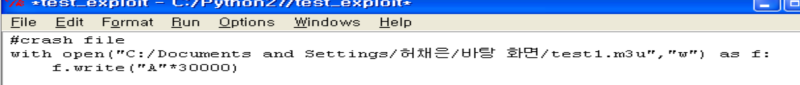

I created a file to check for crashes using Python. If you run it again with the olly debug setting, the debug option will appear. If you look at eip, you can see that the eip address has been overwritten with 41414141.. (file input ASCII value is 41). For reference, eip is the address that the computer will execute next. In other words, if you analyze the offset well with a debugger and input the input, you can change the next execution address to the desired address. (In other words, you can see that there is a vulnerability that breaks the flow)

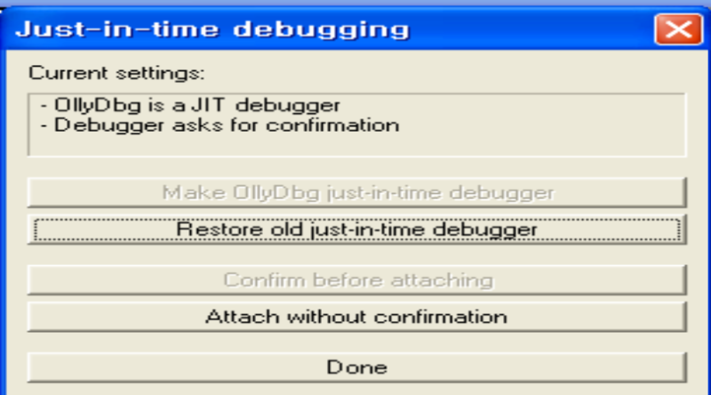

Setting tailored to you

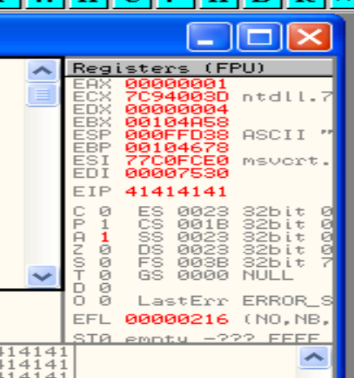

Debugger Register Window

I will conveniently use the immunity debugger to find the offset. Immunity Debugger focuses on making exploits more convenient than other debuggers.

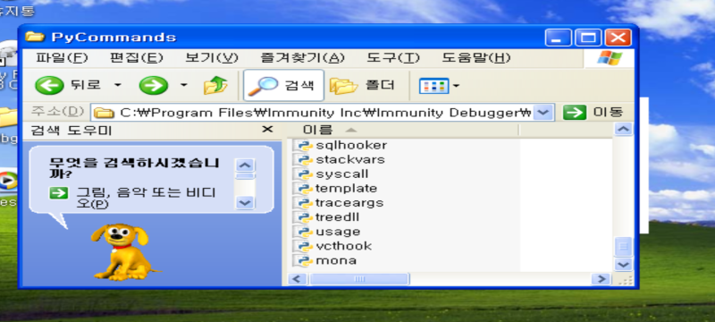

If you download the Imuni debugger and follow it with PyCommand, an exploit tool called Monar is provided. Let's run mona through !mona in the Immunity Debugger.

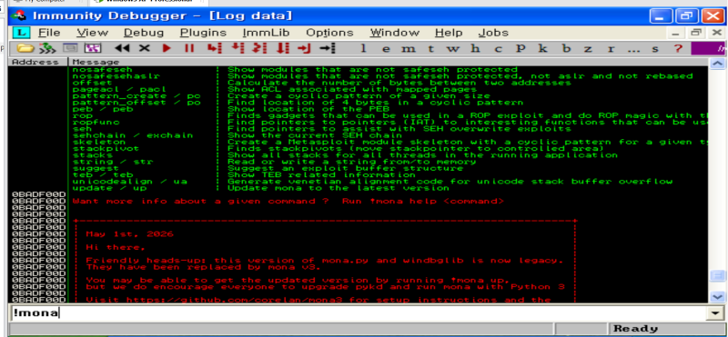

The following section summarizes how `mona.py` supports exploit development.

mona.py is a plugin for the Immunity Debugger that aids exploit development (particularly stack buffer overflow analysis). C
This tool was created by the orelan Team and is used as a standard in training courses such as security research/CTF/OSCP.

Basic Concept: Why do we need “patterns”?

If you crash a program with a code like "A"*30000, which you mentioned earlier, EIP (a register that points to the next instruction to be executed) is overwritten with 0x41414141 (all A's).
The problem is — we don't know exactly how many A's out of 30000 have covered the EIP. They're all the same text.

Pattern creation/offset finding function in mona.py
1. Create a unique pattern
!mona pattern_create 30000
This creates a unique, non-overlapping pattern every 4 bytes, such as "Aa0Aa1Aa2Aa3..." instead of "A". 
This is a mathematical method called the De Bruijn sequence.

2. Find offset after crash
If you crash again with this pattern string, a specific 4-byte fragment of that pattern will remain in EIP. For example, if EIP becomes something like 0x69413969:
!mona pattern_offset 69413969
If you type this, mona will calculate "exactly what byte in the pattern this 4-byte fragment was." Then you can see things like, “Oh, exactly 4113 bytes are needed to cover the EIP.”

Why is this important?
When creating a buffer overflow exploit, we usually use this structure:
[fill bytes with exact offset] + [cover EIP with desired address] + [payload to execute]
If you do not know the exact offset, you cannot precisely control the EIP to the desired value. With "A"*30000, you only know that a crash occurs, but you cannot know "at what byte the EIP is covered," so you cannot proceed to the next step.
Other useful functions in mona.py (for reference)

!mona modules — Check whether the loaded DLLs have protection techniques (ASLR, DEP, etc.)
!mona find — Search memory for a specific opcode (e.g. jmp esp) pattern
!mona bytearray — Create a byte array to check for bad characters (characters that should not be used in the payload, such as null bytes).

You say...?

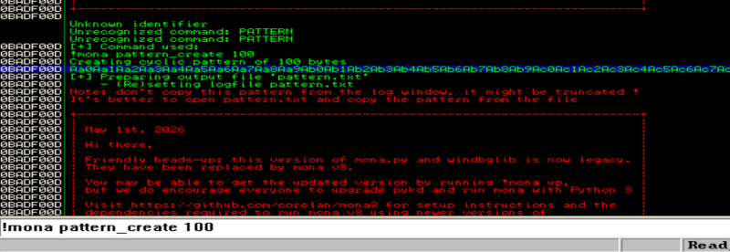

Create a pattern with a command like this!

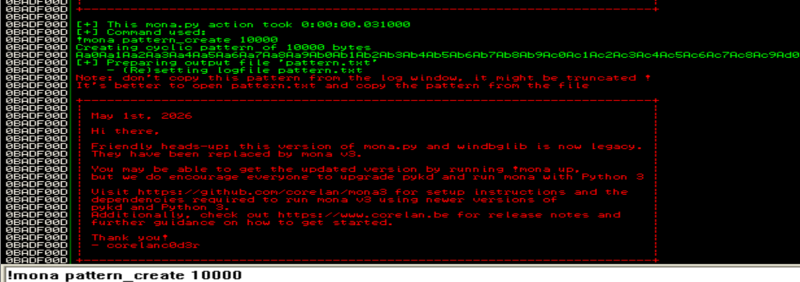

Since we need a lot, it will not be displayed when it is fully bloomed, but will be saved in a txt file. Originally, I put in 30,000 pieces, but I wonder why they made only 10,000 pieces. YouTuber (Sunsaengnim) said that if it exceeds 10,000 pieces, there is a limit to creating new patterns, so the patterns become difficult to detect later.

So, rather than filling all 30,000 with patterns, I created the payload by filling 20,000 with A in the front, which had a lower probability of getting caught, and then adding another 10,000 patterns to the back.

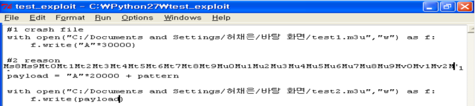

I roughly planned it like this

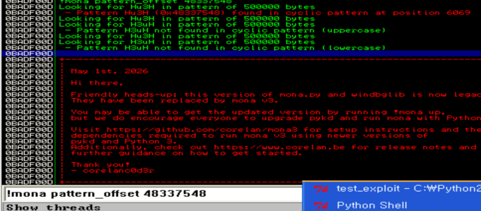

- Pattern Hu3H (0x48337548) found in cyclic pattern at position 6069... appears. In other words, the offset is 6069. However, since only 2 was included, 26069 is actually the offset. Once you know the offset, you need to know the shell code to insert. There is a payload generation tool included in the Metasploit Framework called MSFvenom. When using

msfvenom -p <payload type> <options> -f <output format> -o <output file>

This will extract the reverse shell shellcode in Python byte string format and paste it into the payload of the exploit script created earlier.

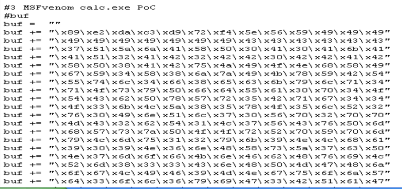

I just copied and pasted it on YouTube. It is a shellcode that launches a calculator, and PoC is a (proof of concept).

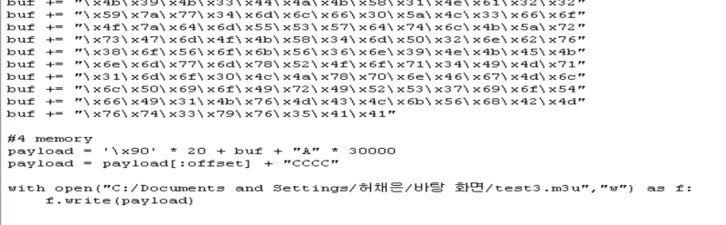

[20 bytes NOP] + [actual shellcode (buf)] + [30,000 bytes of A]

Meaning: All elements necessary for the attack (NOP, shellcode) are placed at the beginning, and then filled with an extremely long "A", causing the program to completely overflow the buffer size it can handle.

NOP stands for “No Operation,” which means that even if the CPU executes an instruction, it moves on to the next instruction without performing any special actions. In vulnerability research materials, there were cases where multiple NOPs were placed before the actual code. In this way, even if the execution location is not exactly the code starting point, you can arrive somewhere within the NOP section and then sequentially move to the actual code.

payload = payload[:offset] + "CCCC"

This part is key. Assume that you have found the exact location (offset value) where the EIP register is modulated through the unique pattern in the previous step (#2 Reason). payload[:offset]: Cuts only the string from the beginning to just before the offset. This truncated data already contains [NOP * 20 + buf + some A]. + "CCCC": Append "CCCC" immediately after the cut string. As a result, "CCCC" (\x43\x43\x43\x43) is placed at the exact offset position of the entire payload (i.e., the RET position from which the system reads the next address to be executed).

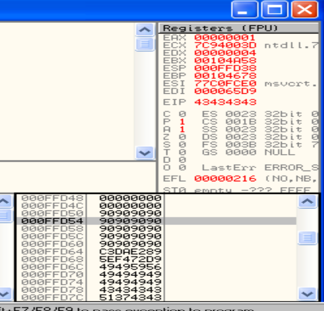

If you look at the EIP, you can see that it is just plastered with (\x43\x43\x43\x43). In other words, if you replace the addresses of 90 (NOP) there with C, the shellcode will be executed. Let's give it a try.

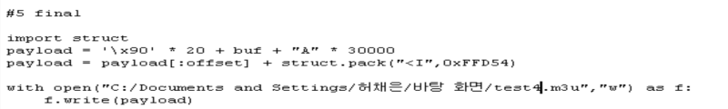

import struct

Meaning: Python's struct module is used to convert virtual memory addresses (numbers) into binary (byte) form that the system can recognize.

After that, if you unpack and enter that address, it will go to the address where the knob is and write the shellcode.

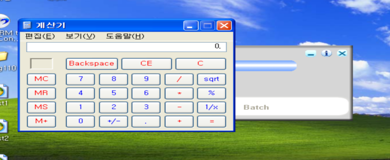

Then, when you insert this file (Test 5), a calculator appears. This is just a calculator as an example, but it can run many other programs.
