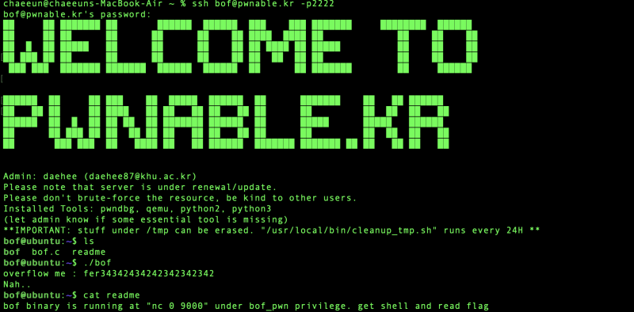
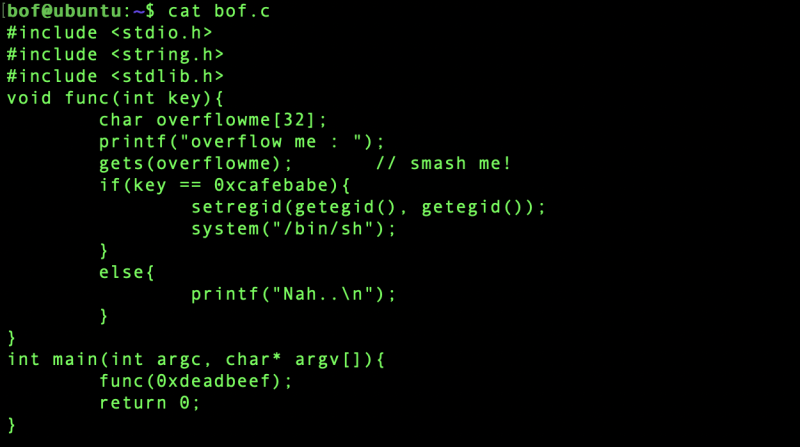
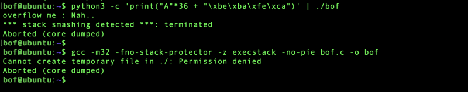
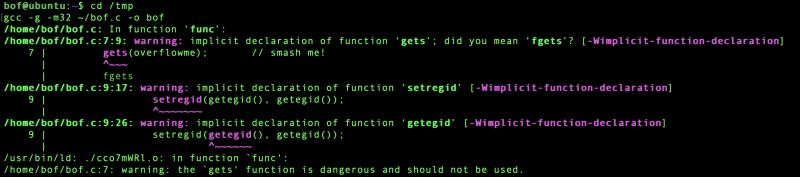
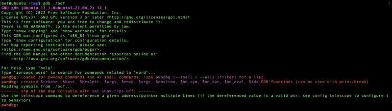
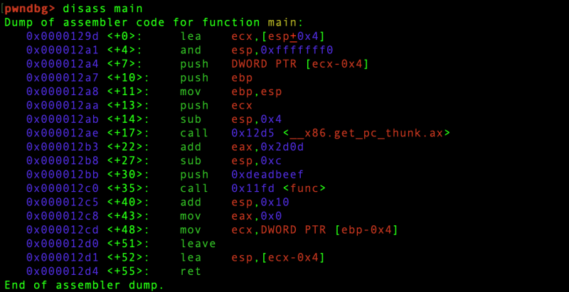
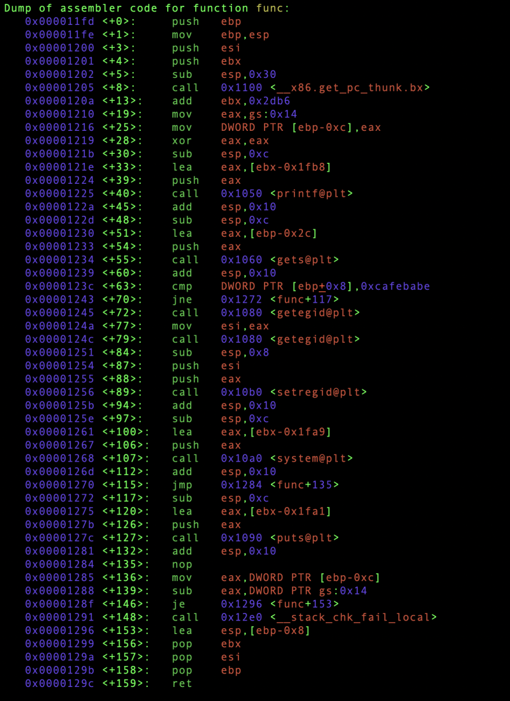
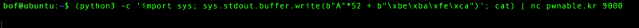
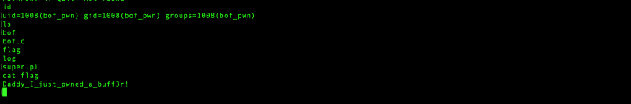

# pwnable.kr: bof

> Originally published on [Naver Blog](https://blog.naver.com/chaeeunhur630/224242853857). Translated and reformatted in English.

Finally, the overflow problem!

python3 -c 'print("A"*36 + "\xbe\xba\xfe\xca")' | ./bof

After confirming that it is 34 bit and entering the value after 32, this message appears.

This message means that Stack canary is turned on. That is, the currently compiled binary has: -fstack-protector enabled. So the canary value was broken before the key was covered, and the program was aborted. So this is not a simple overflow problem, the key is to bypass the stack protector. I tried disabling Canary and recompiling, but I got permission denied. In other words, bypass seems to be important for this problem.

Let’s analyze the main function and func function with gdb.

--> There are 52 bytes away from overflowme to key.

The gets() input buffer is located at [ebp-0x2c], and the key value is located at [ebp+0x8].

So the offset is:

0x2c (buffer → ebp) + 0x8 (ebp → key) = 0x34 (52 bytes)

In other words, a total of 52 bytes are needed to cover the key.

--> 52 bytes (any value) + 4 bytes (0xcafebabe, little-endian: \xbe\xba\xfe\xca)

==> 'A' (any value)*52 + '\xbe\xba\xfe\xca'

Using `python3 -c 'print("a"*52 + "\xbe\xba\xfe\xca")'` fails because text encoding changes the intended raw bytes, causing the stack canary check to fail.

It turns out that in Python 3:

"A"*52 + "\xbe\xba\xfe\xca"

This is not a byte string, but a Unicode string.

In other words, “\xbe” is not “0xBE one byte”,

It is treated as the characters U+00BE.

For example:

\xbe → Unicode character ¾

\xba → Unicode character º

\xfe → Unicode character þ

\xca → Unicode character Ê

Strings in Python 2 were mostly “bytes,” and strings in Python 3 were “Unicode text.”

So..

After that

