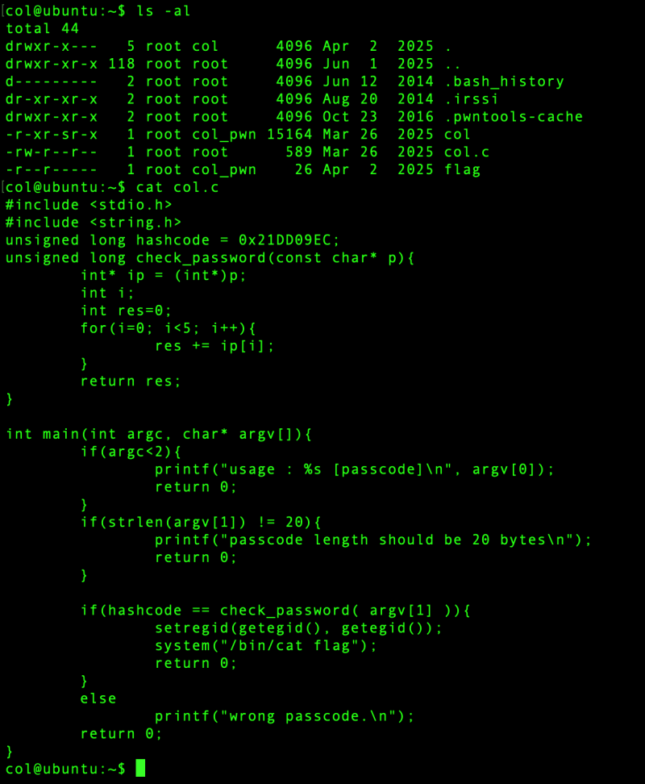
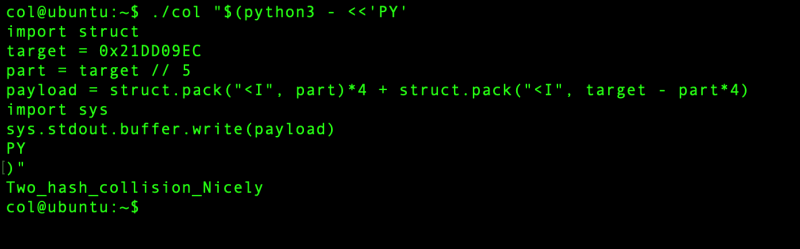

# pwnable.kr: [collision

> Originally published on [Naver Blog](https://blog.naver.com/chaeeunhur630/224200055227). Translated and reformatted in English.

col.c. Let's take a look at the C language code. If you look at the code below, you can see the four most important ones.

Input length is exactly 20 bytes

Cast input string to int*

Divide into 5 parts of 4 bytes and add them.

Success if the sum is 0x21DD09EC

That is, the input is 20 bytes → 4 bytes × 5

ip[0] + ip[1] + ip[2] + ip[3] + ip[4] = 0x21DD09EC

Now, let’s calculate the target value. First, change the hexadecimal number to decimal. 0x21DD09EC = 568134124 (decimal). And do //5 according to the code.

part = target // 5

568134124 // 5 = 113626824

113626824 × 4 = 454507296

Remaining value = 113626828

Therefore

113626824

113626824

113626824

113626824

113626828

The important thing here is that Linux Ubuntu uses little endian.

Since the file was not created, I decided to just run it in one line without a file. That is, 4-byte integers are stored backwards. Let's keep that fact in mind when writing code. Please note that the Python code file was not created separately, so it can be executed directly with one line.

./col "$(python3 - <<'PY'
import struct
target = 0x21DD09EC

part = target // 5
# Evenly distribute the target value to divide it into 5 ints
# Set 4 out of 5 to the same value

payload = struct.pack("<I", part)*4
# Convert part value to 4-byte Little Endian unsigned int
# Repeat this 4 times to generate a total of 16 bytes

payload += struct.pack("<I", target - part*4)
# Calculate the remaining values excluding the four sums created previously
# Add the last 4 bytes to complete a total of 20 bytes

import sys
sys.stdout.buffer.write(payload)
P.Y.
)"

And if you run it.

