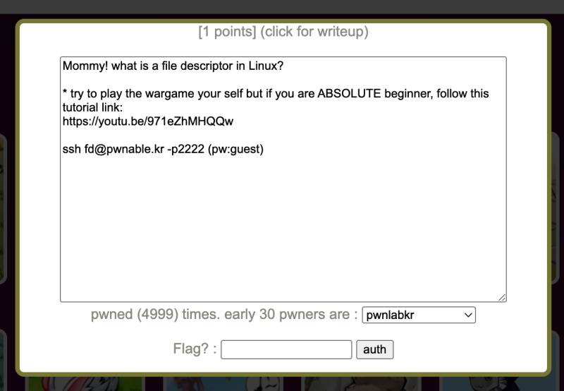
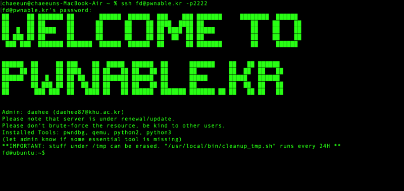
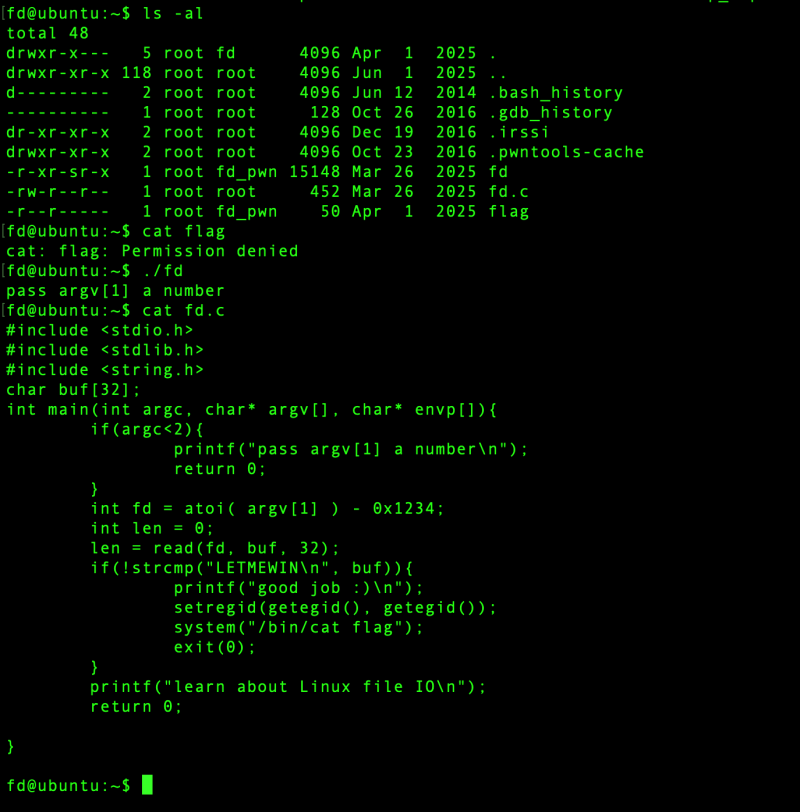
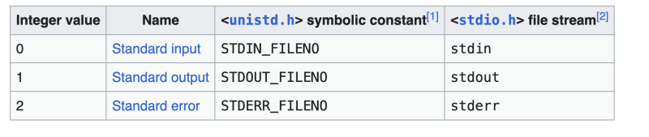
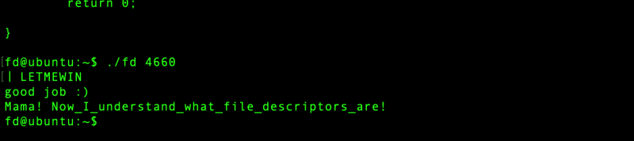

# pwnable.kr: [fd

> Originally published on [Naver Blog](https://blog.naver.com/chaeeunhur630/224199787393). Translated and reformatted in English.

pwnable.kr

Let's access the problem using SSH.

Running `ls -al` shows that the flag is readable only by the `fd_pwn` group. The supplied `fd` program accepts a numeric `argv[1]`, so the next step is to inspect its C source and determine how that value is used.

Let's take a look at the code.

int fd = atoi(argv[1]) - 0x1234;
read(fd, buf, 32);

The value obtained by subtracting 0x1234 from the input value is used as the file descriptor for read(). 0x1234 is 4660 in decimal. I searched the Internet to understand the concept of file descriptors.

Since what we want is to read from stdin, we just need to set fd to 0.

Input value - 4660 = 0

Input value = 4660

Therefore, if you run the file with ./fd 4660, a space for input will appear. If you follow the code and write LETMEWIN there, the key will appear.

