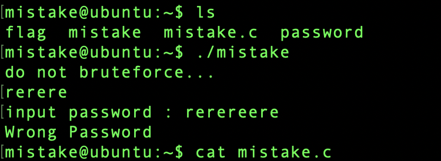
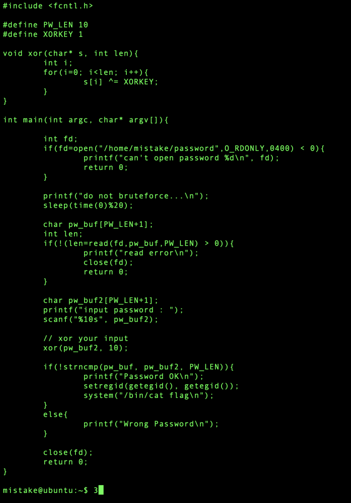
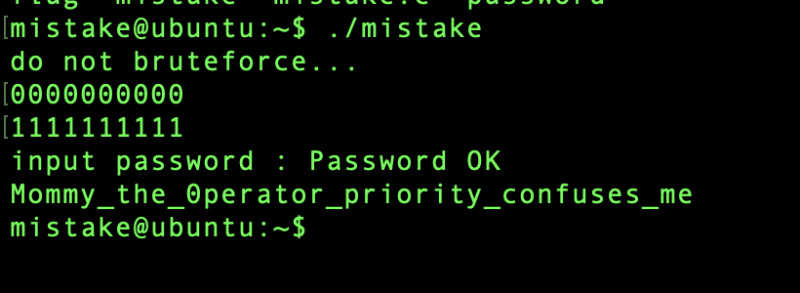

# pwnable.kr: mistake

> Originally published on [Naver Blog](https://blog.naver.com/chaeeunhur630/224271807476). Translated and reformatted in English.

The goal is to recover the password and read the flag. The analysis begins with the provided source code.

The program compares an entered value with the stored password. The vulnerability is in the conditional expression surrounding `open()`.

The key issue is operator precedence in the `open()` conditional.

if(fd=open("/home/mistake/password",O_RDONLY,0400) < 0){

Intended code:
cif((fd = open(...)) < 0) // save to fd and check if it is a negative number

Actual operation:
cif(fd = (open(...) < 0)) // Compare first! Result (0 or 1) is stored in fd
The < operator has higher priority than =, so the comparison result (0 or 1) goes into fd.

Since there are two, I will also take a close look at the read() conditional statement (focus)

if(!(len=read(fd,pw_buf,PW_LEN) > 0)){

For the same reason:
cif(!(len = (read(fd, pw_buf, PW_LEN) > 0)))
// len stores 0 or 1, not the actual number of bytes read
As a result

fd is 0 or 1, not the return value of open()
If fd = 0, standard input (stdin) is read!

fd = 0 → read(0, pw_buf, PW_LEN) → Read keyboard input

Since pw_buf and pw_buf2 are both my inputs, I can enter any value I want.

strncmp(pw_buf, pw_buf2, 10) == 0

To pass this condition, pw_buf == XOR1(pw_buf2). That is, input the value to be entered into pw_buf first, XOR 1 that value, input the result into pw_buf2, and pass strncmp!

For example, if you enter 0000000000, the result of XOR 1 is 1111111111:

First input: 0000000000

Second input: 1111111111

When I do this, Password OK appears.

