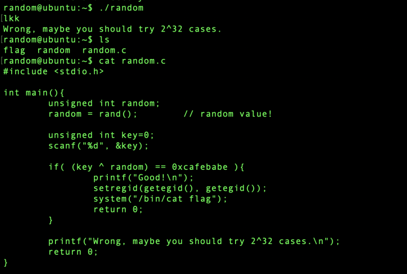

# pwnable.kr: [random

> Originally published on [Naver Blog](https://blog.naver.com/chaeeunhur630/224270976828). Translated and reformatted in English.

flag requires permission. If you look at the random code, if you enter the password correctly, a flag will appear.

This problem is a CTF problem that exploits a vulnerability in the rand() function.

Key Vulnerabilities:

random = rand(); // No seed set!

If you do not set the seed with srand(), rand() always returns the same value. The default seed is fixed to 1.

Solution:

Find out the default return value of rand() and calculate the key that satisfies the condition key XOR random = 0xcafebabe.

key = rand() ^ 0xcafebabe

So just

python3 -c "print(1804289383 ^ 0xcafebabe)" | ./random

If you do

