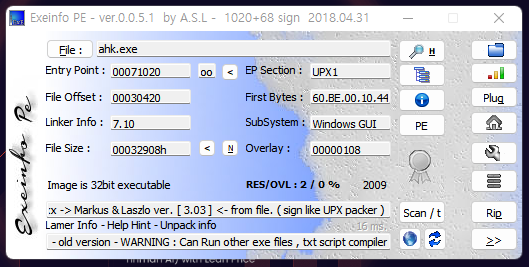
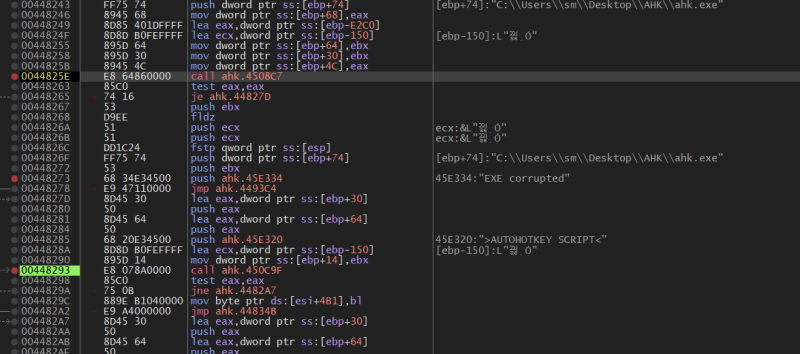
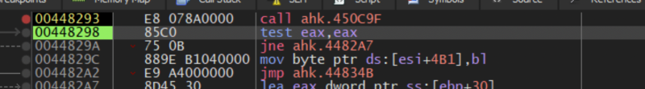
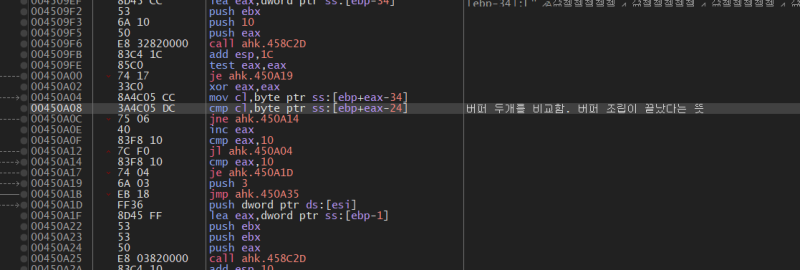

# reversing.kr: AutoHotkey1

> Originally published on [Naver Blog](https://blog.naver.com/chaeeunhur630/224141656146). Translated and reformatted in English.

This issue of AuthHotkey summarizes the process of extracting the DecryptKey and EXE Key to derive the final AuthKey. The final authentication key (AuthKey) in this problem consists of the following formula: AuthKey = un_md5(DecryptKey) + " " + un_md5(EXE's Key)

First, the type of the file was checked through EXEInfo.

The EXE subject to analysis was packed with UPX. If you run it after unpacking, you will see the following string: "exe corrupted"

This message does not mean that the EXE file is actually damaged. This is an error message displayed when the AutoHotkey runtime fails to properly load or decrypt the internal script (key). So if you follow the "exe corrupted" string in the debugger, you can see the following string nearby: AUTOHOTKEY SCRIPT. (For reference, the string exe corrupted appeared, so I analyzed the file in a repacked state)

Let's take a closer look at the code. I analyzed the code and entered the 450C9F function, and found out that it is a function that calculates and assembles the EXE Key and then passes it in the form of a string object.

In other words, you can see that the most appropriate point to check the EXE Key is right after the function returns. I applied a hardware BP to the 450C9F call part after the AuthoHotKey Script, and then used Step Over (F8) instead of Step Into to check the register status immediately after the function call. After that, I noticed that the ECX value was changing, and at this point I knew that ECX points to an AHK string object. If you follow the internal pointer pointed to by ECX, an MD5 format string (EXE Key) can be found in the ASCII/Unicode area: 54593f6b9413fc4ff2b4dec2da337806

After that, I looked at the surrounding assembly language to find out the DECRYPT KEY, and saw 4508C7, the last function called right before entering the AUTOHOTKEY SCRIPT branch. Looking at this function, I found out that it was a function that checks whether or not I can go to the AUTOHOTKEY SCRIPT branch. This was determined by the return value (EAX) of sub_4508C7, and it was found that this is the part where the DECRYPT KEY can be found (because entering AUTOHOTKEY SCRIPT = decryption or verification process is successful).

After looking inside, the 4508C7 function performs the following roles.

Obtain the path to your own executing EXE file

Combination of two internal fixed constant tables

Calculate verification value (Decrypt judgment value) based on executable file

Return success or failure based on calculation results

In other words, this function is not a function that stores DecryptKey in string form,

This is a function that contains the materials and verification logic that create the DecryptKey.

In order to directly obtain the DecryptKey, you must find the “moment when buffer assembly is finished.”

In this problem, whether the buffer assembly is complete can be checked through the following comparison loop.

Comparison range: 0 to 15 bytes

All bytes must match for the loop to terminate normally.

That this loop ends without breaking means:

Calculated Buffer B

Expected value buffer A

This means that both buffers are completely identical,

In other words, the “buffer assembly + key calculation + verification” process has been completed.

If you continue to follow the code after the comparison loop, a key will appear in the EBX Registers window at the following address: 0x00450A7F

If you check the ASCII code at this point, you can check the DecryptKey that has been verified.

DecryptKey: 220226394582d7117410e3c021748c2a

After that I used an MD5 inversion site called https://md5.gromweb.com/ to get the anchor.

Final result:

isolated pawn
