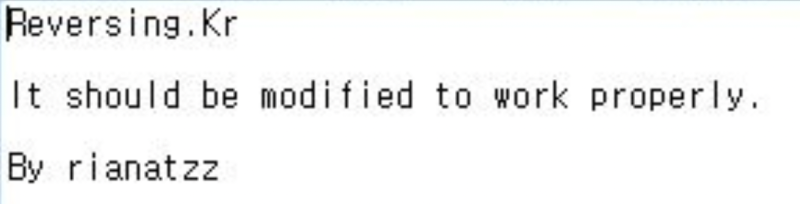
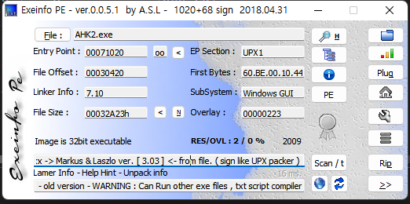
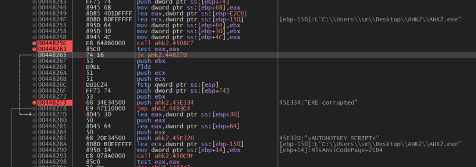
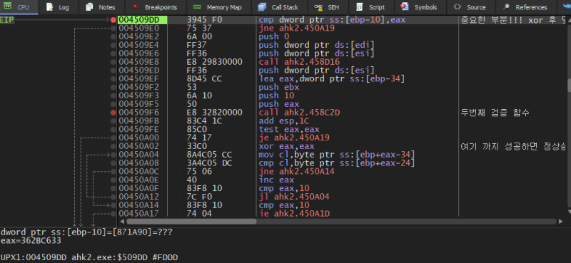
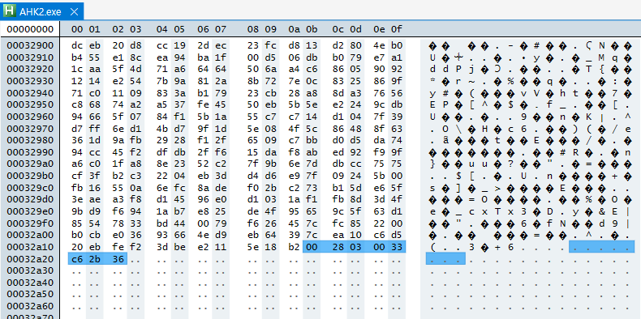
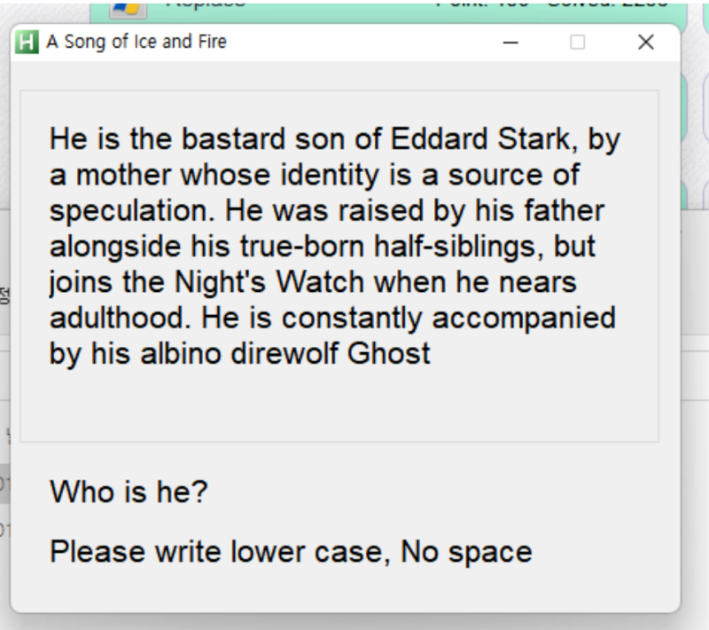

# reversing.kr: AutoHotkey2

> Originally published on [Naver Blog](https://blog.naver.com/chaeeunhur630/224149734853). Translated and reformatted in English.

I downloaded the file and looked at exeinfo and found that it had an upx pack. When I run it, the message “exe corrupt” appears, and even if I unpack it, it’s the same. You can check what needs to be done by reading the text file.

The CRC routine must be debugged from the original executable rather than from an already-unpacked copy. A string reference to `exe corrupt` leads to function `0x004508C7`, which performs the integrity check and branches to the error message on failure.

If you analyze the inside of the function, you can see the code below. When analyzed, the program calculates a certain value (EAX) and XORs 0xAAAAAAAA to that value. Afterwards, in the next line of assembly language, the value read from the file is compared with the xored value. Additionally, [ebp-10] shows that the value read from the last 4 bytes (EOF-4) of the file, that is, the CRC value, is stored at the end of the file. In other words, the reason it says "exe corrupted" here is because the 4 bytes at the end of the last file are different from the value obtained by XORing eax with 0xAAAAAAAA.

Therefore, open the file with a hex editor. And change the last 4 values ​​to the value obtained by xoring eax above (little endian). However, if you save and run it again, you will see exe corrupt appear again. Let's see why. If you analyze the code again, you can see that EOF-8 is “environment value” and EOF-4 is “CRC result in that environment.” In order to restore the ‘normal self-verification file structure’, run the normal AutoHotkey executable AHK1 file in a hex editor and copy EOF-8 to EOF-4.

If you do this, the first corrupt branch will pass normally.

This value is part of the executable's CRC-based integrity check.

