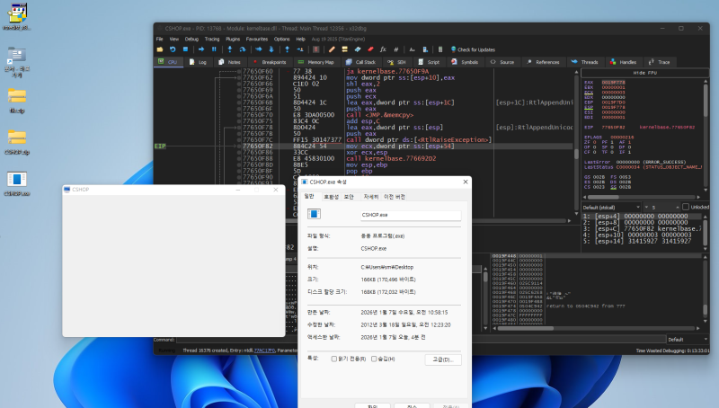
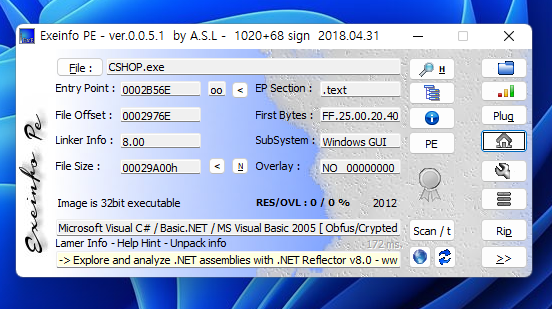
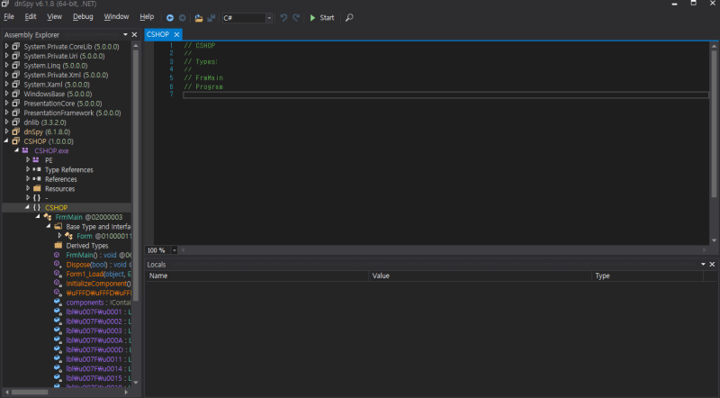
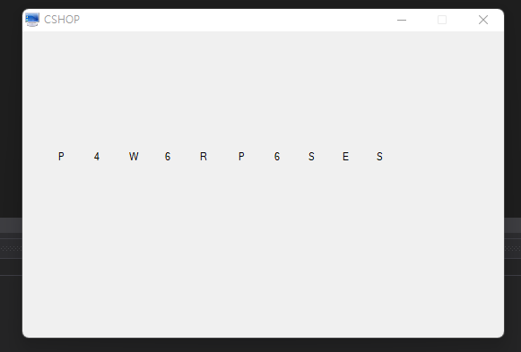
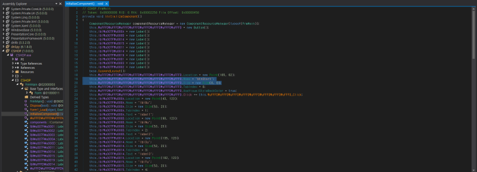

# reversing.kr: CSHOP

> Originally published on [Naver Blog](https://blog.naver.com/chaeeunhur630/224137683773). Translated and reformatted in English.

The program initially appeared not to run.

I downloaded the file and ran it, but nothing came out. The debugger doesn't work and decompilation in Aida is impossible. Exeinfo PE is a very useful tool that analyzes the header information of a file and tells you what language it was created in. Since I don't have it, I'll download it first.

If you see phrases like UPX or Themida, it means that the code is compressed/protected, but the image is not packed or has no relevant information, so it is not packed. It is a net file, and at the bottom, Exeinfo kindly gives a tip to “analyze with .NET Reflector.”

The reason why a debugger cannot be used is that .NET programs are executed as intermediate code called **IL (Intermediate Language)**, not machine language. This is because when you open it with a regular debugger, you only see the process of Windows loading the .NET environment, and it is very difficult to find the actual source code that is actually important. That's why you need a .NET-specific analysis tool. I would use dnSpy instead of the paid Net Reflector.

Load the executable into dnSpy by dragging it into the assembly explorer.

Running the program with F5 and pressing the space bar reveals a flag, although this is not the intended analysis path.

Inspection of the main function reveals a hidden `btnstart` control whose size is set to `0,0`. Patching the dimensions in dnSpy provides an alternative solution by making the button visible.

