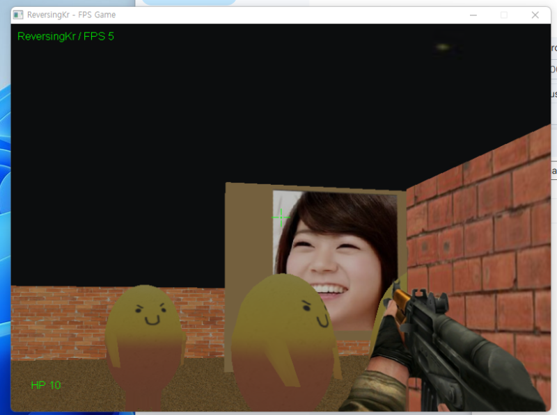
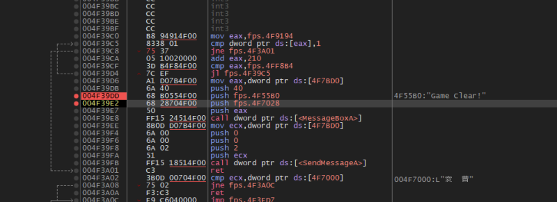
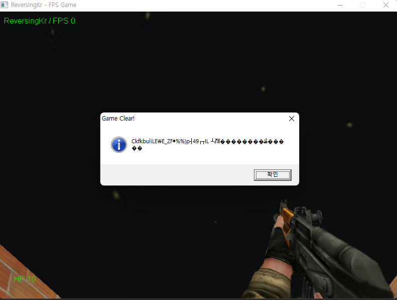
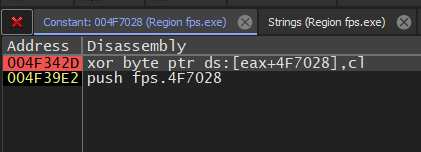
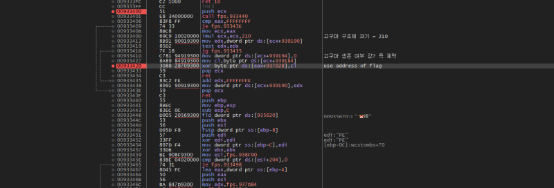
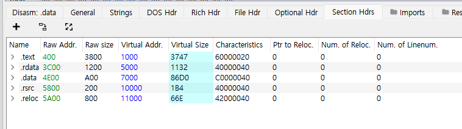
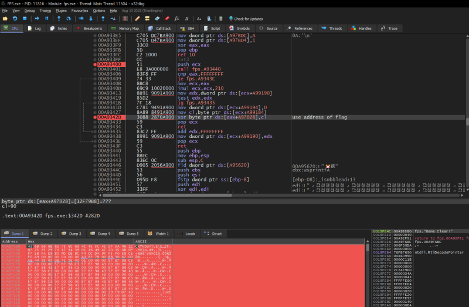

# reversing.kr: Direct3D FPS

> Originally published on [Naver Blog](https://blog.naver.com/chaeeunhur630/224163891187). Translated and reformatted in English.

Let's look at the problem. When you run the file, the game appears. When I look around, pictures of Kara and roasted sweet potatoes are suddenly flying around. You can shoot roasted sweet potatoes with a gun up close, and if they touch the sweet potatoes, their HP will be depleted and they will spawn at the respawn location. Let's take a look at the code.

(Mouse capturing keeps happening on the screen, but it can be avoided with alt + tab.)

Opened it with x64 debugger. Go to the main function and search for a string.

By patching the conditional statement, a game clear message window appears (JE --> JNE). That's why a strange ASCII code window appeared. It's probably true that the correct answer value appears, but I made a clear window appear through the patch, so it seems like the encryption wasn't broken.

I think the address 004F39E2 from earlier is the address of the flag value.

Got to memory dump. Ctrl + R follows. The code is analyzed here. This game is an FPS where you shoot and kill sweet potatoes (enemies). Each sweet potato is a structure. Every time you “kill” a sweet potato, a specific byte in the flag buffer (fps.A97028) is updated with XOR. Flag = Result of “Which sweet potatoes were killed in which order and how many times.” You can see that 00A933FF ~ 00A9343F are processing routines called when a sweet potato is hit.

Sweet Potato Index Calculation:

call fps.A93440
cmp eax,FFFFFFFF
je fps.A9343E
mov ecx,eax
imul ecx,ecx,210 ; sweet potato struct size = 0x210

fps.A93440 → Returns the index of the currently hit sweet potato

Invalid if eax = -1

If valid:

ecx = sweet potato index * 0x210

Sweet Potato Structure Array Access

---------------------------------------

When sweet potato dies: flag XOR

mov dword ptr [ecx+A99194],0 ; Sweet potato survival = dead
mov cl, byte ptr [ecx+A99184] ; Sweet Potato Unique ID/Key
xor byte ptr [eax+A97028], cl ; flag update

So when is the flag “complete”?

Game clear condition = All sweet potatoes die

If you kill all sweet potatoes:

Flag buffer (A97028) is in final state

The status is output as a MessageBox.

That is: flag[i] = struct[i] ^ Sweet Potato_Key[i]

Looking at the code, all the keys are “already in the structure”. In other words, if you extract the entire structure, you can obtain the entire set of keys.

------------------

Now, how do we get the entire sweet potato structure? Remember that the first decrypted address of the structure in assembly language was 4F9194. Considering the image base value, the relative address is 9194. However, when viewed with PE viewer, the Size of Raw Data is much smaller. That is, --> the sweet potato structure is written to memory after the program is loaded into memory.

Since the original file does not have data about the sweet potato structure, let's create a new exe with the data about the sweet potato structure stored in memory and create a file that can view the data about the structure (using the Syllica plugin of 64dbg).

Let's calculate the structure address! Converted the RVA of the structure to RAW (remember the RVA to RAW formula: RAW = RVA - Section.VirtualAddress + Section.PointerToRawData). HxD saved the offset and saved it as a file!

RVA: 0x9184 ~ 0xF8A4

RAW: 0x6F84 ~ 0xD6A4

It also finds flags to xor with!

It was given in the dump window of 64dbg. The values are:

43 6B 66 6B 62 75 6C 69 07 25 25 29 70 17 34 39 F7 EB FA E8 B0 FD EB BC F0 A9

------------------------------

Decryption method

flag[i] = Structure[i] ^ Sweet Potato_Key[i]

The recovered formula was applied programmatically to calculate the required values from the extracted data.

For reference, there are important parts when performing calculations.
1. In reality, there are a series of 0x210 byte unit structures, and only the first byte of each structure is used as the key. That is, sweet potato_key[i] = struct[i * 0x210].first_byte
2. The last structure among the structures is excluded from the calculation. The reason is that the sweet potato key byte length is the actual number of flag bytes, but the structure length is one longer, and the final structure does not match flag 1:1.

Then, Congratulation~ Game Clear! Password is Thr3EDPr0m
