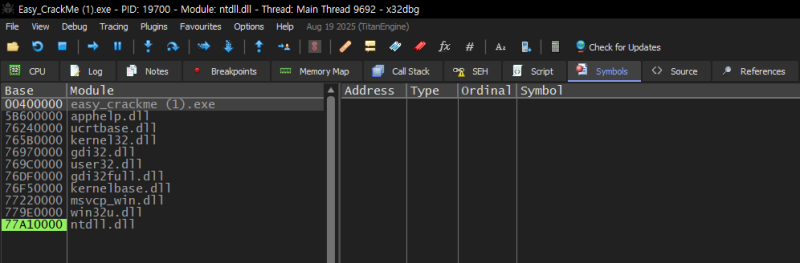
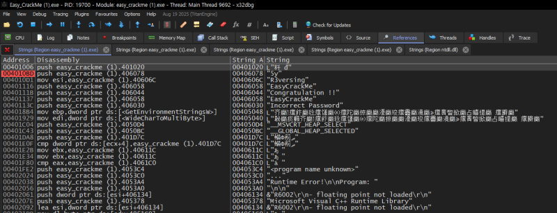
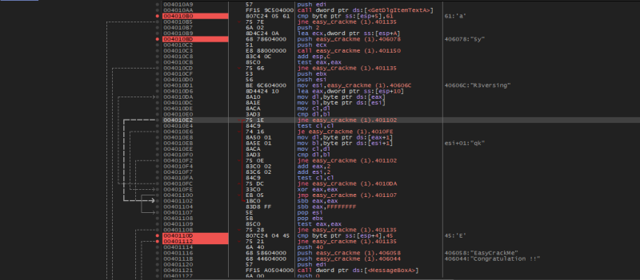
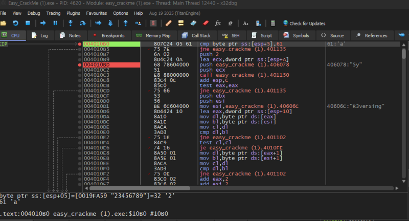
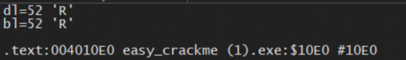

# reversing.kr: EASY CRACK ME

> Originally published on [Naver Blog](https://blog.naver.com/chaeeunhur630/224133257591). Translated and reformatted in English.

** Because it is a war game solved as a hobby, expertise and in-depth understanding may be lacking. Since I am uploading this for personal records, if you want expertise, please look for solutions on other security blogs.

After downloading the Easy Crackme problem file from Reversing.kr, open the executable file in x32dbg. If you check the Symbols (or Modules/Functions) window on the left, you can see main (or entry point → function leading to main) and several DLL functions. Since the goal of this problem is to analyze the password (flag) verification routine, double-click main (or the function assumed to be main) and move to the disassembly view.

Open Strings (A2) and find the string that will be displayed on the screen when the program is run. For example:

A string that appears as the program title/prompt (e.g. EasyUnpack me, etc.)

Failure message (e.g. incorrect / incorrect password)

Success message (e.g. correct)

Once you find these strings, move to **XREF (reference location)** in that string.

It is usually referred to as push offset "incorrect", and a branch condition (je/jne) or cmp/test exists near that point. In other words, in many cases, “near the success/failure string = branching point of the verification result.”

So, set a breakpoint on:

incorrect Code line immediately before/after output

Code line immediately before/after correct output

cmp/test/je/jne nearby (judging the verification results)

If the verification routine is separated into functions such as call 401150, place a BP on that call as well and enter F7 (Step Into) to check the inside.

If cmp appears continuously inside or code that compares byte by byte based on the input buffer address is likely to be “character-by-character verification.”

Since you don't know the answer yet, run it with F9 (Run) and enter the input value arbitrarily. For example, try entering a value with a length such as 123456789. Afterwards, registers/memory are observed every time the BP reaches the cmp (you can see the user's input and (single digit) are compared with the answer). If you proceed with the program as is, an incorrect password message will appear, so if the user's input and the answer (a and 2) being compared are different as shown in the picture below, you can sequentially find out the password by replacing the comparison value at the incorrect point with the correct answer. 123456789 Instead, reset the program again and fill in the incorrect parts with the correct parts. (1a3456789)

If you modify the input based on the comparison results confirmed by BP, the password is revealed sequentially, up to 1a5y56789. After that, look at R3versing, which appears as a hint string in the program screen/register/memory, infer the remaining part, and change the answer back to 1a5yR3versing. Then, in the following cmp statements, you can see that the values ​​compared to the user input match exactly.

(Like this). After exiting the loop, you can see that 1 and E are compared once more in the cmp statement right after the correct string. Therefore, you can see that the value of the user input 1 changed to E is the correct answer. If you then run the exe file and run Ea5yR3versing, you can see that the answer is correct.

Then, you get a flag (password) called Ea5yR3versing.
