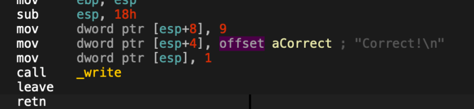
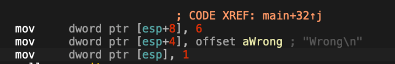
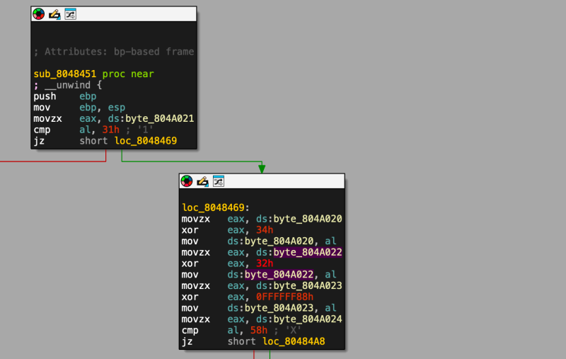
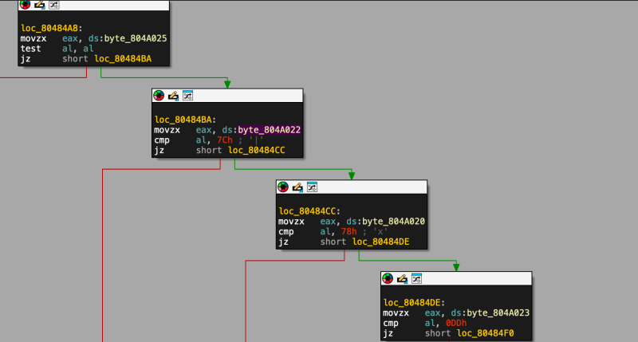

# reversing.kr: Easy ELF

> Originally published on [Naver Blog](https://blog.naver.com/chaeeunhur630/224136587280). Translated and reformatted in English.

Easy elf, must be run in a Linux environment. Let's take a look at how the file runs. After that, I will do a static analysis in Aida. I roughly looked into the program by searching strings. Judging from the fact that there are strings like Correct and Wrong, it seems like a program that checks whether something like a password is probably true or not.

If you look at the large regular function above, you can find a place that continuously repeats cmp and jmp. If you debug here, you may be able to find the password.

Upon closer analysis, you can see that this is a verification routine that transforms (XORs) a typical input string one byte at a time and then compares it to a specific value.

Let's look at the first quarter. If byte_804A021 == '1' (0x31), proceed to the next step. Or a straight path to failure. You can see that the specific position of the input (perhaps index 1) must be the character 1.

The second part is important. Here, you can see that byte_804A020 is read and the XOR result with 0x34 is stored back in byte_804A020. Here, byte_804A020 is input[0].

In the second operation, input[2] ^= 0x32 is the same.

Although 0FFFFFF88h looks a bit unusual here, what is stored is al, or the lower 1 byte. So the actual effect is input[3] ^= 0x88

After the transformation, the comparison continues immediately. input[4] == 'X'.

Also, here test al, al is “test whether it is 0”. If it is 0, ZF=1 → jumps to jz. In other words, you can see that [0]~[4] are characters and [5] is \0. The thing to note in the next block is that all the values ​​being compared here have been transformed into input[2] ^= 0x32 in front of Daimi and saved again. In other words, the value being compared is the “value after transformation.”

That means the conditions are:

input[2] == '|' XOR 0x32

0x7C XOR 0x32 = 0x4E

0x4E = 'N'

input[2] = 'N'

Also:

input[0] == 'x' XOR 0x34

0x78 XOR 0x34 = 0x4C

0x4C = 'L'

input[0] = 'L'

Also:

input[3] == 0xDD XOR 0x88

0xDD XOR 0x88 = 0x55

0x55 = 'U'

input[3] = 'U'

To summarize the conditions we have confirmed:

input[0] = 'L'

input[1] = '1' (in the initial comparison)

input[2] = 'N'

input[3] = 'U'

input[4] = 'X'

input[5] = '\0' (end string)

That means the final input string is:

It is L1NUX.
