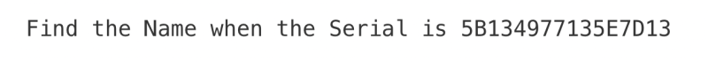
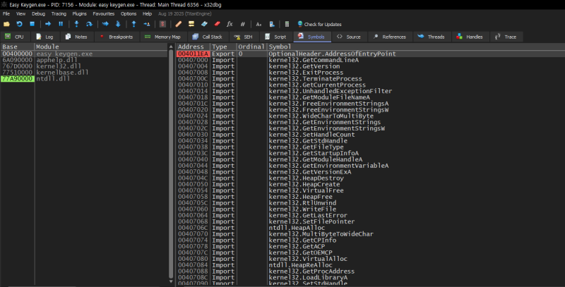
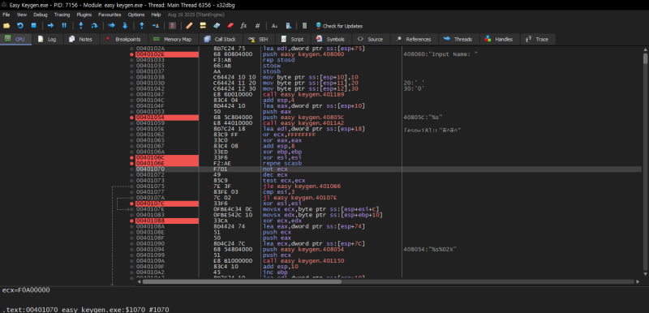
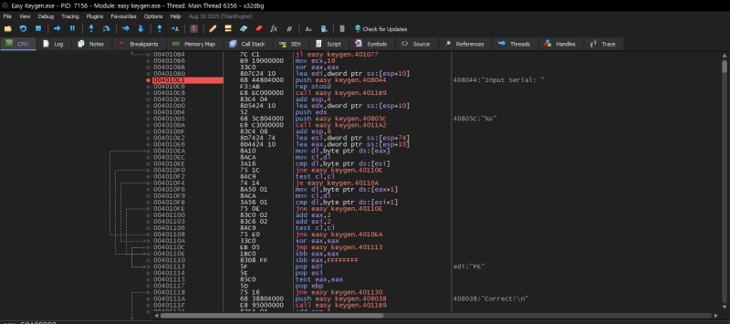
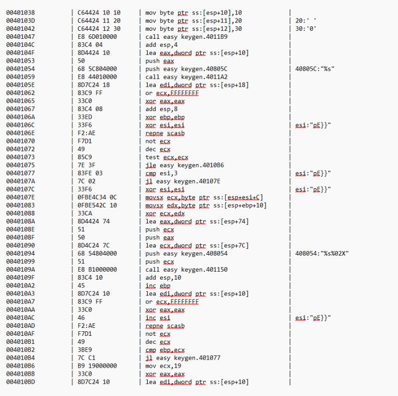
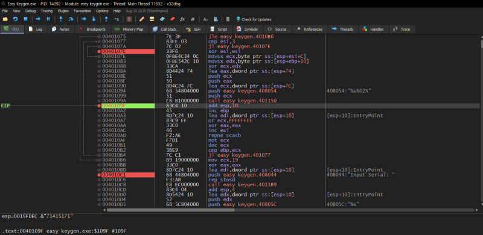

# reversing.kr: EASY KEYGEN

> Originally published on [Naver Blog](https://blog.naver.com/chaeeunhur630/224133323775). Translated and reformatted in English.

** Because it is a war game solved as a hobby, expertise and in-depth understanding may be lacking. Since I am uploading this for personal records, if you want expertise, please look for solutions on other security blogs.

There are two files. One is an executable file and the other is a note containing the war game instructions.

After downloading the Easy Keygen problem file from Reversing.kr, open the executable file in x32dbg. If you check the Symbols (or Modules/Functions) window on the left, you can see main (or entry point → function leading to main) and several DLL functions. Since the goal of this problem is to analyze the routine to check the correct name of the serial key, double-click main (or the function assumed to be main) and move to the disassembly view.

If you open Strings (A2) and search for a string that will be displayed on the screen when the program is run, you can see that it receives an input name first, and after completing some calculation, it receives an input serial below. Below that, the value is compared to the serial number, compared to the value created in the calculation. ** If you analyze the codes in the meantime, you can see that the serial number is created using one character (1 byte) of the entered name, and the loop is repeated as long as the entered name.

This means that the program runs:

Enter name --> Create a serial key by calculating the name --> Enter serial number -->

if(serial number == name) --> correct

if(serial number != name) --> wrong

To analyze the calculation in more detail, I added assembly language to Notepad.

If you look at the three lines above, you can see that the XOR operation is performed on one byte of the string (name), and 0x10, 0x20, and 0x30 are used in turns.

Let's continue debugging assembly language. call easy_keygen.401150 If we focus on this function,

0040108E | 51 | push ecx

0040108F | 50 | push eax

00401090 | 8D4C24 7C | lea ecx, dword ptr ss:[esp+7C]

00401094 | 68 54084000 | push easy_keygen.408054 | 408054:"%s%02X"

00401099 | 51 | push ecx

0040109A | E8 B1000000 | call easy_keygen.401150

The easy_keygen.401150 function is a sprintf series function that accumulates and attaches the XOR result to the existing serial string (0x19FE6C) as a hexadecimal string in %02X format.

The recovered algorithm can now be implemented in Python. The script below accepts a name and reproduces the serial-number calculation observed in the assembly.

Testing the loop with `aaaa` produces `71415171`; `aaaaaaaa` produces `7141517141517141`, and `abcd` produces `71425374`. These observations are sufficient to implement the following key generator:

def serial_to_name(serial_hex: str) -> str:

serial_hex = serial_hex.strip()

if len(serial_hex) % 2 != 0:

raise ValueError("Invalid serial length (must be even number of hex chars).")

key = [0x10, 0x20, 0x30]

out = []

for i in range(0, len(serial_hex), 2):

b = int(serial_hex[i:i+2], 16)

k = key[(i // 2) % 3]

out.append(chr(b ^ k))

return "".join(out)

Serial: If you solve 5B134977135E7D13 with the above logic:

Name = K3yg3nm3
