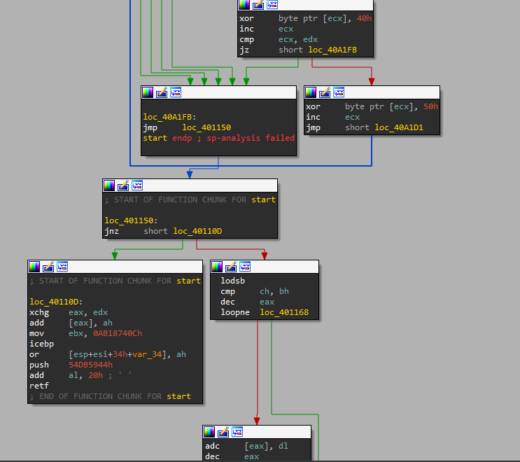
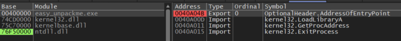
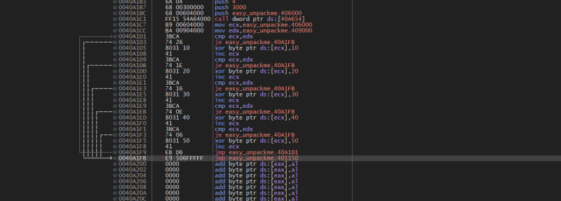

# reversing.kr: Easy Unpack

> Originally published on [Naver Blog](https://blog.naver.com/chaeeunhur630/224139847465). Translated and reformatted in English.

Packer is a protection technology that “compresses, encrypts, and transforms” executable files to make analysis and reversal difficult. Packers are mainly used to prevent reverse hacking. An unpacker refers to all actions, technologies, and tools that follow the execution flow of an executable file that has been transformed, encrypted, and compressed by a packer, and find the point at which the original code is completely restored in memory, that is, the OEP (Original Entry Point), making normal program analysis possible.

Here I will analyze the code with Aida. When analyzing the execution flow based on IDA's Graph View, many repetitive loops and meaningless branch codes such as XOR, INC, CMP, and JZ/JMP are observed at the initial entry point. These patterns are typical of packer decryption routines (packer stub), which are not actual program logic, but are a preparation step for restoring the original code in memory.

In particular, the loops at the top increase ecx and repeatedly perform the XOR operation on a specific memory area, and cycle through the same loop structure several times through conditional branching. In this section, the normal flow of function calls, API usage, and program logic does not appear at all, and the control flow is also artificially complicated and distributed. This is a characteristic of packing code intended to interfere with static analysis.

After this decryption routine ends, the execution flow goes through several branches and converges to a single point, which is 0x401150. Based on this address, IDA resumes normal function structure analysis with the indication START OF FUNCTION CHUNK FOR start.

The following changes are clearly observed in the code after 0x401150:

Meaningless loops and obfuscating branching structures are eliminated.

Instructions with normal logic flow such as lodsb, cmp, jnz, etc. appear.

Actual condition judgment and data processing code appears

The code flow then begins to form the logical structure of the program.

This is strong evidence that after the packer stub has completed all decryption and memory relocation, it passes control flow to the start of the original program, i.e. to the OEP.

If you want to use the x32 debugger, there is also a way to do this. Here's how. easy unpack me In the main function, go down to the Ep address. As you go down the code, you will see points where meaningless branches appear in one place in the same way.

In other words, we can know that 401150 is OEP. Therefore, Flag is 401150.
