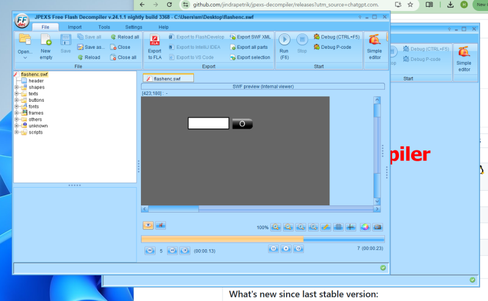
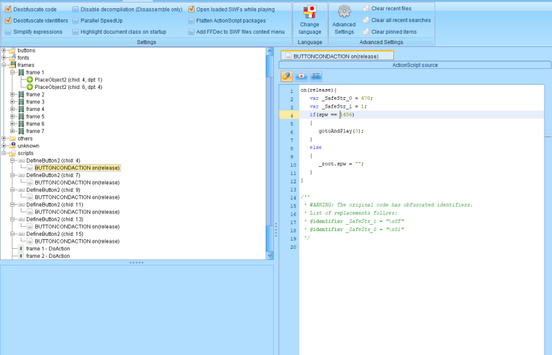
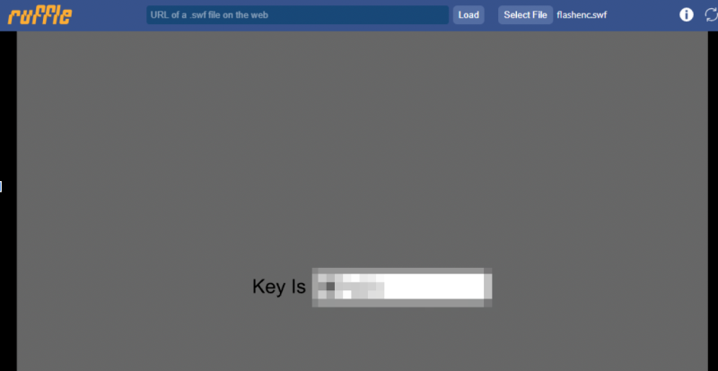

# reversing.kr: Flash Encrypt

> Originally published on [Naver Blog](https://blog.naver.com/chaeeunhur630/224139929724). Translated and reformatted in English.

I will try the ‘dynamic observation method’, which involves embedding a SWF file in HTML and executing it in the browser (or trying to do so).

<object>

<embed src="flashenc.swf" width="100%" height="100%"></embed>

</object>

To put it very simply:

This means that the flashenc.swf file will be embedded as a Flash object in the web page. But this is an old solution and doesn't work 99% of the time now. I'll probably have to use a lot of static analysis to solve it.

Here is a dedicated analysis tool for Flash Encrypt: https://github.com/jindrapetrik/jpexs-decompiler/releases?utm

First, run the file with F6. As shown above, several frames are repeated, with buttons frantically disappearing and appearing in different places. It seems that when you press that button, a key flag appears. The settings after this are important. Just follow the settings shown below. Then, you can view the decompiled source codes in the script directory. First, let's understand the meaning of the source code here. spw is like the password value entered by the user. gotoAndPlay(3) is like jumping to frame 3 and executing the code/screen there. In that way, you can solve it by going to frame 3 and looking at the code again.

So the logic of the code is:

If the input value is correct → move to success frame

If the input value is incorrect → Initialize the input value

eg.

[input]
↓
[Button 1] spw == 1456 ? → frame 3 → [Button 2] spw == 8 ? → frame 4 → [Button 3] spw == 88 ? → frame 5...
[Final frame] → flag output

...must pass several steps to get the final answer

So, when you analyze the code and follow the flow:

1456 → 25 → 44 → 8 → 88 → 20546 → flag; I knew it was going like this

I tried string search and various static analysis tools to find the answer, but couldn't find it. Looking at the official solution, it seems that it is solved using the HTML embed method, but it is not possible now.

I tried to do dynamic analysis with Save as exe, but that also blocked me. Instead, I installed the Flash Emulator, ruffle! Dynamic analysis is possible by dragging and dropping the SWF file. If you write down each item one by one according to the flow obtained earlier, you will get a flag at the end.

