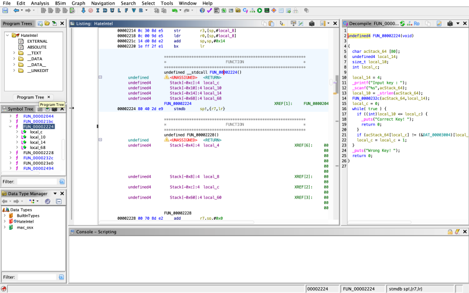
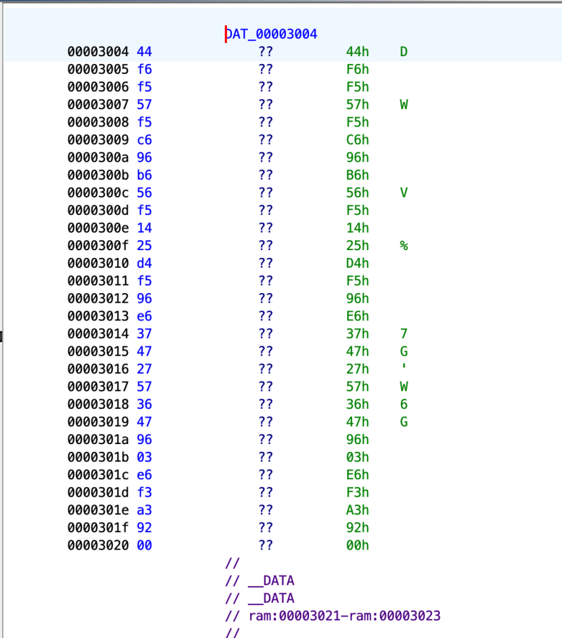

# reversing.kr: HateIntel

> Originally published on [Naver Blog](https://blog.naver.com/chaeeunhur630/224140564429). Translated and reformatted in English.

When I tried to run it, it was impossible to run it because the CPU architecture did not match. Instead, I'm going to try static analysis using Aida. Find the main function through string search. . If you try decompiling in Aida, it will tell you that there is no decompiler suitable for the current file. It seems that Aida does not support the ARM64 (Apple Silicon) decompiler. Let's try it with Gydra decompiler.

Here is the decompiled code:

int FUN_00002224(void)
{
 char input[80];
 unsigned int key_len;
 int i;
 int offset;

 offset = 4;

 printf("Input key : ");
 scanf("%s", input);

 key_len = strlen(input);

 // Function to transform the input string
 FUN_0000232c(input, offset);

 i = 0;
 while (1) {
 if (key_len <= i) {
 puts("Correct Key!");
 return 0;
 }
 if (input[i] != ((char *)&DAT_00003004)[i])
 break;
 i++;
 }
 puts("Wrong Key!");
 return 0;
}

full flow

Receives string input

Calculate length with strlen

Call FUN_0000232c(input, 4) → Transform input value

Compare the transformed input value with the answer table letter by letter

If everything is the same, “Correct Key!”

Now, what you really need is two things. FUN_0000232c() (how to change the input value) and DAT_00003004 (transformed input == DAT_00003004).

Then, let’s decompile FUN_0000232c(). Just click twice and follow along.

void FUN_0000232c(char *param_1, int param_2)
{
 char cVar1;
 size_t sVar2;
 int local_14;
 int local_10;

 for (local_14 = 0; local_14 < param_2; local_14 = local_14 + 1) {
 for (local_10 = 0;
 sVar2 = strlen(param_1), local_10 < (int)sVar2;
 local_10 = local_10 + 1) {

 cVar1 = FUN_00002494(param_1[local_10], 1);
 param_1[local_10] = cVar1;
 }
 }
 return;
}

important points

Round the entire string = 4 times

Apply FUN_00002494(char, 1) to each character

In other words, the result of applying FUN_00002494(…,1) 4 times per character is

Must be equal to DAT_00003004

To know the exact calculation method here, you must also decompile FUN_00002494():

uint FUN_00002494(byte param_1, int param_2)
{
 undefined4 local_10;
 undefined4 local_c;

 local_10 = (uint)param_1;

 for (local_c = 0; local_c < param_2; local_c = local_c + 1) {
 local_10 = local_10 << 1;
 if ((local_10 & 0x100) != 0) {
 local_10 = local_10 | 1;
 }
 }

 return local_10 & 0xff;
}

--> This is Rotate Left (ROL) based on 8 bits.

call structure

FUN_0000232c(input, 4);

And inside:

c = FUN_00002494(c, 1);

That is,

for one character

Repeat ROL 1 4 times

As a result:

final transform = ROL(input_char, 4)

(= rotate left 4 bits based on 8 bits)

Verification logic summary

ROL4(input[i]) == DAT_00003004[i]

Therefore the original input key is: input[i] = ROR4(DAT_00003004[i])

(rotate 4 bits to the right)

Then, in order to create a code based on the information, you can find the value by following DAT_00003004.

This is the Python code based on this:

data = [
 0x44, 0xf6, 0xf5, 0x57, 0xf5, 0xc6, 0x96, 0xb6,
 0x56, 0xf5, 0x14, 0x25, 0xd4, 0xf5, 0x96, 0xe6,
 0x37, 0x47, 0x27, 0x57, 0x36, 0x47, 0x96, 0x03,
 0xe6, 0xf3, 0xa3, 0x92
]

def ror4(x):
 return ((x >> 4) | (x << 4)) & 0xff

key = ''.join(chr(ror4(b)) for b in data)
print(key)

When printed, the key values are:

Do_u_like_ARM_instructi0n?:)
