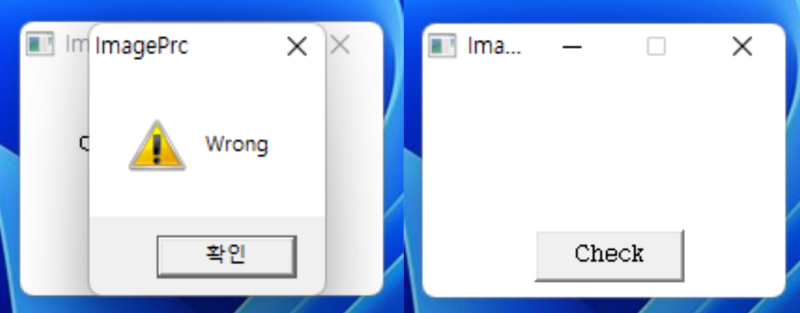
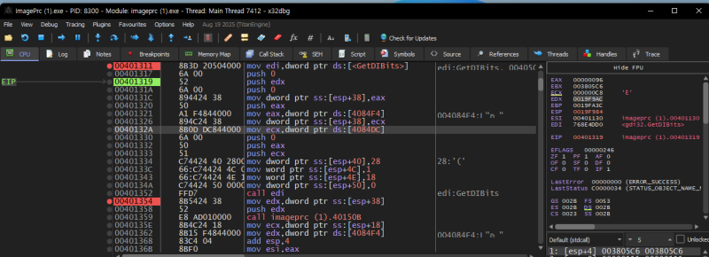
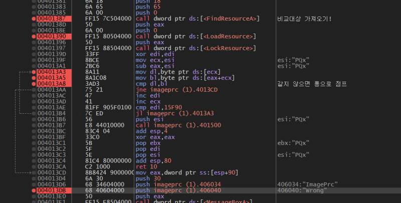
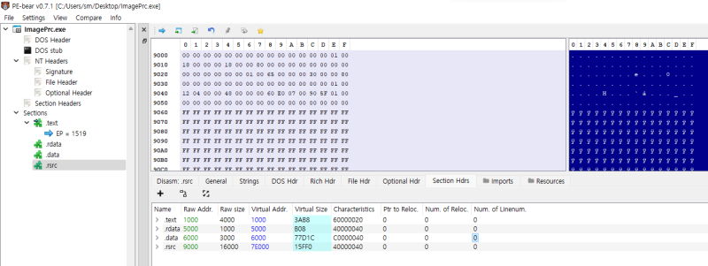
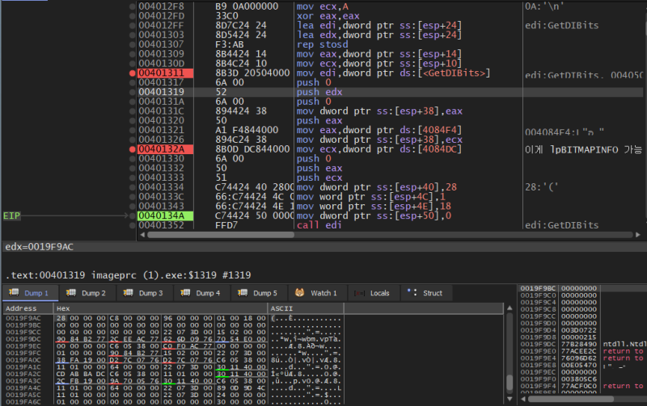
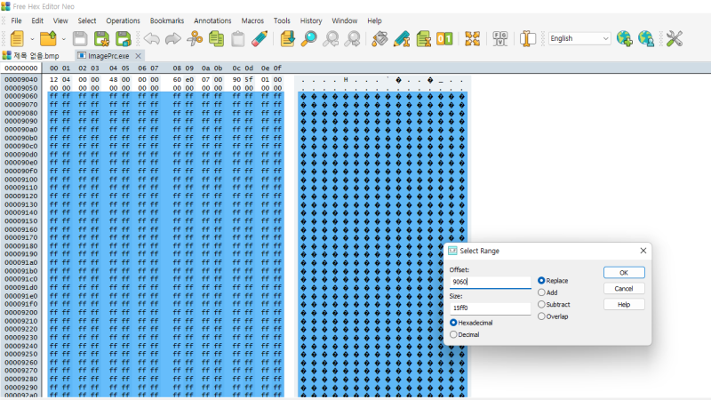
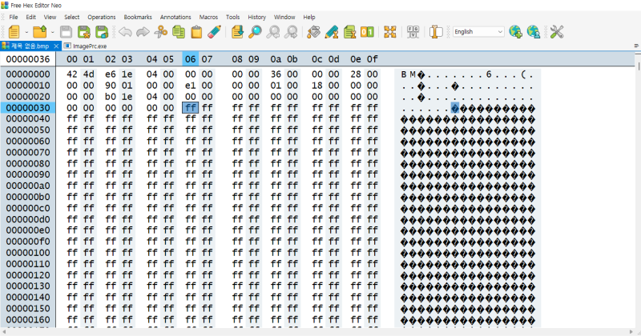
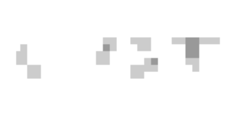

# reversing.kr: ImagePcr

> Originally published on [Naver Blog](https://blog.naver.com/chaeeunhur630/224139807571). Translated and reformatted in English.

The program accepts a drawing and validates its pixel data. An arbitrary drawing produces the `Wrong` result.

Open it with X32dbg first. Go to the address that uses Wrong in the string search. First, get the bitmap image with GetDIBits. This is probably a picture I drew! Then, retrieve the file to be compared using FindResourceA and LoadResource. It seems to compare bit by bit, and if it is wrong, Wrong is immediately output. If so, the answer will be in that file!

I opened it with PE Viewer, and there is resource data in the rsrc section.

You can find out the file of the correct answer image with the information above.

0960 (where f starts)~ (0960 + 15FF0)

It is a bitmap image file. I looked all the way down and saw that there was a 00 in the middle. To do that, you need to know the height and width.

Let's analyze the code again. I looked around and found GetDIBits. GetDIBits is a Windows GDI API that retrieves the actual pixel data of a bitmap into a memory buffer.

You can see the data by looking at the hex value (first line) of the push edx, getDiBits address.

BITMAPINFOHEADER structure (standard)
typedef struct tagBITMAPINFOHEADER {
 DWORD biSize; // 0x00
 LONG biWidth; // 0x04
 LONG biHeight; // 0x08
 WORD biPlanes; // 0x0C
 WORD biBitCount; // 0x0E
} BITMAPINFOHEADER;

To summarize this:

Offset

HEX

Size

field

meaning

value

+0x00

28 00 00 00

4B (DWORD)

biSize

struct size

0x28 = 40 bytes

+0x04

c8 00 00 00

4B (LONG)

biWidth

horizontal pixels

0xC8 = 200 px

+0x08

96 00 00 00

4B (LONG)

biHeight

vertical pixels

0x96 = 150 px

+0x0C

01 00

2B (WORD)

biPlanes

number of planes

1 (fixed value)

+0x0E

18 00

2B (WORD)

biBitCount

color depth

0x18 = 24 bit

Using this information, create a bitmap in Paint. (Must be saved as a 24-bit map; match pixel size as well). Now it's time to fill in the contents of the bitmap and see the flag (answer image). Open the ImagePcr.exe file and the bmp file in the hex editor. Extract the desired hax portion from ImagePcr.exe using the offset obtained earlier.

After pasting the copy, click and paste at 0x36, which is the address where the header ends and the body begins. (It fits perfectly)

After saving like this, open the bmp file to see the flag.

Mosaic processing!
