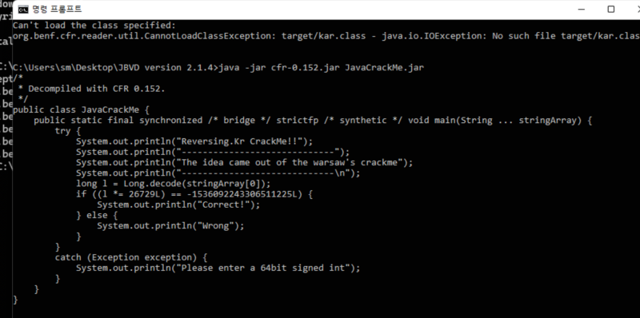

# reversing.kr: Multiplication

> Originally published on [Naver Blog](https://blog.naver.com/chaeeunhur630/224139052970). Translated and reformatted in English.

First, you need a Java decompiler to analyze this code. First, I tried decompiling using JD-GUI, but this problem was caused by an anti-decompiler that intentionally broke JD-GUI. So I decided to view the source in CFR.

Below is the source code I obtained with java -jar cfr.jar target.jar --outputdir out.

If you look at the code, you can see that this problem is using a long overflow. We can find some evidence to support that.

1. long type long var1 Java long = signed 64-bit; Range: -2^63 to 2^63 - 1

2. Normal arithmetic inversion fails

If it's not an overflow, the problem should be as simple as this:

l = (-1536092243306511225) / 26729

But in reality:

Division result is not an integer (a rational number)

Java long allows decimals

In other words, it does not constitute a normal mathematical problem.

CrackMe asks for an “integer input” and the lack of an integer solution is an intentional trap.

long l = Long.decode(stringArray[0]);
if ((l *= 26729L) == -1536092243306511225L) {
System.out.println("Correct!");
}

→ You can create this formula with:

Java longs are 64-bit 2's complement, meaning all operations are mod 2⁶⁴.

l × 26729 ≡ −1536092243306511225 (mod2^64)

l ≡ −1536092243306511225 × 26729^-1 (mod 2^64)

The recovered arithmetic can be implemented directly with the following code.

import java.math.BigInteger;

public class SolveMultiplicative {

 public static void main(String[] args) {

 // 2^64 (modular for long overflow)
 BigInteger MOD = BigInteger.ONE.shiftLeft(64);

 // Result value compared in the problem (long literal)
 BigInteger target = BigInteger.valueOf(-1536092243306511225L);

 // constant to be multiplied by
 BigInteger multiplier = BigInteger.valueOf(26729);

 /*
 * Core math:
 * x * 26729 ≡ target (mod 2^64)
 * x ≡ target * inverse(26729) (mod 2^64)
 */
 BigInteger inverse = multiplier.modInverse(MOD);
 BigInteger x = target.multiply(inverse).mod(MOD);

 /*
 * JVM long is signed 64bit
 * If MSB (63bit) is 1, converted to negative number
 */
 if (x.testBit(63)) {
 x = x.subtract(MOD);
 }

 System.out.println("Answer = " + x);
 }
}

The anchor/flag is: -8978084842198767761
