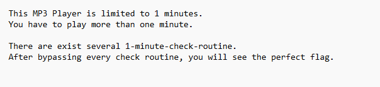
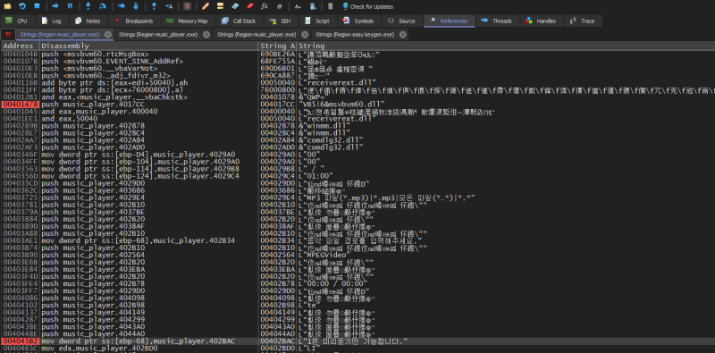
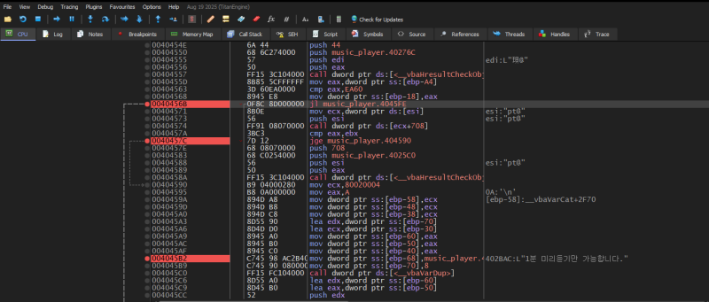
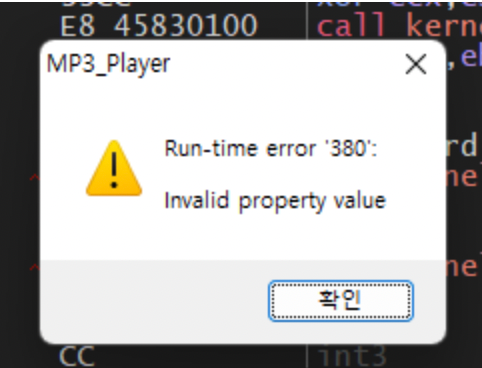
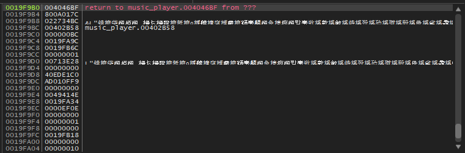
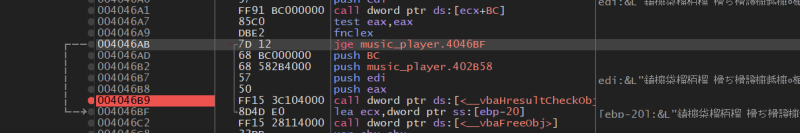
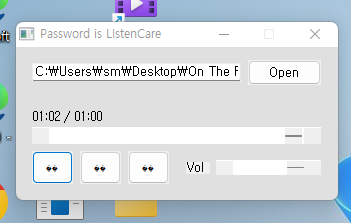

# reversing.kr: Music Player

> Originally published on [Naver Blog](https://blog.naver.com/chaeeunhur630/224134823779). Translated and reformatted in English.

** Because it is a war game solved as a hobby, expertise and in-depth understanding may be lacking. Since I am uploading this for personal records, if you want expertise, please look for solutions on other security blogs.

There are two files. One is an executable file and the other is a note containing the war game instructions.

After downloading the Music Player problem file from Reversing.kr, open the executable file in x32dbg. If you check the Symbols (or Modules/Functions) window on the left, you can see main (or entry point → function leading to main) and several DLL functions. Since this is what allows the music player in question to run for more than a minute, double-click main (or the function assumed to be main) and go to the disassembly view.

If you open Strings (A2) and search for the string that will be displayed on the screen when the program is run, you will see the phrase "Only 1 minute preview is possible", which is the phrase that appears when the music player is focused for more than 1 minute. From there, let's debug the code.

The code is in the jl statement. That means if the jl statement is always true, you can go beyond the 1 minute preview. Press the space bar to change the jl statement in assembly language to the jmp statement. After that, you can continue to press F9 to select the music prepared in advance and gradually listen to the music. Certainly, after changing the jl statement, the phrase "Only 1 minute preview is possible" does not appear, but a runtime error appears instead.

To find the function that causes the runtime error, we repeat once again focusing on the call stack. The code first calls address 004046BF when a runtime error occurs, and we follow that address. And debug the assembly language there again.

If you search for vbaHresultCheckObj here, you can see that it is a function that calls a runtime error. Change the above conditional statement to TRUE to prevent access to vbaHresultCheckObj.

In that state, run the code again with F9. Even after one minute, the song continues to play and the flag is displayed in the title one minute later.

The flag is ListenCare.
