# reversing.kr: PEPassword

> Originally published on [Naver Blog](https://blog.naver.com/chaeeunhur630/224186411184). Translated and reformatted in English.

This write-up focuses on the password-check and decryption paths in the unpacked executable.

When I unpacked and opened the file, there was an original file and a packed file.

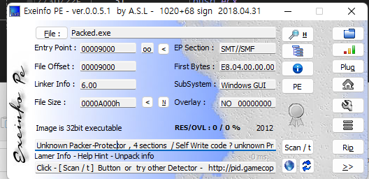

When I look at the original file, I see something like this.

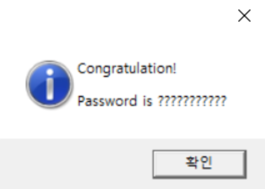

packed.exe appears as follows.

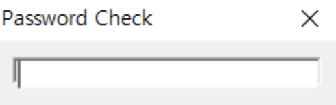

Even if you insert a string, no characters such as correct or wrong appear. First, open the file and go to the symbol and move it to the exe file section to analyze how the file is executed. After that, if you wander around with bp on some of the calls below, you can see the function that calls the window.

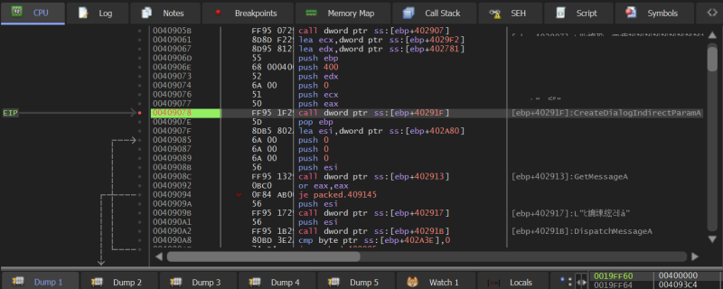

Well, you can see that this is where the calculation starts anyway, so let's slowly analyze the parts below. If you continue to run the code, the dialog will end at some point. I looked for the function that caused it.

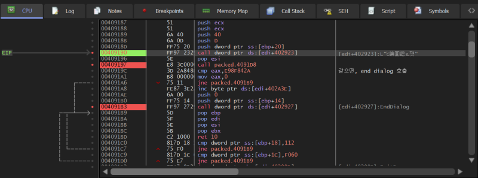

It seems that the result of the 4091D8 function call is comparing whether eax is 0xE98F842A. If they are the same, the dialog ends by calling the EndDialog function. Once you patch the jne part with je, you can go further!

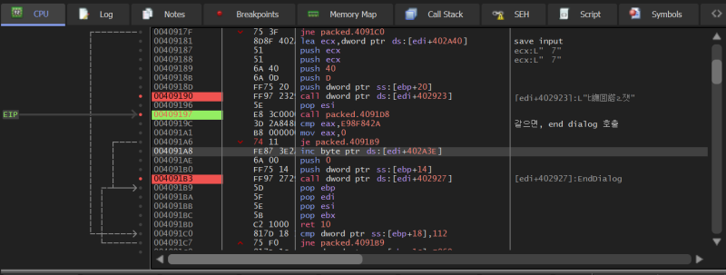

Patch!

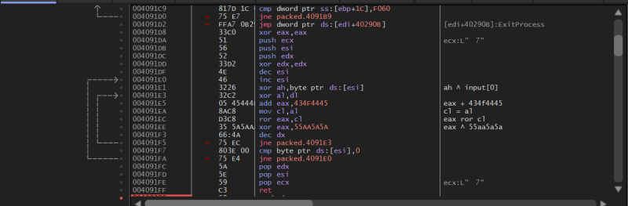

Let’s take a look below. On the right, I wrote down an analysis of how the user's input is handled. I hope you take a look. The core flow of decoding unfolds at 0x40921F. In the previous step, the password check routine located at 0x4091DA is called twice, and the call results are stored in EAX and EBX, respectively.

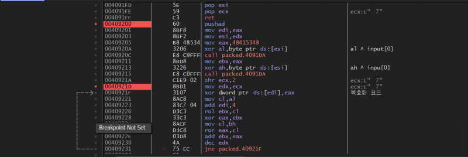

Here in the decryption code, let's look at the edi register. It is 00401000. Follow along and see the values ​​in the dump window. Since it is a dword, you can look at 4 bytes at a time.

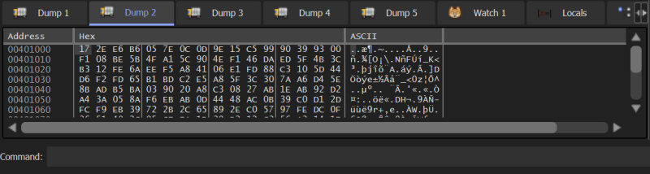

Let's look at the same part of the original exe with a hex editor. Considering the image base value, it is 1000.

>>> hex(0xb6e62e17 ^ 0x14cec81)
'0xb7aac296'
>>> hex(0x0d0c7e05 ^ 0x57560000)
'0x5a5a7e05'

eax changes depending on the edx value. So, we also need the ebx value. The value of the eax register can be easily obtained, but the ebx register cannot be calculated using the inverse operation. So I wrote the code and got it!

def rol32(x: int, r: int) -> int:
 r &= 31
 return ((x << r) | (x >> (32 - r))) & 0xFFFFFFFF

def ror32(x: int, r: int) -> int:
 r &= 31
 return ((x >> r) | (x << (32 - r))) & 0xFFFFFFFF

def bytes_to_dword_le(b: bytes) -> int:
 if len(b) != 4:
 raise ValueError("Need exactly 4 bytes")
 return int.from_bytes(b, "little")

def hexbytes_to_dword_le(s: str) -> int:
 """
 String like '81 EC 4C 01' -> 0x014CEC81
 """
 s = s.replace("0x", "").replace(",", " ").replace("\t", " ").strip()
 parts = [p for p in s.split() if p]
 if len(parts) != 4:
 raise ValueError("Need 4 hex bytes like: '81 EC 4C 01'")
 b = bytes(int(p, 16) for p in parts)
 return bytes_to_dword_le(b)

def recover_ebx0_from_two_blocks(
 plain0: int, cipher0: int,
 plain1: int, cipher1: int
) -> list[int]:
 """
 Loop structure:
 [edi] ^= eax
 cl = al
 ebx = rol(ebx, cl)
 eax ^= ebx
 cl = bh
 eax = ror(eax, cl)
 ebx += eax

 Here, we get eax0 and eax1 as the first two DWORD plaintext/ciphertext,
 bh(0~255) Restore ebx0 candidate with brute force.
 """
 eax0 = (cipher0 ^ plain0) & 0xFFFFFFFF # eax used in 1st iteration
 eax1 = (cipher1 ^ plain1) & 0xFFFFFFFF # eax used in 2nd iteration

 al0 = eax0 & 0xFF # cl = al (first rotation amount)

 candidates = []
 for bh in range(256):
 # ror(eax_pre, bh) = eax1 -> eax_pre = rol(eax1, bh)
 eax_pre = rol32(eax1, bh)

 # eax_pre = (eax0 ^ ebx1) where ebx1 = rol(ebx0, al0)
 ebx1 = (eax_pre ^ eax0) & 0xFFFFFFFF

 # cl = bh comes from "current BH of ebx1" so should match
 if ((ebx1 >> 8) & 0xFF) != bh:
 continue

 # ebx1 = rol(ebx0, al0) -> ebx0 = ror(ebx1, al0)
 ebx0 = ror32(ebx1, al0)
 candidates.append(ebx0)

 return candidates

if __name__ == "__main__":
 plain0 = hexbytes_to_dword_le("81 EC 4C 01")
 cipher0 = hexbytes_to_dword_le("17 2E E6 B6")

 plain1 = hexbytes_to_dword_le("00 00 56 57")
 cipher1 = hexbytes_to_dword_le("05 7E 0C 0D")

 cands = recover_ebx0_from_two_blocks(plain0, cipher0, plain1, cipher1)
 print("EBX0 candidates:", [hex(x) for x in cands])

When I ran it, the ebx value was correct. I don't know why, but the first candidate value satisfied the conditions up to the second iteration section, but was not restored properly in the third iteration step. So, I will write the second one with eax above.

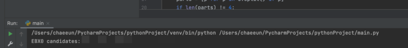

When I put it in right before xor and run it, a flag appears!

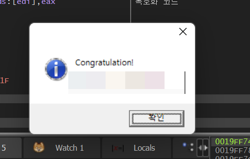
