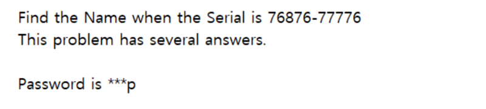
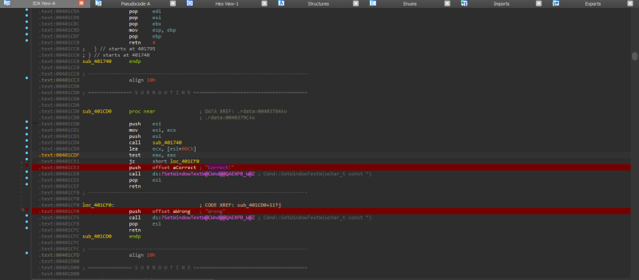

# reversing.kr: Position

> Originally published on [Naver Blog](https://blog.naver.com/chaeeunhur630/224134933146). Translated and reformatted in English.

** Because it is a war game solved as a hobby, expertise and in-depth understanding may be lacking. Since I am uploading this for personal records, if you want expertise, please look for solutions on other security blogs.

There are two files. One is an executable file and the other is a note containing the war game instructions.

After opening the executable file in IDA/x32dbg, check the Symbols (or Modules/Functions) window on the left and enter the main function (exe), not DLL. You can easily solve the problem in x32dbg, but this time I use Aida because I want to see the source code (F5). 32If you want to view the source code with a debugger, simply use assembly language through AI. In the string search, search for a string such as “wrong”. When debugging the code, the code first obtains the name and creates the serial key value through a specific calculation. After receiving the serial key value as input from the user, the serial key value created through calculation is compared with the user input to determine whether it is correct or incorrect.

View the source code with F5 to analyze how the serial key value is created from the name and write Python code to find the name that can fit the specific serial key. If you check, the approximate structure is to create serials[0]~[4] using name[0] and name[1], and serial[6]~[10] using name[2] and name[3]. The code below is for reference, as the original code is too long, parts that seem unnecessary have been cleaned up to help you understand the calculation method.

int __stdcall sub_401740(int a1)
{
 int i = 0, j;
 wchar_t s[4]; //original v50
 wchar_t t[11]; //original v51
 wchar_t tmp[4]; //original v52

 // GetWindowTextW(a1 + 304, &v50)
 GetInput1(s); // length 4

 // check length
 if (*(DWORD *)(s - 12) != 4)
 return 0;

 // check a~z
 for (i = 0; i < 4; i++)
 {
 if (s[i] < 'a' || s[i] > 'z')
 return 0;
 }

 // Check for duplicate characters
 for (i = 0; i < 4; i++)
 {
 for (j = 0; j < 4; j++)
 {
 if (i != j && s[i] == s[j])
 return 0;
 }
 }

 // GetWindowTextW(a1 + 420, &v51)
 GetInput2(t); //length 11

 if (*(DWORD *)(t - 12) != 11 || t[5] != '-')
 return 0;

 // === based on s[0], s[1] ===
 if (t[0] != '0' + (((s[0] & 1) ? 6 : 5) + ((s[1] & 4) ? 2 : 1))) return 0;
 if (t[1] != '0' + (((s[0] & 8) ? 6 : 5) + ((s[1] & 8) ? 2 : 1))) return 0;
 if (t[2] != '0' + (((s[0] & 2) ? 6 : 5) + ((s[1] & 16) ? 2 : 1))) return 0;
 if (t[3] != '0' + (((s[0] & 4) ? 6 : 5) + ((s[1] & 1) ? 2 : 1))) return 0;
 if (t[4] != '0' + (((s[0] & 16) ? 6 : 5) + ((s[1] & 2) ? 2 : 1))) return 0;

 // === based on s[2], s[3] ===
 if (t[6] != '0' + (((s[2] & 1) ? 6 : 5) + ((s[3] & 4) ? 2 : 1))) return 0;
 if (t[7] != '0' + (((s[2] & 8) ? 6 : 5) + ((s[3] & 8) ? 2 : 1))) return 0;
 if (t[8] != '0' + (((s[2] & 2) ? 6 : 5) + ((s[3] & 16) ? 2 : 1))) return 0;
 if (t[9] != '0' + (((s[2] & 4) ? 6 : 5) + ((s[3] & 1) ? 2 : 1))) return 0;
 if (t[10] != '0' + (((s[2] & 16) ? 6 : 5) + ((s[3] & 2) ? 2 : 1))) return 0;

 return 1;
}

It is much easier to understand debugging while looking at the decompiled source code. Below are the results:

Name = c0 c1 c2 c3

Length: 4

Letters: 'a' to 'z'

No overlap

Number generation rules:

4-character lowercase name → Decompose each character bit → Generate 10 numbers → Generate XXXXX-YYYYY key

These results are added to the previous values. For reference, the third and fourth characters have the same structure. We ask Ai for a Python code that obtains a list of possible names ending in p, depending on the specific keygen, along with the above analysis. Below is the result:

import string
import itertools

SERIAL = "76876-77776"

def check(name: str, serial: str) -> bool:
 # name constraints (original v50 check)
 if len(name) != 4:
 return False
 if any(c < 'a' or c > 'z' for c in name):
 return False
 if len(set(name)) != 4:
 return False

 # serial constraints (original v51 check)
 if len(serial) != 11 or serial[5] != '-':
 return False

 s = [ord(c) for c in name]
 t = serial

 # === Based on s[0], s[1] ===
 if int(t[0]) != ((6 if (s[0] & 1) else 5) + (2 if (s[1] & 4) else 1)): return False
 if int(t[1]) != ((6 if (s[0] & 8) else 5) + (2 if (s[1] & 8) else 1)): return False
 if int(t[2]) != ((6 if (s[0] & 2) else 5) + (2 if (s[1] & 16) else 1)): return False
 if int(t[3]) != ((6 if (s[0] & 4) else 5) + (2 if (s[1] & 1) else 1)): return False
 if int(t[4]) != ((6 if (s[0] & 16) else 5)+ (2 if (s[1] & 2) else 1)): return False

 # === Based on s[2], s[3] ===
 if int(t[6]) != ((6 if (s[2] & 1) else 5) + (2 if (s[3] & 4) else 1)): return False
 if int(t[7]) != ((6 if (s[2] & 8) else 5) + (2 if (s[3] & 8) else 1)): return False
 if int(t[8]) != ((6 if (s[2] & 2) else 5) + (2 if (s[3] & 16) else 1)): return False
 if int(t[9]) != ((6 if (s[2] & 4) else 5) + (2 if (s[3] & 1) else 1)): return False
 if int(t[10]) != ((6 if (s[2] & 16) else 5)+ (2 if (s[3] & 2) else 1)): return False

 returnTrue

results = []
letters = string.ascii_lowercase

for a, b, c in itertools.product(letters, repeat=3):
 name = a + b + c + "p" # ends with p
 if len(set(name)) != 4:
 continue
 if check(name, SERIAL):
 results.append(name)

print("Possible passwords ending with 'p':")
for r in results:
 print(r)
print("\nTotal found:", len(results))

If you use the code created like this,

bump

cqmp

ftmp

All possible names ending with p appear. Here, the FlAG value for auth authentication is Bump.
