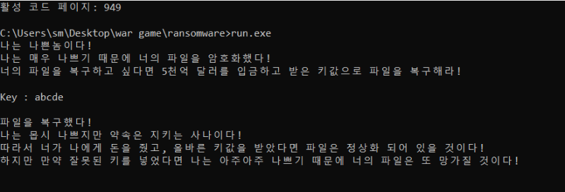
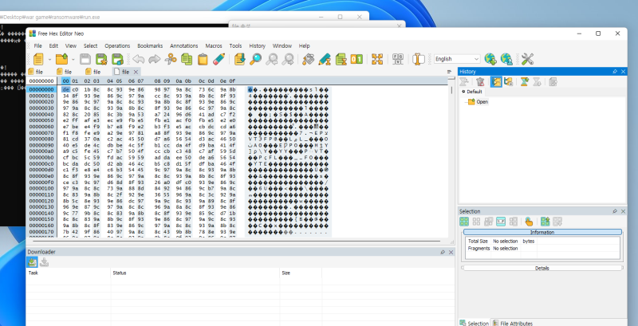
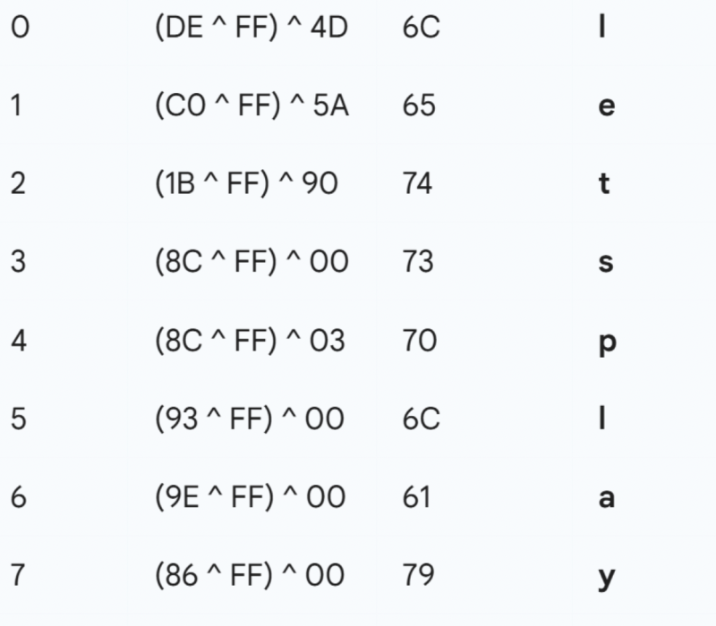

# reversing.kr: Ransomware

> Originally published on [Naver Blog](https://blog.naver.com/chaeeunhur630/224137574600). Translated and reformatted in English.

Try running the wargame from Cmd. It is unreadable at first due to a problem with broken character encoding. This problem occurs because the output string exists but the code page is wrong. Before running Cmd, configure the environment using chcp 949.

Hackers encrypt files containing passwords and normalize the files once they find out the key value. First, find where “Key:” is by searching the string.

When analyzing the assembly code, the program largely goes through the following process: **[Key input -> Reading file -> Decryption (XOR) -> Writing file]**. The 'Key' we need to find is a string that can properly decrypt the file.

Important decryption logic (0044A8B6 ~ 0044A8F2)

This part is the core algorithm for finding the key. It takes each byte of the file and performs the following operation:

0044A8B9 | movsx ecx, byte ptr ds:[edx+5415B8] ; data read from file

0044A8C5 | div dword ptr ss:[ebp-C] ; Divide the file pointer by the key length (preparing for the remainder operation)

0044A8C8 | movsx edx, byte ptr ds:[edx+44D370] ; Character at (index % key length) position in the entered key

0044A8CF | xor ecx, edx ; 1st XOR: Data ^ Key[i % len]

0044A8E9 | xor edx, F F ; 2nd XOR: (1st result) ^ 0xFF

That is, the decryption formula is as follows:

$$DecryptedByte = (OriginalByte ^ Key[i % len]) ^ 0xFF

The “file” in question has been encrypted by ransomware. If the file is a normal executable (PE) or document, we know the **file header (Magic Number)**.

Check the file format: Open the encrypted file with a hex editor. After that, do the inversion using the hex value of run.exe and the hex value of the file in the same place:

Key[i] = (EncryptedByte ^ 0xFF) ^ OriginalByte

hex editor

Afterwards, you can obtain “letsplaythechess” by performing calculations with the hex values of the found files and executable files using a hex editor. In other words, the key is “letsplaychess”. Calculations were performed until a sentence with an arithmetic expression appeared below.

As a result of decrypting the encrypted 'file' file with the "letsplaychess" key value, it was decrypted into a PE executable file, and as a result of executing the executable file, the flag value in question was obtained.

Flag : Colle System
