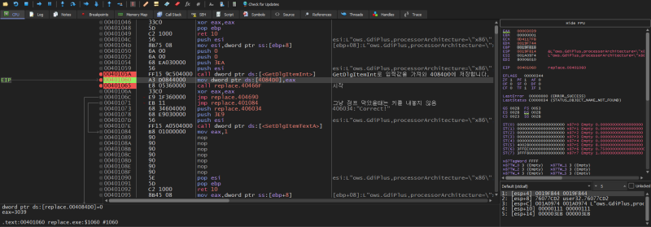
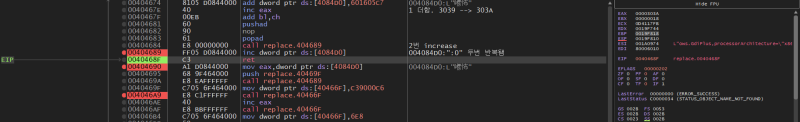
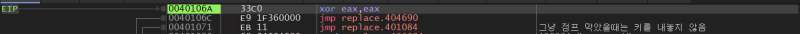
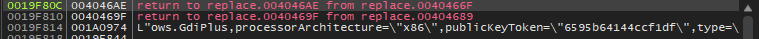
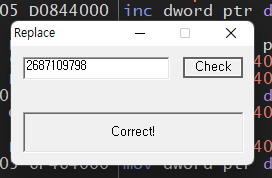

# reversing.kr: Replace

> Originally published on [Naver Blog](https://blog.naver.com/chaeeunhur630/224135411832). Translated and reformatted in English.

If you turn on the program and check, you can see that it is a program that receives input and checks whether it is correct or not when you press the Check button. The problem with this approach is that it implies that the password is a flag. First, we enter the main code through the main function and string search method.

First, make the jump statement in 00401071 unconditionally true and display the correct phrase. However, you may realize that you can't find the flag that way. Run the program first and enter 12345. When you run it, the eax value is stored in 004084d0, which is 3039 in hexadecimal.

eax = 0x004084d0 = 0x3039

After that we go to that function (40466F), and there we increase the value of 4084D0 twice.

eax = 0x3039(12345) / 0x004084d0 = 0x3039+2 = 0x303B

If you continue executing, there is another operation in that part (because of ret). eax increases by 1 and the value of 004084d0 increases by 601605c7.

eax = 0x3039 + 1 = 0x303a / 0x004084d0 = 0x3039 + 2 + 0x601605c7 =

Also, go through the relevant parts again in order and increase the value of 4084D0 once again.

eax = 0x303a, 0x004084d0 / 0x3039 + 2 + 0x601605c7 + 1

Afterwards, the eax value is initialized and jumps (branch) to 404690.

At address 404690, the value of 4084D0 is stored in eax as much as the DWORD size (which is 60163604). Afterwards, call 404689 and add 2 through INC to create '60165CA' and store it in 4084D0. The address called is the point where the original error occurred. The error that occurs at 40466F is ultimately caused by the failure of a normal address to be entered into eax. Therefore, if it operates normally, nop will be entered in eax.

After the error occurred, the stack status was checked. Looking at the stack status, when returning from 404672, the address to be returned was 4046AE address. If the address 4046AE is returned normally, the code after that location is executed and the eax value increases by 1.

Afterwards, address 40466F is called again, and this part appears to be a routine that uses the value in eax as an address to store a specific value in memory. The cause of the error that occurred earlier is because the routine was executed without a normal address being entered in eax. If it operates normally, a valid address is entered in eax. At this time, it appears to have been designed to store the NOP (0x90) at that address, and if this NOP storage is performed normally, the function returns to the calling point again through ret.

If you follow the execution flow later, you can see that the pop eax command is executed at address 4046BE. This command appears to have been used for cleaning up the values remaining in the stack rather than for the purpose of using the eax value. If you actually check the stack, the 40469F address remaining from the previous step was present in the stack, and this value is removed through pop eax, and the stack state is normalized.

After stack cleanup is completed, the execution flow branches to address 401071 through the jump statement located at address 4046C4. This address, 401071, is the location where the Correct phrase was initially forcibly branched and output, and is a routine that can only be reached when normal conditions are met.

In other words, it can be seen that the structure is such that Correct is finally output only when all previous operations and stack cleaning processes are performed normally.

If you trace the internal calculation process, it goes through the process of adding 2 to the input value, adding 0x601605C7, and then adding 1 and 1 again, and the branch condition is satisfied only when the final result is 0x00401071. This is expressed as below:

x + 2 + 0x601605C7 + 1 + 1 = 0x00401071 -->

x = 0xA02A0AA6 --> Convert to decimal --> 2687109798

When you actually enter the value, you can see that the Correct phrase is displayed, and as a result, this value is a flag.

