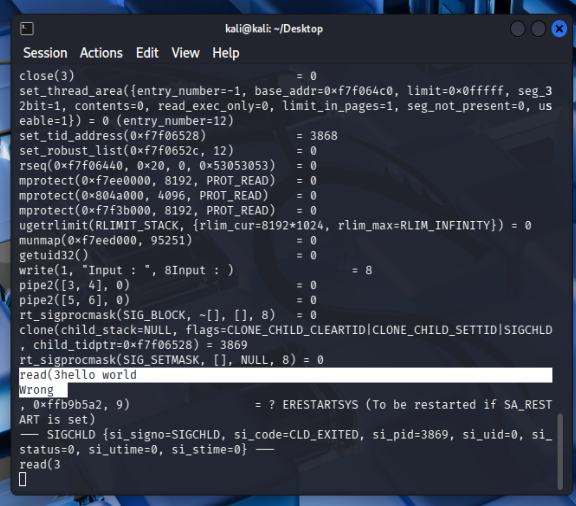
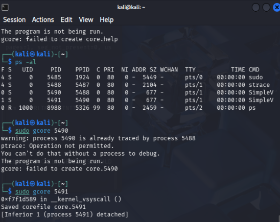
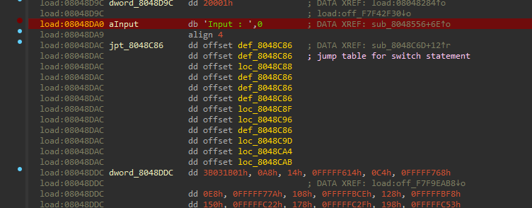
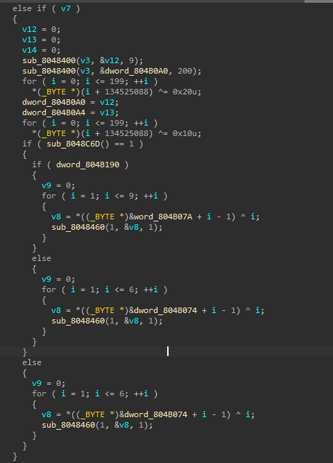
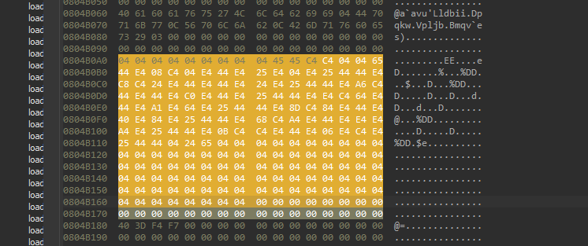
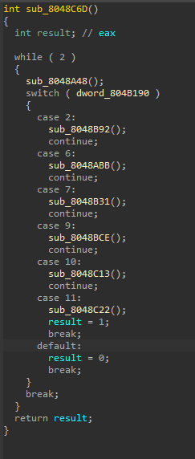
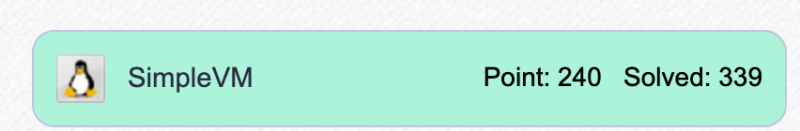

# reversing.kr: SimpleVM

> Originally published on [Naver Blog](https://blog.naver.com/chaeeunhur630/224166448819). Translated and reformatted in English.

The challenge is an ELF executable. `strace` shows an access-denied error under an unprivileged account, so the sample was run in the isolated lab with `sudo ./SimpleVM`. The program implements a small virtual machine for key verification and prints `CORRECT` only when the supplied input passes the internal VM.

After running it one more time, without entering anything, I typed sudo gcore (PID) in the second terminal to dump the core file. (pid can be found with ps-al).

I'll explain the reason for dumping the core file in case you don't know (because I didn't know so I just dumped it). The reason for dumping the core file is to avoid digging up the environment. input: To reach this stage, the permission architecture and terminal execution method must all be correct. If even one mistake is made, analysis cannot begin at all. So, I just grab the running memory and look at it. This is because gcore “preserves the state during execution” (what data this program has and how far it has been executed).

Now let’s start the analysis with Aida.

Find where user input is obtained through string search in Aida (Fn+12). Use Xref

It goes to the place where the string is referenced. Let's decompile (F5) and analyze the code. If you look at the code, after the code receives user input:

1. Rotate each byte 3 bits to the left (ROL 3)

2. XOR 0x20 on the result

3. Subsequent user input overwrites some areas.

4. Finally XOR 0x10 to the entire buffer

At this point, user input overwrites only a portion of the entire data, and then the entire XOR operation is applied again. In other words, it is difficult to believe that the input value is directly used to generate the flag.

The code XORs data beginning at `0x804B0A0`; the corresponding bytes can be inspected in the hex dump.

ar = [4, 4, 4, 4, 4, 4, 4, 4, 4, 69, 69, 196, 196, 4, 4, 101, 68, 228, 8, 196, 4, 228, 68, 228, 37, 228, 4, 228, 37, 68, 68, 228, 200, 196, 36, 228, 68, 228, 68, 228, 36, 228, 37, 68, 68, 228, 166, 196, 68, 228, 68, 228, 192, 228, 68, 228, 37, 68, 68, 228, 228, 196, 100, 228, 68, 228, 161, 228, 100, 228, 37, 68, 68, 228, 141, 196, 132, 228, 68, 228, 64, 228, 132, 228, 37, 68, 68, 228, 104, 196, 164, 228, 68, 228, 228, 228, 164, 228, 37, 68, 68, 228, 11, 196, 196, 228, 68, 228, 6, 228, 196, 228, 37, 68, 68, 4, 36, 101, 4, 4, 4, 4, 4, 4, 4, 4, 4, 4, 4, 4, 4, 4, 4, 4, 4, 4, 4, 4, 4, 4, 4, 4, 4, 4, 4, 4, 4, 4, 4, 4, 4, 4, 4, 4, 4, 4, 4, 4, 4, 4, 4, 4, 4, 4, 4, 4, 4, 4, 4, 4, 4, 4, 4, 4, 4, 4, 4, 4, 4, 4, 4, 4, 4, 4, 4, 4, 4, 4, 4, 4, 4, 4, 4, 4, 4, 4, 4, 4, 4, 4].

So, the code performs secondary decryption of the primary decrypted code of these hex values, and then enters the key value check routine. If you follow the flow of the code, you can see that it is a switch-case based VM interpreter rather than a general branching structure.

Case 2: Generating flag characters

Case 6: Memory XOR

Case 7: Comparison

Case 9: Conditional branching

Case 10: Jump

Case 11: End

When decoding and checking the entire VM code, Case 2 (opcode 2) appears linearly and repeatedly regardless of conditional branching. In other words, this VM is not a structure for actually verifying user input, but is closer to a device for hiding flags inside the VM code. Therefore, without the need to actually emulate the VM, the flag can be restored by sequentially extracting only the immediate values ​​used in Case 2 from the decrypted VM code. Here is the Python code including the logic above.

byte = [4, 4, 4, 4, 4, 4, 4, 4, 4, 69, 69, 196, 196, 4, 4, 101, 68, 228, 8, 196, 4, 228, 68, 228, 37, 228, 4, 228, 37, 68,
 68, 228, 200, 196, 36, 228, 68, 228, 68, 228, 36, 228, 37, 68, 68, 228, 166, 196, 68, 228, 68, 228, 192, 228, 68,
 228, 37, 68, 68, 228, 228, 196, 100, 228, 68, 228, 161, 228, 100, 228, 37, 68, 68, 228, 141, 196, 132, 228, 68,
 228, 64, 228, 132, 228, 37, 68, 68, 228, 104, 196, 164, 228, 68, 228, 228, 228, 164, 228, 37, 68, 68, 228, 11,
 196, 196, 228, 68, 228, 6, 228, 196, 228, 37, 68, 68, 4, 36, 101, 4, 4, 4, 4, 4, 4, 4, 4, 4, 4, 4, 4, 4, 4, 4, 4,
 4, 4, 4, 4, 4, 4, 4, 4, 4, 4, 4, 4, 4, 4, 4, 4, 4, 4, 4, 4, 4, 4, 4, 4, 4, 4, 4, 4, 4, 4, 4, 4, 4, 4, 4, 4, 4, 4,
 4, 4, 4, 4, 4, 4, 4, 4, 4, 4, 4, 4, 4, 4, 4, 4, 4, 4, 4, 4, 4, 4, 4, 4, 4, 4, 4, 4]

def rol3(value):
 return ((value << 3) | (value >> (8 - 3))) & 0xff
input = b'123456789'

# Stage 1: 1st decoding (ROL + XOR)
for i in range(200):
 byte[i] = rol3(byte[i]) ^ 0x20

# Stage 2: Overwriting user input (bait stage)
for i in range(len(input)):
 byte[i] = input[i]

# Stage 3: Secondary decoding (VM opcode restoration)
for i in range(200):
 byte[i] ^= 0x10

# Stage 4: Securing padding area for VM execution
byte.extend([0x00] * 50)
#The bytecode interpreted by the actual VM interpreter starts from byte[10:]. This means that only the front part of the buffer is overwritten and user input is not used.
code = byte[10:]

i = 0
d = []
flag = ""

while i < len(code):

 opcode = code[i] ^ 0x10

 if opcode == 2:
 decoded = code[i + 2] ^ 0x10
 d.append(decoded)
 i += 3

 elif opcode in (6, 7):
 i += 3

 elif opcode in (9, 10):
 i += 2

 elif opcode == 11:
 i += 1

 else:
 break

print("Flag Is: ", end="")

for i in range(0, len(d) - 1, 2):
 ch = d[i] ^ d[i + 1]
 print(chr(ch), end="")

On the surface, this problem appears to be a VM problem verifying user input, but in reality, the structure was to generate a flag by combining immediate values inside the VM. Therefore, the key was to interpret the VM bytecode itself rather than analyzing input values or tracking conditional branches. Sigh!

