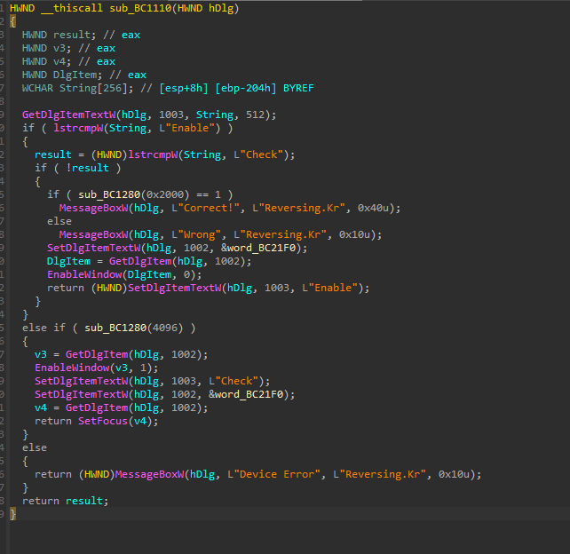
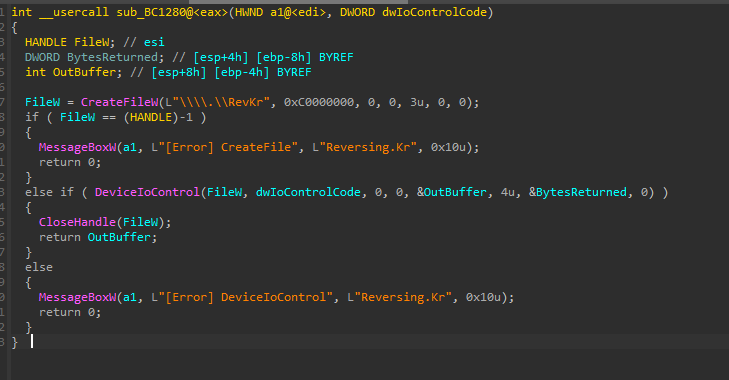
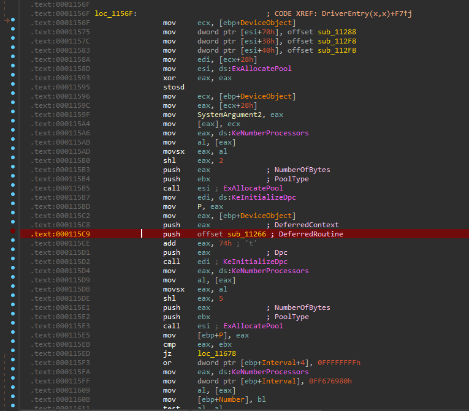
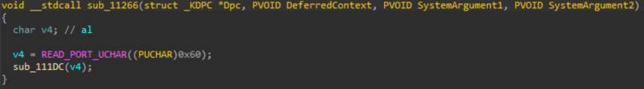
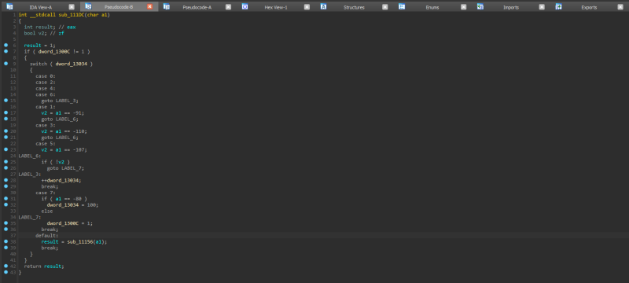
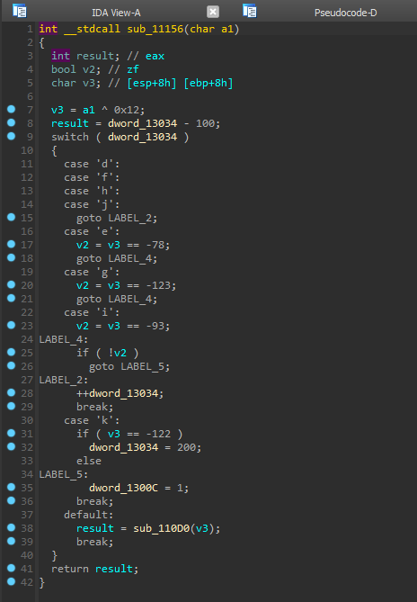
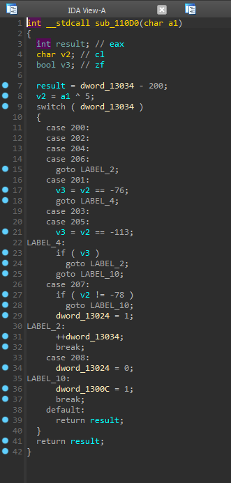
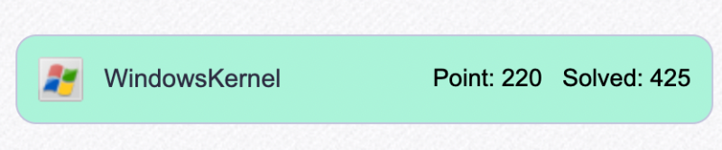

# reversing.kr: WindowKernel

> Originally published on [Naver Blog](https://blog.naver.com/chaeeunhur630/224158282814). Translated and reformatted in English.

This problem is a Windows Kernel issue of Reversing.kr.

Instead of general user-mode input verification, the kernel driver uses a structure that directly reads the keyboard hardware port.

The key hints are as follows:

Keyboard scan code

Windows kernel driver

IOCTL based communication

In other words, this problem is a problem of reversing the driver that intercepts and verifies keyboard input at the kernel level. First, let's look at the exe file. Using Aida, I looked at the branching (correct/wrong) string of the main function and decompiled the function.

Let's analyze this code. The value returned from the function called sub_BC1280 determines corret/wrong. Let's follow.

If you analyze this code closely, you can see that WinKern.sys needs to be analyzed to obtain the key. sub_11288 is the IRP_MJ_DEVICE_CONTROL handler. That is, the essence of this function is:

Control interface between user-mode and kernel-mode

Status initialization / Status inquiry

return result value

However, if you look here, you can see that unlike the original essence, there is no input data processing logic at all. No SystemBuffer is read, InputBufferLength is not used, and no “key value” is passed in user-mode. The paths through which user input enters the Windows kernel are very limited. However, this driver: does not attach with the kbdclass filter, does not hook IRP_MJ_READ, and instead registers the DPC directly. WinKern.sys in analyst thinking collectively refers to:

i8042 keyboard controller path

PS/2 keyboard port (0x60 / 0x64)

Kernel level keystroke processing root

In other words, it is a symbolic name for “Windows Kernel Input Path”. So, naturally, the DriverEntry of WinKern.sys is analyzed.

Looking at the above, DriverEntry has the following characteristics.

Create \\.\RevKr device through IoCreateDevice, IoCreateSymbolicLink

Register sub_11288 as IRP_MJ_DEVICE_CONTROL handler

Register DPC routines via KeInitializeDpc

READ_PORT_UCHAR availability strongly suspected

At this point, this driver does not use the standard keyboard driver path (kbdclass.sys);

It can be seen that it operates its own DPC-based keyboard input processing routine.

Let’s follow the sub_11266 function here.

This code means:

Read 1 byte directly from port 0x60 on the PS/2 keyboard controller

The read value is Scan Code, not ASCII

The value is then passed to the FSM (State Machine)

In other words, it is not a structure that sends a value in user-mode,

Actual keyboard input is consumed directly by the kernel. Here sub_111DC

Stage 1: sub_110DC analysis (KEYBD). Stage 1 operates in the initial state (state < 100).

Features:

Even states are free-pass

Checking specific scan code break values in odd states

State increases when inspection is passed

Finally reach state == 100

The input pattern required at this stage is interpreted based on the keyboard scan code break,

Converting this to actual key input, it becomes the following string.

KEYBD

This step is the first part that stands for “Keyboard”.

Stage 2 starts from state == 100.

The following transformations apply here:

v3 = al ^ 0x12

In other words, the input scan code is compared after XOR 0x12 operation.

Features:

Use character state ('d' ~ 'k') as state

Free-pass state and verification state intersect

Upon final success, state == 200

If you follow this FSM exactly, the key inputs required for Stage 2 are as follows.

INT (meaning interrupt here)

Therefore, the Stage 1 + Stage 2 results are as follows.

KEYBDINT

Stage 3 is a section that many people are confused about.

This is the key step in determining the last four letters.

The important points are as follows:

Stage 3’s input verification function is sub_110D0

Using the operation v2 = al^5

Verification states are 201, 203, 207

The rest is free-pass

In other words, a total of 4 characters are entered, but only 3 values are actually compared, and free-pass is mixed in. Common mistakes made at this stage are as follows:

An attempt to map scan codes directly to characters

Just refer to the scancode table, ignoring the XOR operation.

However, the intention of this problem lies not in the numbers themselves but in the meaning.

Stage 3 requires:

Actual behavior of driver intercepting keyboard input

Structure using READ_PORT_UCHAR(0x60)

DPC-based keystroke monitoring

In other words, the actions this driver performs are clear. Keyboard Hook

Therefore, the meaning of Stage 3 is the following string.

HOOK

Putting all the steps together, the final input string is: keybdinthook

The end ^^

