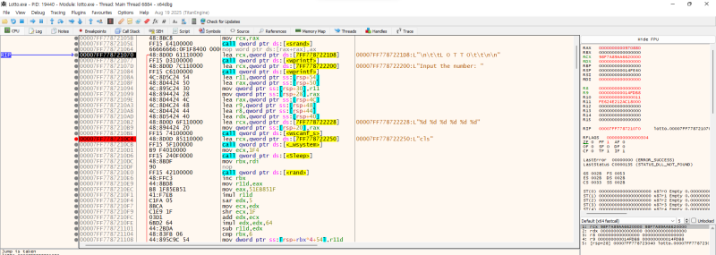
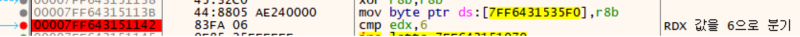
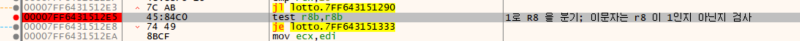
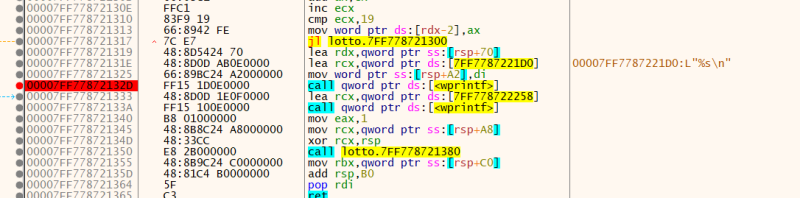
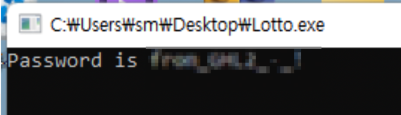

# reversing.kr: x64 Lotto

> Originally published on [Naver Blog](https://blog.naver.com/chaeeunhur630/224141775823). Translated and reformatted in English.

It seems to be programming that requires guessing lottery numbers. First, let's open it with Aida64, decompile the file, and perform a static analysis of the file. Below is the source code obtained through Aida F5 decompilation:

do
 {
 wprintf(L"\n\t\tL O T T O\t\t\n\n");
 wprintf(L"Input the number: ");
 wscanf_s(L"%d %d %d %d %d %d", &v13, &v14, &v15, &v16, &v17, &v18);
 wsystem(L"cls");
 Sleep(0x1F4u);
 for ( i = 0i64; i < 6; v19[i - 1] = rand() % 100 )
 ++i;
 v2 = 1;
 v3 = 0;
 v4 = 0i64;
 byte_1400035F0 = 1;
 while ( v19[v4] == *(int *)((char *)&v13 + v4 * 4) )
 {
 ++v4;
 ++v3;
 if ( v4 >= 6 )
 goto LABEL_9;
 }
 v2 = 0;
 byte_1400035F0 = 0;
LABEL_9:
 ;
 }

After receiving and storing 6 integer inputs from the user, 6 random numbers are generated using rand() % 100. Compare the generated random number array (v19) and the numbers entered by the user (v13 to v18) sequentially from the beginning. If all 6 are the same, the success flag (v2=1, byte_1400035F0=1) is maintained; if even one is different, it is immediately set to failure.

while ( v3 != 6 );
 v5 = byte_140003021;
 v23[1] = 92;
 v23[0] = 184;
 v23[2] = 139;
 v23[5] = 184;
 v23[3] = 107;
 v6 = 0i64;
 v23[4] = 66;
 v23[6] = 56;
 v23[7] = 237;
 v23[8] = 219;
 v23[9] = 91;
 v23[10] = 129;
 v23[11] = 41;
 v23[12] = 160;
 v23[13] = 126;
 v23[14] = 80;
 v23[15] = 140;
 v23[16] = 27;
 v23[17] = 134;
 v23[18] = 245;
 v23[19] = 2;
 v23[20] = 85;
 v23[21] = 33;
 v23[22] = 12;
 v23[23] = 14;
 v23[24] = 242;
 v24 = 0;
 do
 {
 v7 = byte_140003021[v6 - 1];
 v6 += 5i64;
 *((_WORD *)&v20 + v6 + 1) ^= (unsigned __int8)(v7 - 12);
 *((_WORD *)&v21 + v6) ^= (unsigned __int8)(byte_140003021[v6 - 5] - 12);
 *((_WORD *)&v21 + v6 + 1) ^= (unsigned __int8)(byte_140003021[v6 - 4] - 12);
 v23[v6 - 2] ^= (unsigned __int8)(byte_140003021[v6 - 3] - 12);
 v23[v6 - 1] ^= (unsigned __int8)(byte_140003021[v6 - 2] - 12);
 }
 while ( v6 < 25 );
 if ( v2 )
 {
 v8 = 0;
 v9 = v23;
 do
 {
 v10 = *v9++;
 v11 = v8++ + (v10 ^ 0xF);
 *(v9 - 1) = v11;
 }
 while ( v8 < 25 );
 v24 = 0;
 wprintf(L"%s\n", v23);
 }
 wprintf(L"\n", v5);
 return 1i64;
}

Initializes several variables to fixed values. The data at 0x140003021 is imported and the value is changed by performing an XOR operation in order with the initialized variables. If v1 == 1 (if all lottery numbers were correct previously), XOR 0xF again on the transformed values ​​and output them as a string. This output result is a flag. Our input values ​​have no effect on creating the flag, and the flag is created using only the values ​​of v23 and byte_140003021.

Then, let’s go back into x64dbg and check. The main function uses a string search to find the lotto number.

Since there is a CLS string, let's set a breakpoint there. Set a breakpoint in the cmp parts that determine success or failure in the code and branch the values. The way to know whether it is a code that determines success or not is that when jne moves back to the beginning, you can know that it is a code that determines success or not.

First, hang it on the cmp edx, 6 part below. Here, if edx is not equal to 6, it goes back to the beginning. Branch the rdx part to 6 and press F8.

Second, apply a hardware break to the test r8b and r8b parts. When it arrives, branch R8 to 1 to prevent it from going back to the beginning.

If the number is wrong:

ZF = 0

jne → failure route

If correct:

ZF = 1

success route

Additional explanation. Why bet your first BP on CLS?

“Because it is the starting point of user input/output.”
If you look at the flow
EntryPoint
CRT initialization (__scrt_common_main_seh)
→ Enter user code (wmain)
Screen cleanup (system(\"cls\"))
UI output (wprintf(\"LOTTO\"))
input (wscanf_s)

cls is not a CRT, but the first action of ‘logic written by the problem tester’
So in reversing:

If cls/printf/scanf comes out in succession,

→ “Ah, this is the main user.”
It is judged that

For reference, you need to add bp to the wprintf statement (prints a flag) here to get a flag when it succeeds! The answer at the end is:

